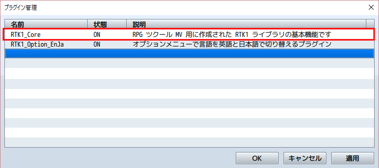
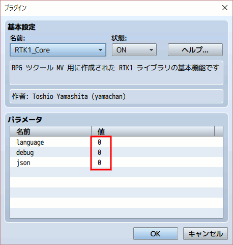

[English version](RTK1_Core.md)

# [RTK1_Core](RTK1_Core.js) プラグイン

RPGツクール MV 用に作成された RTK1ライブラリの基本(Core)部分です。

ダウンロード: [RTK1_Core.js](https://raw.githubusercontent.com/yamachan/jgss-hack/master/RTK1_Core.js) (ver1.10 2016/07/06)

## 概要

RPGツクール MV 用に作成された RTK1系プラグイン(RTK1_*.js)で利用している共通部分をまとめたもの（Coreライブラリ）です。 開発に便利な機能をまとめていますので、ご自由にお使いください。

RTK1系プラグインを利用する場合には、それらより前に本プラグインを読み込んでください。



パラメータは全て 0 のまま特に変更する必要はありません。



以下、必要があれば読んでください。

## language パラメータ

language パラメータは、開発に使用しているRPGツクール MVの言語環境を指定します。 初期値は "0:Auto detect" となっており、動作に問題がなければこのままでかまいません。


"0:Auto detect" はデータベースの用語に設定した値をいくつか確認し、英語かそれ以外(日本語)か判断しています。

よって例えば、日本語環境で用語の幾つかをあえて英語にしている場合、RTK1_Core プラグインはそれを英語環境で開発されたゲームだと誤解しまうことがあります。 この場合には language パラメータを 2 に変更して、日本語環境であることを明示してください。

なおもし英語版のRPG Maker MVと、日本語版のRPGツクール MVを使い分けている場合、そのゲームの言語環境は、そのゲームのプロジェクトを最初に作成した環境に影響されます。 いまプロジェクトを操作しているアプリケーションの環境ではありませんので、注意してください。

不明な場合はデータベースの用語タブを確認してください。そこに並んでいるのが英語であれば英語環境で作成したプロジェクトでしょうし、日本語であれば日本語環境で作成したプロジェクトでしょう。

## debug パラメータ

debug パラメータをセットすると、デバッグモードになります。


デバッグモードでは、コンソールに RTK1系プラグインの動作ログが表示されるようになります。


RTK.log() 関数はデバッグモードの時だけコンソール出力する関数で、自由にお使いください。 引数に文字列を渡せばそれを console.log() 表示しますし、オブジェクトを渡せば console.dir() 表示します。 第1引数に文字列、第2引数にオブジェクトを渡せば両方表示します。

RTK.trace() 関数もあり、デバッグモードの時だけスタック状態をコンソール出力します。引数は不要ですが、文字列を指定すればそれをラベルとして表示します。


## json パラメータ

PC環境でゲームをプレイすると save フォルダにセーブデータが幾つか作成されます。 この中身は json 形式のデータなのですが、圧縮されていて中身の参照が困難です。


json パラメータを 1 に変更すると、セーブデータ作成の際に圧縮されない json ファイルも同時に同じ場所に生成します。 開発中にセーブデータを参照することが容易になります。

## onReady サービス

RTK.onReady() 関数で自分のプラグイン用の初期化関数を登録しておくと、ゲームデータが生成され、Scene_Boot が終了し、RTK1_Core が準備された後の適切なタイミングで、登録された関数が登録順に呼び出されます。

```js
RTK.onReady(function(){
  // your init code here
});
```

初期化ルーチンの実行タイミングを気にしなくて済み、またこのサービスを使っているプラグイン間では登録順に初期化処理が実行されますので、コーディングが楽になります。

## onCall サービス

プラグインコマンドを実装するためには Game_Interpreter.prototype.pluginCommand(command, args) を置き換える必要がありましたが、RTK.onCall() 関数を使えば以下のように簡単に実装できます。

```js
RTK.onCall(command, function(args){
  // your plugin command code here
});
```

この仕組みを利用すれば、登録した command に一致する場合にだけ登録した関数がコールされるので、command の判断文が不要でコードが簡潔になり、また処理速度も向上します。

もし1つの関数で複数の command に対応したい場合、以下のように第2引数で渡される値を利用できます。

```js
RTK.onCall(command, function(args, command){
  // your plugin command code here
});
```

## Persistent サービス

セーブデータを拡張して、プラグイン独自のデータをセーブするサービスです。 使い方は簡単で key は文字列、value は保存したいデータです。

```js
RTK.save(key, value);
var value = RTK.load(key);
```

例えば myData という変数の値をセーブデータに含めたいとします。 自分のプラグインのなかで値を参照するときは

```js
var myData = RTK.load("myData") || "default value";
```

のように読み込みます。 ゲーム開始時などは保存された値が存在しないので、|| で繋いで初期値("default value")を指定してください。 そして値の保存は以下のようにします。

```js
myData = "saved value";
RTK.save("myData", myData);
```

先ほど説明した　json パラメータを使って、セーブファイルの中身を確認してみてください。 最後のほうに以下のように値が追加されているのがわかります。

```js
{
  "system":{
  //... (中略) ...
  },
  "RTK1_Core":{
    "myData":"saved value"
  }
}
```

値が不要になったら削除してください。

```js
RTK.del(key);
```

以下は機能テストのために作成したイベントです。 1～3 の値を選択すると、ゲームをセーブして再開してもその値を覚えています。


またあわせて、以下のゲーム変数を配列にまとめる関数も利用してください。 dataArray は配列、startVariable と endVariable は変数の番号を示す数値です。

```js
var dataArray = RTK.pack(startVariable, endVariable);
RTK.unpack(startVariable, dataArray);
```

これらを組み合わせ、例えば変数 100～119 をいったん保存しておくのには以下のように記述します。

```js
RTK.save("backup100-119", RTK.pack(100,119));
```

保存した値を数 100～119 に戻す場合には以下のように記述します。

```js
RTK.unpack(100, RTK.load("backup100-119"));
```

RTK.unpack はイベントのスクリプト入力で複数の変数を一括で初期化するのにも使えます。 例えば以下は変数1～5全てに8の値を設定しています。

```js
RTK.unpack(1, [8,8,8,8,8]);
```

また Persistent サービスには、セーブファイルの保存時と読み込み時の終盤に登録した関数を呼び出してくれるサービスがあり、保存されるデータ形式の変換に利用できます。

```js
RTK.onSave(function(){
  // Update your original save data with RTK.save function
});
RTK.onLoad(function(){
  // Convert your original save data with RTK.load function
});
```

例えばプラグインでアイテムのリストを管理している場合、オブジェクトの配列はそのまま保存すると情報が失われますので、アイテムIDのリストに変換して保存する必要があります。 そういった場合に本サービスは便利です。

onSave 時には共通のゲーム用関数 RTK.objects2ids が、onLoad 時には共通のゲーム用関数 RTK.ids2objects が便利ですので、よかったら併せて使ってみてください。

## onStart サービス

onStart サービスは onReady サービスと同様のサービスですが、登録した関数が呼ばれるタイミングがより遅く、ゲームの開始直前 (Scene_Map が開始する直前) になります。

```js
RTK.onStart(function(mode){
  // your start code here
});
```
呼ばれる関数には引数 (mode) が1つ渡され、新規にゲームを開始した場合には 1、セーブファイルを読み込んで開始した場合には 0 になります。 なお戦闘テストのときには 2 の値、イベントテストの時には 3 の値になります。

onReady サービスとの最大の違いは、セーブファイルが読み込まれた後のタイミングだということです。 よって Persistent サービスで説明した RTK.load 関数を使用し、保存していた値でプラグインを初期化する場合には、こちらの onStart サービスを利用してください。 onReady サービスは保存されたデータにアクセスするにはタイミングが早すぎるのです。

## 簡易的なテキスト管理 サービス

プラグイン作成時に英語/日本語のコメントを分けて記述できる仕組みはありますが、困るのはプラグイン中で利用する言語依存のテキストです。

例えば質問に Yes/No で答えてもらうか、はい/いいえ で答えてもらうか、という問題です。 プラグインパラメーターで利用者に指定してもらう方法もありますが、数が多いと処理が面倒です。

RTK.text は言語モードに応じた言語依存のテキストを扱うための簡易的な仕組みを提供します。 例えば以下のように英語と日本語のテキストを関連付けて登録すると

```js
RTK.text("Yes", "はい");
RTK.text("No", "いいえ");
```

以後、"Yes" の文字列の代わりに、RTK.text("Yes") を使うことができます。 実際に関数が返すテキストは、以下のルールで決まります

1. 引数に指定した英語に対応する日本語が登録されていない場合、指定した英語がそのまま返される
2. RTK1_Option_EnJa プラグインが導入されている場合、その言語モードに応じたテキストが返される
3. RTK1_Core で判別した実行環境の言語モード (RTK.\_lang) に応じたテキストが返される

プラグインで使用する英語/日本語テキストを事前に登録しておき、利用時には RTK.text() を介することで、以後、言語モードの違いによるテキスト表記は気にしなくてもよくなります。

なお処理の際に英語の大文字/小文字は区別しませんので、RTK.text("Yes") と RTK.text("yes") は同じ結果を返します。

## 共通の JS 関数

| 関数名 | 引数 | 説明 |
| :---- | :---- | :---- |
| RTK.cloneObject | o : Object | オブジェクトをコピーする (参照先はコピーしない浅いコピーです) |
| RTK.isTrue | v : Object or value | v が真であれば真を返します<br>Array.filter 関数と併せて使うと便利です |

## 共通のゲーム用関数

| 関数名 | 引数 | 説明 |
| :---- | :---- | :---- |
| RTK.object2id | o : Object | Item/Weapon/Armor/Skill オブジェクトを接頭語付きのID文字列に変換します<br>例) $dataItems[1] => "i1"<br>例) $dataWeapons[10] => "w10"|
| RTK.id2object | id : String | 上記の関数の逆の変換を実施します |
| RTK.objects2ids | list : Object Array | 配列に対して RTK.object2id と同様の変換を実施します<br>その際にエラーを意味する空文字列 "" は取り除きます<br>例) [$dataArmors[2],$dataSkills[3]] => ["a2","s3"] |
| RTK.ids2objects | list : String Array | 上記の関数の逆の変換を実施します |

## 更新履歴

| バージョン | 公開日 | 必須ライブラリ | 更新内容 |
| --- | --- | --- | --- |
| ver1.13 | 2016/07/12 | N/A | RTK.objectClone 関数を拡張 |
| [ver1.12](archive/RTK1_Core_v1.12.js) | 2016/07/10 | N/A | Battle/Event Test に対応 |
| [ver1.11](archive/RTK1_Core_v1.11.js) | 2016/07/06 | N/A | RTK.id2object() などid系関数を追加 |
| [ver1.09](archive/RTK1_Core_v1.09.js) | 2016/07/01 | N/A | 安定版 公開 |

## ライセンス

[The MIT License (MIT)](https://opensource.org/licenses/mit-license.php) です。

提供されるjsファイルからコメント等を削除しないのであれば、著作権表示は不要です。 むろん表示いただくのは歓迎します！
