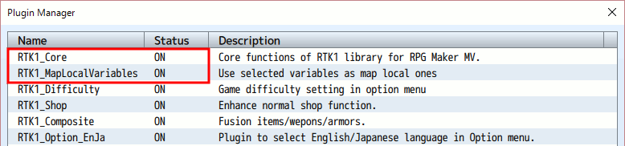
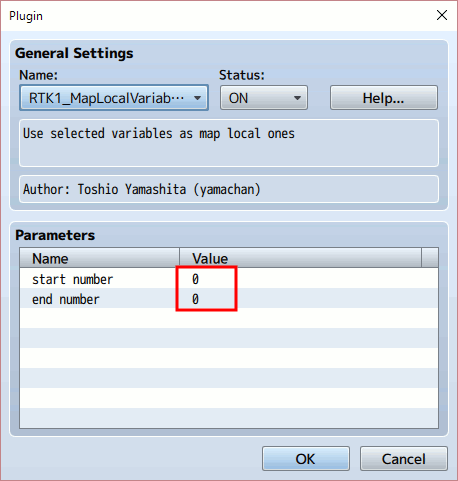
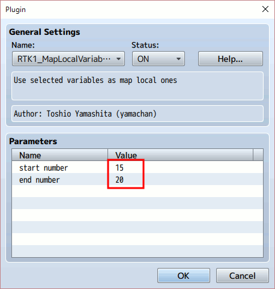
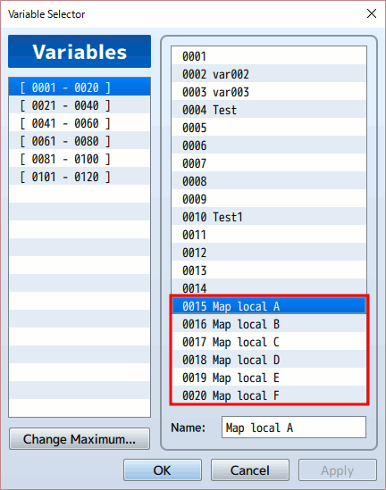
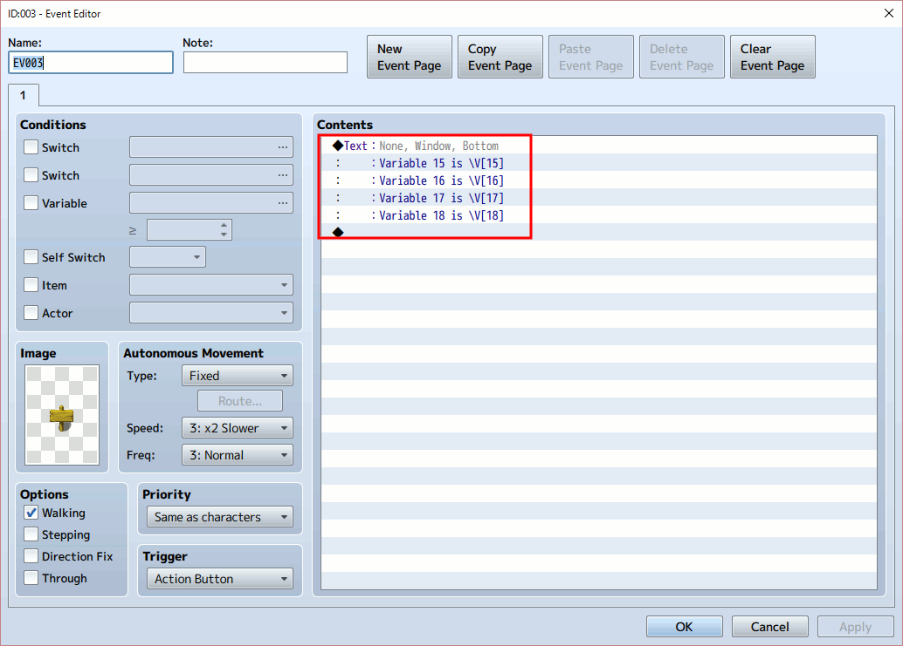
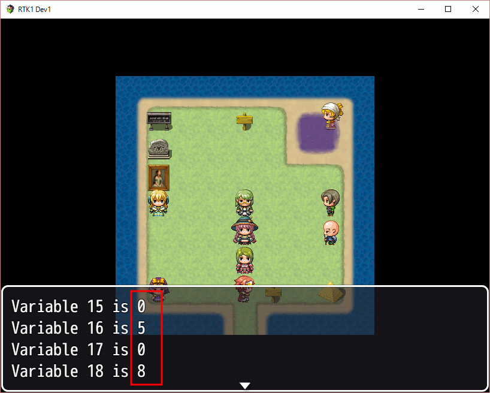
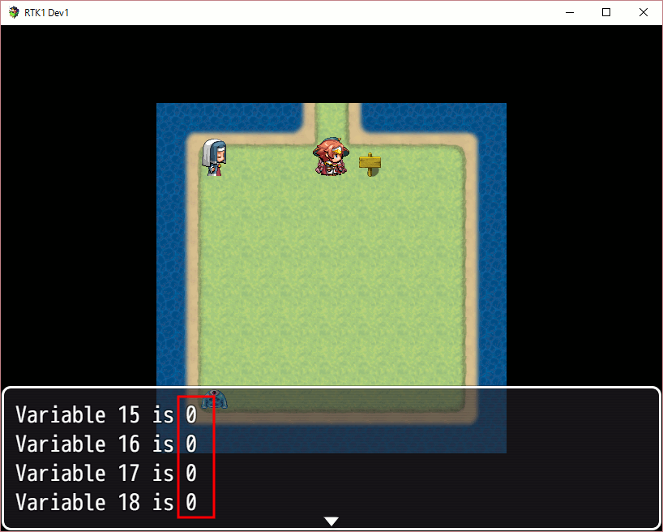
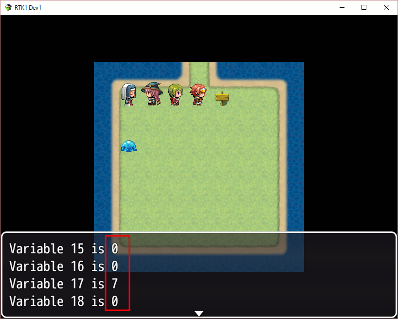

[Japanese version](RTK1_MapLocalVariables.ja.md) | [Back to toppage](README.md)

# [RTK1_MapLocalVariables](RTK1_MapLocalVariables.js) Plugin

Plugin to use selected variables as map local ones for RPG Maker MV.

Download:  [RTK1_MapLocalVariables.js](https://raw.githubusercontent.com/yamachan/jgss-hack/master/RTK1_MapLocalVariables.js)

## Overview

This plugin depends on [RTK1_Core plugin](RTK1_Core.jp.md). Please include it before this plugin, as follows;

The default plugin parameters are 0, the plugin doesn't avtive in this setting.

## Overview

At first, you should decide the variable range for the map local. In this document, I use variable 15 - 20 for this purpose.

You should set the range into the plugin parameters;

In addtion, I suggest to set the good and proper names against these game variables. For example, I use names from "Map local A" to "Map local F" as follows;

The map local variables is available for each map, and will use save file's space. So please try to keep the range size will be fit against your game. (But in face, this plugin has simple data compression logic)

## How about map local variables?

Map local variables are almost same as normal game variables. You can use them for your event commands, script values, event trigers, and so on.

But the following points are different;

* The map local variables change when you transfer the map
  * At the first entry into a map, all map local variables are set by 0
  * The map local variables are automatically saved when you transfer the map
  * At the 2nd or later entry into a map, all map local variables are recovered from saved area

Basically, you should use the map local variables only for values which are map unique and necessary to be saved.

## Sample to understand

For example, let's add a simple event which shows game variables;

Let's kick an event which change the game variabes, then check the game variable's values with the 1st event;

Let's move the another map, then check all local values became '0';

And in this map, the left-top sister event sets the game valiable 17 by 7. Let's talk with her, then check the game variable's values with the 1st event;

Now, the local map variables are set and availavle in each map.

Let's move among these 2 maps, and check the each variables keep map's local value. This situation will be kept, after save and load this game.

## Update history

| version | date | require | update |
| --- | --- | --- | --- |
| ver1.15 | 2016/07/17 | [RTK1_Core](RTK1_Core.ja.md) ver1.15 or later | Open |

## License

[The MIT License (MIT)](https://opensource.org/licenses/mit-license.php)

You don't need to display my copyright, if you keep my comments in .js files. Of course, I'll be happy, when you will display it. :-)

[Back to toppage](README.md)
