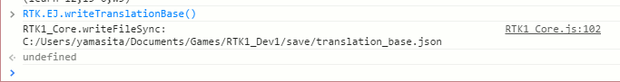
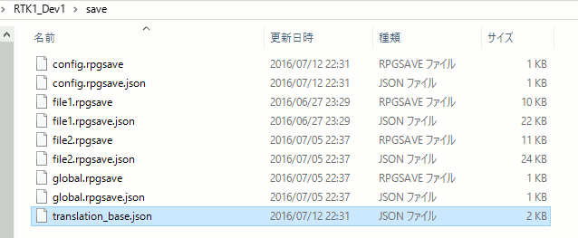

[Japanese version](RTK1_Option_EnJa.ja.md) | [Back to toppage](README.md)

# [RTK1_Option_EnJa](RTK1_Option_EnJa.js) Plugin

Plugin to select English/Japanese language in Option menu for RPG Maker MV.

Download: [RTK1_Option_EnJa.js](https://raw.githubusercontent.com/yamachan/jgss-hack/master/RTK1_Option_EnJa.js)

## Overview

I'm using English version of RPG Maker MV. I hope my son to play my game, but he can't read English well. So I need to handle Japanese text in my game.

This plugin support to develop the game which runs in both English and Japanese mode easily. You can add system level language support without any setting and coding. enjoy!

This plugin depends on [RTK1_Core plugin](RTK1_Core.jp.md). Please include it before this plugin, as follows;


The parameters are set by 0. Normally, you don't need to change it.


Finished!

Now, you can use Language setting in Option　menu from the title screen and the game menu. It will switch system language (basic terms) during English and Japanese.


The following is game screen in English mode.


The following is game screen in Japanese mode.


If system level (basic terms) translation is not enough for you, please read the following sections. You can translate more - avator name, class name, text message, and so on. This plugin has some functions which will support your development.

## switch parameter

If you need to know the language selection in game, you should use switch parameter of this plugin. For example, you can show English text in English mode, and Japanese text in Japanese mode.

In plugin setting, please set 1-999 value for switch parameter. The following sample set "8" value.


This value shows the number of switch in RPG maker MV. The switch will engage the language selection - it will be ON in Japanese mode, OFF in English mode.

In this case, let's set the intelligible name (Japanese_Mode) for the 8th switch.


Then, let's use this 8th switch (Japanese_Mode) for "IF..Else..End" block in the event contents;


The following is game screen in Japanese mode.


The following is game screen in English mode.


This is a simple coding style to support English/Japanese mode, and it looks enough for small games.

## Language change plugin command

This plugin has plugin commands to change the language mode. The following commands applys English mode;

* RTK1_Option_EnJa english
* RTK1_Option_EnJa en

The following commands applys Japanese mode;

* RTK1_Option_EnJa japanese
* RTK1_Option_EnJa ja

The following is the sample event which uses these plugin commands. When you talk with the blond girl, you will see the question about the language change.

This sample event also uses switch parameter which I described before.


The following is game screen in Japanese mode.


The following is game screen in English mode.


## hide parameter

If you don't allow players to change the language setting everytime, you should set the 'hide' plagin parameter to 1:ON. The option munu will hide "Language" option.

## Expand game data

Now, you can switch system language from English to Japanese. Next, let's switch the actor name, class name and so on. You can use the plugin's official method - tag text in note area.

For example, the following is a 'Class' tab of Database in English version RPG Maker MV. You can see the Japanese text with 'ja' tag, like  &lt;ja:勇者&gt; in the note are of 'Hero' class.


The actor name is same. The followng screen is the game which set Japanese tag note text into all actors/classes.


If you are using Japanese version RPG Make MV, the default data in Database is in Japanese, so you should input English note text with 'en' tag, like &lt;en:Hero&gt;.


You can set more than 2 texts with comma-separated format. For example, I set not only actor name, but also nickname and profile with the note 'ja' tag.


The following is the result screen in English mode. The actor's name, nickname and profile is same as the database setting.


The following is the result screen in Japanese mode. The actor's name, nickname and profile is replaced by 'ja' tag information in note area.


I show you another sample. Let's set a 'ja' tagged Japanese text into Portion item's note.


You can see the tagged text in the Japanese mode.


That's all. You can use &lt;ja:Japanese text&gt; and &lt;en:English text&gt; tag in each note area, to set the specific text depends on the lnaguage.

## Caution about expanded game data

You can use the event commands which change avator's name, nickname or profile. But you need to use them carefully.


If you use these commands, the system will replace both English and Japanese values. This is businesslike and safe work, and it doesn't have any bad effect to the current game.

For example, in an event, if you use 'Change Nickname...' event command with "Iron fist girl" value against Therese, her nickname will be set so in both English and Japanese mode.

With this plugin, if the value has '||' string in it, these event commands become the enhanced mode - left text will be set for English mode, right text will be set for Japanese mode.

I the Therese's case, you can use the value "Iron fist girl||鉄拳少女" to the event commands, so it will work well.

The following is the sample event about this;


The old man ask you the new name of actor1. The 2nd and 3rd answer contains English and Japanese name separated by '||' string.


If you choise the 2nd answer, the result is as follws in Japanese mode;


With this enhance, please use these event command as you like.

## Expanded type data

Same as name, nickname and profile of avator, the plugin enpands texts in 'Type' tab in Database.

The rule is also same, English and Japanese text separated by '||' string.


You can see the Japanese text (in red box in above screeenshot) is used in Japanese mode as follows;


## Language translation resource control

When you develop a big and long game, the number of resources also becomes big. In this case, you should add a translater into your team, and delegate the translation to him/her. This plugin has the functions to support this process.

### Language translation resource in plugin

At the end of [RTK1_Option_EnJa.js](RTK1_Option_EnJa.js) file, you can see the following code;

```js
M.translation = {
  "actors":[],
  "classes":[],
  "items":[],
  "weapons":[],
  "armors":[],
  "enemies":[],
  "troops":[],
  "skills":[],
  "states":[],
  "t_weapons":[],
  "t_armors":[],
  "t_equips":[],
  "t_skills":[],
  "t_elements":[]
};
```

This object (RTK.EJ.translation) will contain the translated resource - English texts for Japanese game or Japanese texts for English game. This plugin will read this object, and update switchable language resources in the plugin during its onStart initiation.

### Output the translation source file

To support the translation work, this plugin has a function to create the translation source file automatically. Start your new game with this plugin, then execute the following command (function) from RPG Maker MV's F8 console.

```js
RTK.EJ.writeTranslationBase()
```


After it、you can find a new 'translation_base.json' file in the 'save' folder.



If the original game is English mode, the following English text is written into this json file as follows.

```js
{
  "actors":[
    ["Harold","Sword boy","Teenage boy with red hair loves Sword."],
    ["Therese","Axe girl","Teenage girl with green hair loves Axe."],
    ["Marsha","Mysterious majic girl","Too mysterious..."],
    ["Lucius","Eye glasses priest","Too eye glasses..."]
  ],
  "classes":[
    "Hero",
    "Warrior",
    "Mage",
    "Priest"
  ],
  [omission]
}
```

You should send this json file to your translater. So the translater can translate it with Text editor or a kind of json tool, then send back to you.

### Apply the Language translation resource

You can update the plugin's js file directly with the translated JSON data. Or, you can register the translated JSON data from your own plugin. In this case, the following function is maybe useful.

```js
RTK.EJ.applyTranslation(
{
  // The translated JSON data is here
}
);
```

## message parameter

Expand text messege... (TBD)

## Maintenance Dictionary plugin command

(TBD)

## Update history

| version | date | require | update |
| --- | --- | --- | --- |
| ver1.13 | 2016/07/12 | [RTK1_Core](RTK1_Core.md)<br>ver1.13 or later | Support Language resource file |
| [ver1.04](archive/RTK1_Option_EnJa_v1.12.js) | 2016/07/10 | [RTK1_Core](RTK1_Core.md)<br>ver1.12 or later | Support Battle/Event Test mode |
| [ver1.04](archive/RTK1_Option_EnJa_v1.04.js) | 2016/06/27 | [RTK1_Core](RTK1_Core.md)<br>ver1.04 or later | Open |

## License

[The MIT License (MIT)](https://opensource.org/licenses/mit-license.php)

You don't need to display my copyright, if you keep my comments in .js files. Of course, I'll be happy, when you will display it. :-)

[Back to toppage](README.md)
