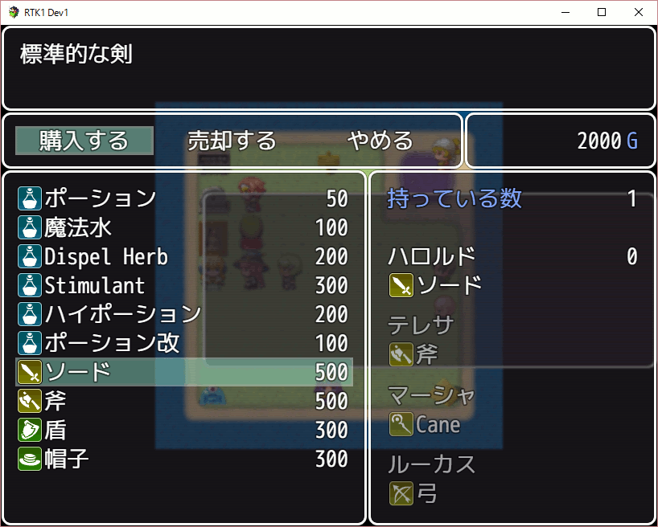
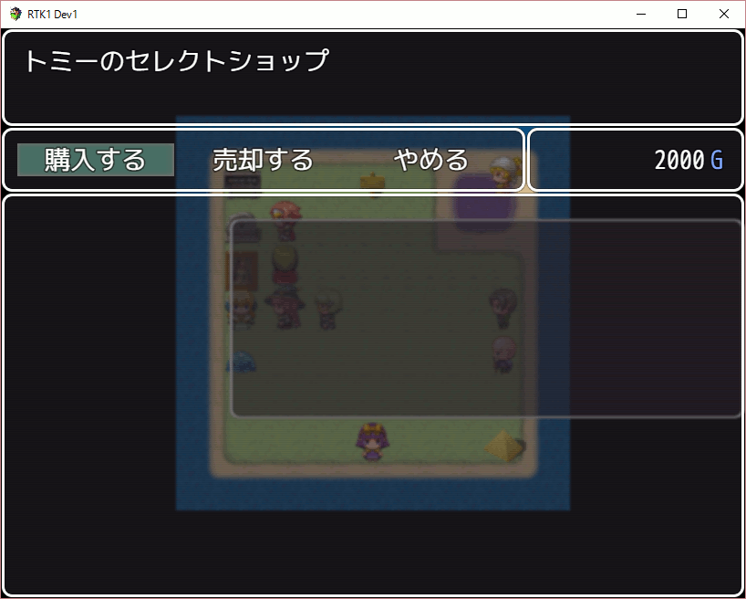

[English version](RTK1_Shop.md)

# [RTK1_Shop](RTK1_Shop.js) プラグイン

RPGツクール MV 用に作成した、標準のショップ機能を実現するプラグインです。

ダウンロード: [RTK1_Shop.js](https://raw.githubusercontent.com/yamachan/jgss-hack/master/RTK1_Shop.js)

## 概要

[RTK1_Core プラグイン](RTK1_Core.ja.md) を前提としていますので、先に読み込んでください。 なるべく新しいバージョンをダウンロードして使うようにしてください。


パラメータは全て初期値のままで、特に変更する必要はありません。


## 基本的な使い方

ショップを開くには、以下のようにイベントコマンドを使います。


私の場合、販売する商品の数が増えてくると、このショップの販売リストの管理を少し面倒に感じるようになりました。 ゲーム開発の終盤にアイテムを1つ新規追加したら、マップを全部みて各ショップのリストに加えていく、あたりの作業も時間がかかります。

合成機能のプラグイン([RTK1_Composite.js](RTK1_Composite.ja.md))を作成した時、'i1-8,w1-4,a1-4' など範囲指定できるようにしたのが便利でしたので、この指定方法を標準ショップでも利用できるようにしたのが本プラグインです。 それに加えて幾つか自分で望む機能を追加してみました。

本プラグインを導入すると、上記と同じ品揃えのショップを以下のプラグインコマンドで開くことができます。

```
RTK1_Shop open i1-6,w1-2,a1-2
```




i + 数値がアイテム、w + 数値が武器、a + 数値が防具で、数値はIDです。 カンマ(,)で値を区切り、ハイフン(-)でIDの範囲も指定できます。

特に販売する種類が多い場合、いちいちドロップダウンリストから1つ1つ選択していくより、だいぶ楽になるとおもいます。

また価格が 0 のものはリストに追加しませんので、データベース上で定義せずに飛ばした項目は表示されません。　序盤の店では i1-30、中盤の店では i20-40、終盤の店では i30-50 を販売する、などと使用するIDの範囲を最初から決めておくと、管理も容易ですし、ショップ定義も楽になります。

## 販売専用のショップ

イベントコマンドには販売専用のショップを設定できるフラグがあります。


プラグインコマンドでショップを開く際に、open の第2引数に true を指定すると同様に販売専用ショップになります。

```
RTK1_Shop open i1-6,w1-2,a1-2 true
```

この第2引数のデフォルト値は false で、省略すると売却もできる通常のショップになります。

## ショップ名の表示

ショップに名前があるほうが雰囲気がでる場合もあります。 以下のように第3引数にショップ名を指定すれば、購入・売却をしていない時はショップ名が上部に表示されるようになります。

```
RTK1_Shop open i1,i3-8 false トミーのセレクトショップ
```


ショップ名に空白スペースを含む場合には、かわりに "%20" を指定してください。

## 価格と売価のコントロール

イベントコマンドと違い、本プラグインのプラグインコマンドではアイテムごとの個別の価格を設定できません。データベースで設定した価格のままとなります。 売価は価格の半額です。

補助的な手段として "buy rate" と "sell rate" のプラグインパラメータを用意しました。


"buy rate" は購入価格の計算に使用される倍率です。 データベースで設定した価格に、この値を掛けたものがショップでの販売価格となります。 初期値は 1 ですので、データベースで設定した価格と同じ値になります。 これを 2 に変更すると、ショップで販売される価格は倍になります。

"sell rate" は売却価格の計算に使用される倍率です。 データベースで設定した価格に、この値を掛けたものがショップでの売却価格となります。 初期値は 0.5 ですので、データベースで設定した価格の半額となります。これを 0.8 に変更すると、元値の 80% の価格でショップに売却できます。

売却価格は、販売価格ではなく、データベースで設定された価格から計算されることに注意してください。例えば buy rate を 10 と大きくしたのに、sell rate が 0.5 のままだと、もともと 50G のポーションが 500G で販売されるのに対し、売却価格が 25G と低すぎる値になります。

buy rate と sell rate は、ゲーム中に以下のプラグインコマンドで変更することができます。 変更された値はセーブファイルに保存されます。

```
RTK1_Shop buy 1.2
RTK1_Shop sell 0.8
```

またゲーム用の変数の値を buy rate や sell rate に代入することができます。 この場合には switch (sw でも可) を併用して以下のように変数番号を指定してください。

```
RTK1_Shop buy switch 10
RTK1_Shop sell switch 11
```

マップに配置した自動実行のイベントや、マップ移動のイベントで buy rate や sell rate を設定するようにすれば、地方ごとの物価の違いが表現できるでしょう。

## より高度な使い方

### 商品リストのコントロール

ショップで販売される商品の一覧をコマンドでより細かくコントロールできます。

| コマンドと引数 | 説明 |
| --- | --- |
| clear | リストを空にする |
| clear item/weapon/armor | リストから指定された種類を全て削除する |
| complete | リストに全ての商品を追加する |
| complete item/weapon/armor | リストに指定された種類を全て追加する |
| add IDs | 指定された IDs の商品をリストに追加する |
| remove IDs | 指定された IDs の商品をリストから削除する |
| max_id #value | #value 以下の ID の商品を残し、他を削除する |
| min_id #value | #value 以上の ID の商品を残し、他を削除する |
| max_price #value | #value 以下の価格の商品を残し、他を削除する |
| min_price #value | #value 以上の価格の商品を残し、他を削除する |

事前に定義されたショップを開くには、商品の IDs を指定しません。 第二引数を指定したい場合には none を指定します。

```
RTK1_Shop open
RTK1_Shop open none true
RTK1_Shop open none false トミーのセレクトショップ
```

例えば、以下は 「100Gショップ」 を開くプラグインコマンドのリストになります。

```
RTK1_Shop clear
RTK1_Shop complete
RTK1_Shop max_price 100
RTK1_Shop min_price 100
RTK1_Shop open none true すべて%20100G%20のお店
```

### セット商品の登録と利用

商品リストのコントロールの際、セット商品の機能を利用すると更に便利です。

| コマンドと引数 | 説明 |
| --- | --- |
| set #name | 現在のリストの内容を商品セット #name として登録する<br>同じ #name を指定すると上書きします<br>リストが空の状態で実行すると #name 定義を削除します |
| add #name | 商品セット #name に含まれる商品をリストに追加する |
| remove #name | 商品セット #name に含まれる商品をリストから削除する |

商品セットはセーブファイルに保存されるため、ゲームの開始時に定義しておけば、ゲーム中はいつでも利用することができます。

例えば、以下は回復薬ばかりを含んだ "Potions" 商品セットを定義しています。

```
RTK1_Shop clear
RTK1_Shop add i1,i5-6
RTK1_Shop set Potions
```

以後は以下のようにいつでも、この商品セットを店の商品リストに加えることができます。

```
RTK1_Shop clear
RTK1_Shop add Portions
RTK1_Shop open none false 回復薬のお店
```

回復薬ばかりを含んだ "Potions" 商品セットは、ゲーム中に任意に再定義できます。 これをうまく使えば、新しい薬が発見されるたびに商店にも並ぶ、という仕組みが簡単に実現できるでしょう。

## 他プラグインとの連携

### RTK1_Difficulty プラグインとの連携

RTK1_Difficulty プラグインは 「とても簡単」から「とても難しい」まで5段階のゲーム難易度を提供します。

本プラグインはプラグインパラメータ 'difficulty buy rate' と 'difficulty sell rate' で連携します。 それぞれ初期値は 0 となっており、この状態ではゲーム難易度とは連携しません。


'difficulty buy rate' は商店での値段を調整しますが、設定した値によって商品の価格は以下のように変わります。

| 設定値 | とても簡単 | 簡単 | 普通 | 難しい | とても難しい |
| :---: | :---: | :---: | :---: | :---: | :---: |
| 0 | 100% | 100% | 100% | 100% | 100% |
| 0.05 | 90% | 95% | 100% | 105% | 110% |
| 0.1 | 80% | 90% | 100% | 110% | 120% |
| 0.2 | 60% | 80% | 100% | 120% | 140% |
| 0.3 | 40% | 70% | 100% | 130% | 160% |

'difficulty sell rate' は商店での販売価格を調整しますが、設定した値によって価格は以下のように変わります。

| 設定値 | とても簡単 | 簡単 | 普通 | 難しい | とても難しい |
| :---: | :---: | :---: | :---: | :---: | :---: |
| 0 | 100% | 100% | 100% | 100% | 100% |
| 0.05 | 110% | 105% | 100% | 95% | 90% |
| 0.1 | 120% | 110% | 100% | 90% | 80% |
| 0.2 | 140% | 120% | 100% | 80% | 60% |
| 0.3 | 160% | 130% | 100% | 70% | 40% |

難易度が高いほど、商品の価格は高くなり、販売価格は安くなります。 資金繰りが厳しくなるわけですね。

## 更新履歴

| バージョン | 公開日 | 必須ライブラリ | 更新内容 |
| --- | --- | --- | --- |
| ver1.14 | 2016/07/15 | [RTK1_Core](RTK1_Core.ja.md)<br>ver1.14 以降 | 公開 |

## ライセンス

[The MIT License (MIT)](https://opensource.org/licenses/mit-license.php) です。

提供されるjsファイルからコメント等を削除しないのであれば、著作権表示は不要です。 むろん表示いただくのは歓迎します！
