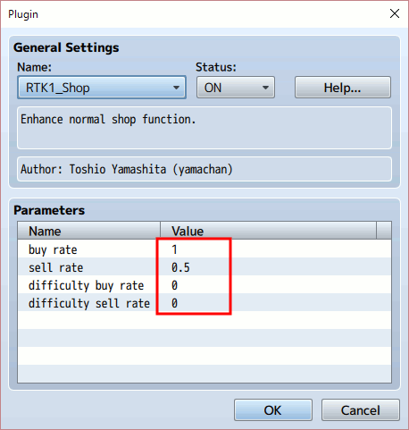
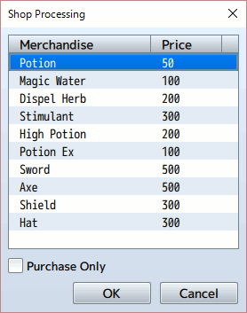
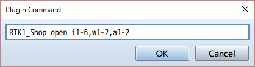
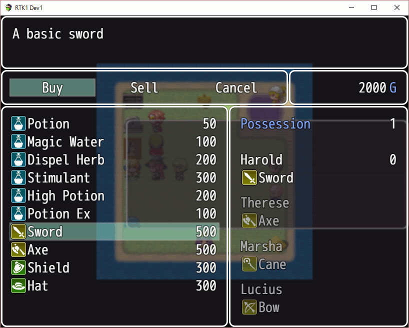
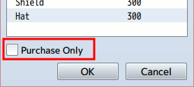
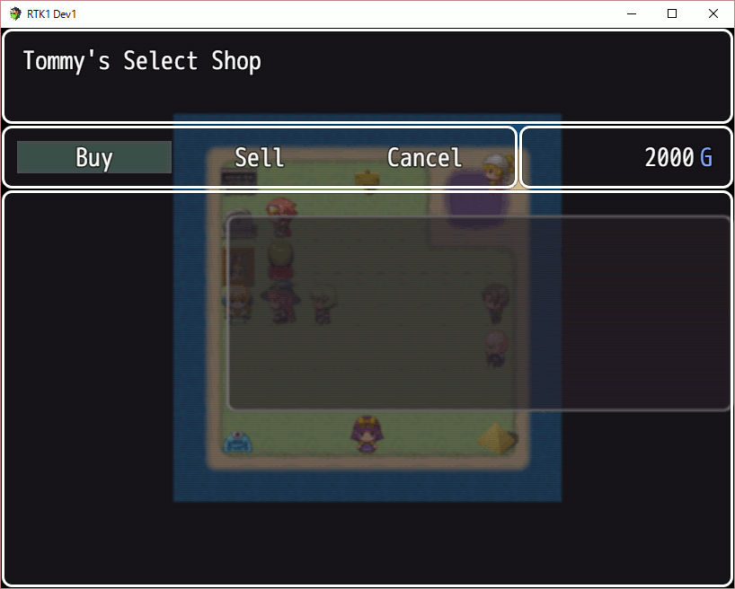
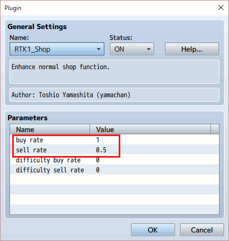

[Japanese version](RTK1_Shop.ja.md)

# [RTK1_Shop](RTK1_Shop.js) Plugin

Plugin to enhance the normal shop function for RPG Maker MV.

Download:  [RTK1_Shop.js](https://raw.githubusercontent.com/yamachan/jgss-hack/master/RTK1_Shop.js)

## Overview

This plugin depends on [RTK1_Core plugin](RTK1_Core.jp.md). Please include it before this plugin, as follows;


Normally, you don't need to change parameters.



## 1st step

To open the normal shop, you may use the following event command;



This is good - easy to understand. But for me, it looks a little bit dull when I must add lots of items.

In the other hand, I had developed a logic which can handle 'i1-8,w1-4,a1-4' type item list for [RTK1_Composite.js](RTK1_Composite.ja.md) plugin. It's good to handle lots of items. So I decided to bring this logic in the normal shop function.

With this plugin, you can use the following plagin command which opens the same shop as above;

```
RTK1_Shop open i1-6,w1-2,a1-2
```




'i + ID' is item, 'w + ID' is weapon and 'a + ID' is armor. And, a comma separates values, and a hyphen shows range of IDs.

This plagin command will skip the item which price is 0. So I suggest to decide the id range at first - for example, i1-30 are listed in shops at the 1st area, i20-40 are listed in the 2nd area, and i30-50 are listed in the last area. This is one good way to contol shops and items.

## Purchase only shop

The event command has a flag to set 'Purchase Only'.



The plugin command has a same flag at the 2nd argument. Please set 'true' as the 2nd argument, when you need a purchase only shop.

```
RTK1_Shop open i1-6,w1-2,a1-2 true
```

The default value of the 2nd argument is 'false'. So you can cut out it for the normal shop.

## Show shop name

If you want to set the shop name, set it as the 3rd argument as follows;

```
RTK1_Shop open i1,i3-8 false Tommy's%20Select%20Shop
```


If the shop name contains a white space, replace it by "%20" string.

## Control buy and sell price

In the event command, you can set each item's price. But you can't set it with the plugin command. You can use 'buy rate' and 'sell rate' plugin values instead.



'buy rate' is used for item's price in the shop. The original price (set in database) multiplied by this value is the shop price. The default value is 1, so the shop price is same as the original price.

'sell rate' is used for item's sell price in the shop. The original price (set in database) multiplied by this value is the shop sell price. The default value is 0.5, so the shop price is a half of the original price.

The shop sell price is calculated by the original price, not the sell price.

You can change these 'buy rate' and 'sell rate' values with following plugin commands;

```
RTK1_Shop buy 1.2
RTK1_Shop sell 0.8
```

In addtion, you can use the game valiables to set these values. You can set the valiable number with 'switch' or 'sw' keyword.

```
RTK1_Shop buy switch 10
RTK1_Shop sell switch 11
```

These values will be kept into the game save file.

If you set these 'buy rate' and 'sell rate' values in the map move event or map's autorun event, you can show the different commodity price in each area or country.

## Advanced

### Control the shop list

You can control the shop list more with following plugin commands;

| Command and arguments | description |
| --- | --- |
| clear | Clear the list |
| clear item/weapon/armor | Remove selected type from the list |
| complete | Add all to the list |
| complete item/weapon/armor | Add all selected type to the list |
| add IDs | Add IDs to the list |
| remove IDs | Remove IDs from the list |
| max_id #value | Remove items which ID is over #value |
| min_id #value | Remove items which ID is under #value |
| max_price #value | Remove items which price is over #value |
| min_price #value | Remove items which price is under #value |

With the controled shop list, you can open the shop as follows;

```
RTK1_Shop open
RTK1_Shop open none true
RTK1_Shop open none false Tommy's%20Select%20Shop
```

You don't needs IDs with the controled list, and use 'none' when you want to use the 2nd argument.

For example, the following command list will open "100G Shop".

```
RTK1_Shop clear
RTK1_Shop complete
RTK1_Shop max_price 100
RTK1_Shop min_price 100
RTK1_Shop open none true All%20100G%20Shop
```

### Use the set list

When you control the shop list, the set list function is very useful.

| Command and arguments | description |
| --- | --- |
| set #name | Save the current shop list as a set list #name<br>If there is the same #name in set list, it will be overwritten<br>If the shop list is empty, #name will be deleted |
| add #name | Add the set list #name to the shop list |
| remove #name | Remove the set list #name from the shop list |

The set list is kept in the save files. If you set some set lists at the game start, you will use them anytime you want in the game.

For example, the following plugin commands set "Potions" set list;

```
RTK1_Shop clear
RTK1_Shop add i1,i5-6
RTK1_Shop set Potions
```

Then, you can use this set list "Potions" anytime.

```
RTK1_Shop clear
RTK1_Shop add Portions
RTK1_Shop open none false Portion%20Shop
```

You can update this "Potions" set list anytime. For example, you can add a new portion into this set list in an event, then the all shop with this set list will list the new portion automatically.

## Relation with other plugins

### Relation with RTK1_Difficulty plugin

RTK1_Difficulty plugin adds 5 level game difficulty setting from 'Very Easy' to 'Very Hard' in option menu

This plugin relates with it by 'difficulty buy rate' and 'difficulty sell rate' plugin parameters. The default value of these parameters is '0', and it means no relation at the default setting.


'difficulty buy rate' affects the shop price, the rate value works with 5 levels as follows;

| rate | Very Easy | Easy | Normal | Hard | Very Hard |
| :---: | :---: | :---: | :---: | :---: | :---: |
| 0 | 100% | 100% | 100% | 100% | 100% |
| 0.05 | 90% | 95% | 100% | 105% | 110% |
| 0.1 | 80% | 90% | 100% | 110% | 120% |
| 0.2 | 60% | 80% | 100% | 120% | 140% |
| 0.3 | 40% | 70% | 100% | 130% | 160% |

'difficulty sell rate' affects the shop sell price, the rate value works with 5 levels as follows;

| rate | Very Easy | Easy | Normal | Hard | Very Hard |
| :---: | :---: | :---: | :---: | :---: | :---: |
| 0 | 100% | 100% | 100% | 100% | 100% |
| 0.05 | 110% | 105% | 100% | 95% | 90% |
| 0.1 | 120% | 110% | 100% | 90% | 80% |
| 0.2 | 140% | 120% | 100% | 80% | 60% |
| 0.3 | 160% | 130% | 100% | 70% | 40% |

In The Hard or Very Hard mode, the shop price becomes higher, and the sell price becomes lower. It makes the game play more difficult.

## Update history

| version | date | require | update |
| --- | --- | --- | --- |
| ver1.14 | 2016/07/15 | [RTK1_Core](RTK1_Core.md)<br>ver1.14 or later | Open |

## License

[The MIT License (MIT)](https://opensource.org/licenses/mit-license.php)

You don't need to display my copyright, if you keep my comments in .js files. Of course, I'll be happy, when you will display it. :-)
