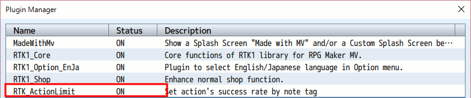
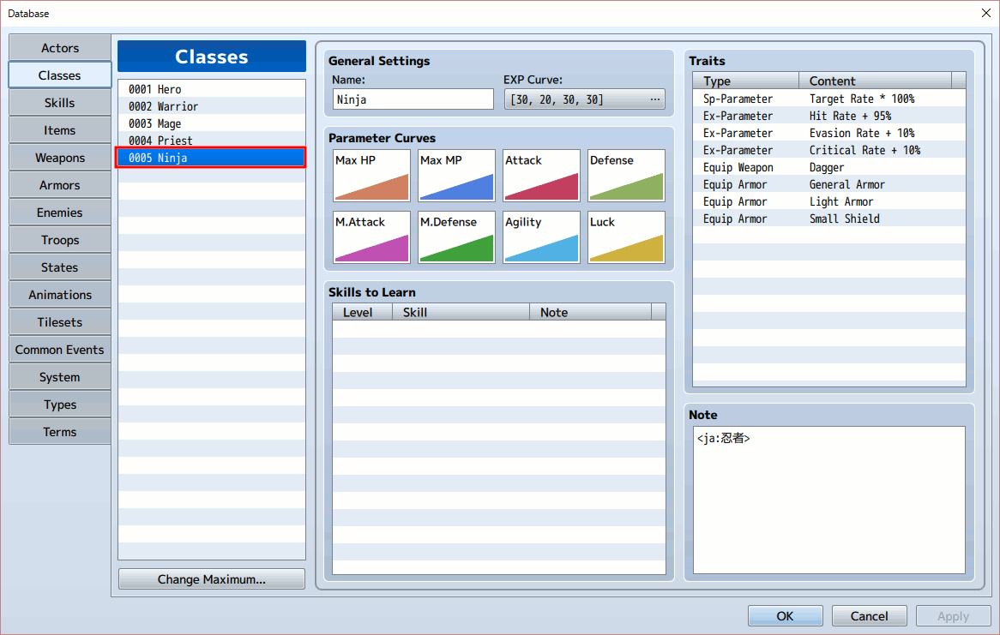
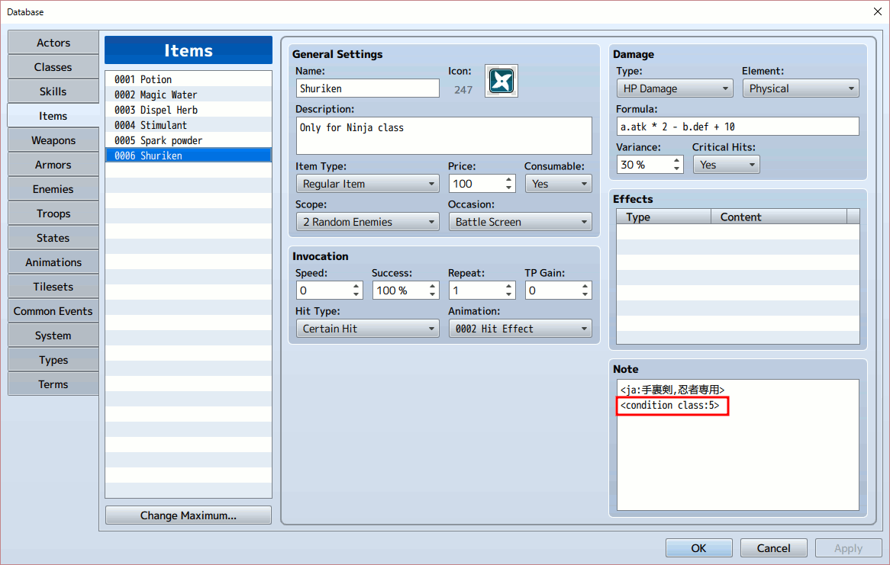
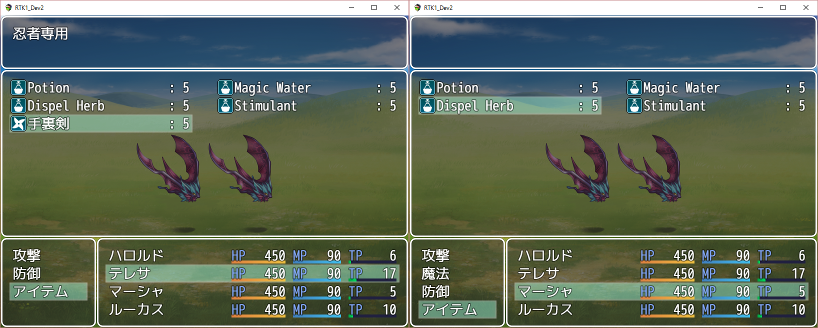
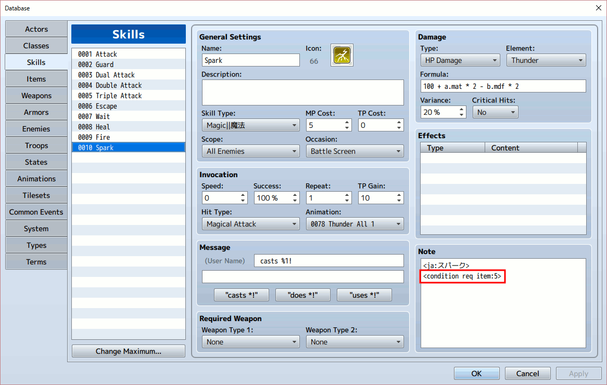
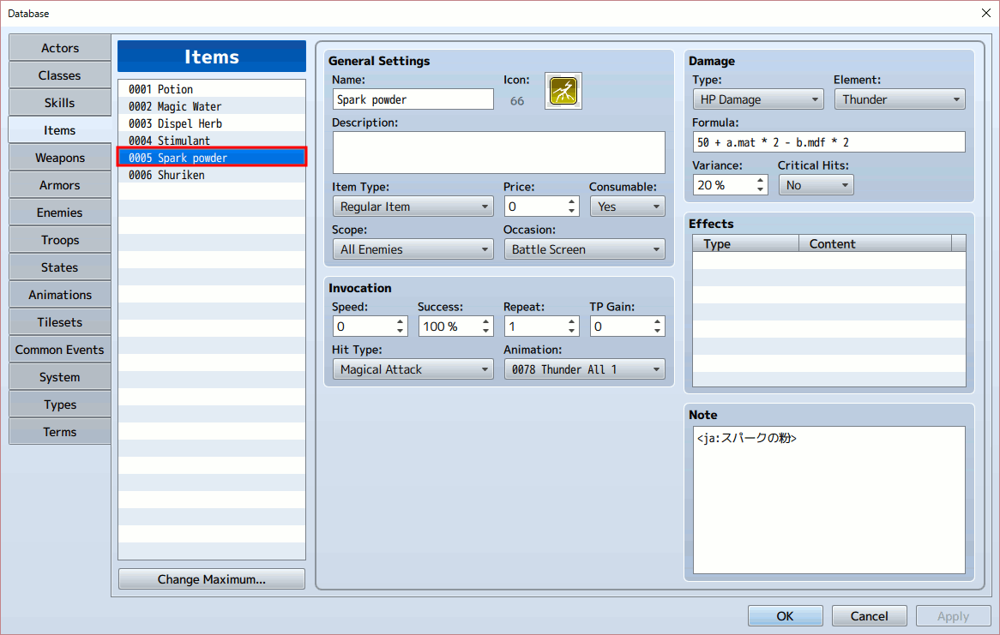

[トップページに戻る](README.ja.md)

# [RTK_ActionLimit](RTK_ActionLimit.js) プラグイン

RPGツクール MV 用に作成した、スキルやアイテムの利用条件を設定するためのプラグインです。

ダウンロード: [RTK_ActionLimit.js](https://raw.githubusercontent.com/yamachan/jgss-hack/master/RTK_ActionLimit.js)

## インストール

上記の js ファイルを RPGツクールMV　プロジェクトフォルダにある js/plugins フォルダに保存し、プラグインマネージャーで ON にしてください。



特に前提としている他のプラグインはありません。 基本的に置き換えている関数はありませんので、可能であればなるべく下のほうに配置してください。

## 基本的な使い方

あると特定のアイテムを利用できるキャラクターを限定してみましょう。
例えば「忍者」という職業(クラス)を新しく追加したとします。



この忍者用に「手裏剣」という攻撃用の消費アイテムを用意してみます。

本プラグインを使用すると、この「手裏剣」アイテムは忍者しか使えない、と設定することができます。
「手裏剣」のメモ欄に &lt;condition class:5&gt; と入力してください。



これで「手裏剣」は忍者専用のアイテムになりました。
以下が実際の戦闘画面です。



忍者であるテレサがアイテムを使用する時には「手裏剣」が表示されています。
それに対して、忍者ではないマーシャがアイテムを使用しようとしても、「手裏剣」が表示されていないことがわかります。

## 使用者を限定する

先ほどの「基本的な使い方」では、アイテムの利用者を以下のようにメモ欄で指定しました。

```
<condition class:5>
```

5はクラスの番号(ID)で、今回のサンプルでは「忍者」を示します。
このIDは複数指定でき、以下のようにカンマで区切って指定します。

```
<condition class:1,5>
```

この指定がされたアイテムは、クラスで1番に定義されている「勇者」と5番で定義されている「忍者」のどちらのクラスでも使用することができます。

クラスのかわりにアクターで指定することができ、その場合には class のかわりに actor キーワードを使用してください。
例えば2番のアクター、マーシャだけに使えるアイテムは以下のように指定します。

```
<condition actor:5>
```

この指定はアイテムだけでなくスキルにも有効ですが、スキルはクラスごとに定義できるので、あまり使われることは無さそうです。

例えば、主人公のハロルド君はとあるイベントで勇者専用のすっごーいスキルを教わるんだけど、このスキルには制限があって、ハロルド君が勇者の時しか使えない。他の職業に転職中はこのスキルは無効になっている。とまあ、そんな感じの設定ならば、スキルにプラグインの機能で制限することで実現できます。

## 前提条件を設定する

とても強力なスキルやアイテムだけど、いきなりは使えなくて、まずは準備が必要、ってパターンってありますよね。 前提条件による制限、も本プラグインで実現できます。

例えば最初から定義されている稲妻の魔法、「スパーク」のスキルですが、これに前提条件を設定してみましょう。
メモ欄に &lt;condition req item:5&gt; と入力してください。



これでこのスキル「スパーク」は自由には使えなくなりました。
まず事前準備として、戦闘中に5番のアイテムを使う必要があります。
5番のアイテムを使用した次のターンからようやく、「スパーク」のスキルが選択可能になります。

5番のアイテムも適当に定義しちゃいましょう。
こちらは特にメモ欄の設定は必要なく、スパークの前提条件なので「スパークの粉」としてみました。
使用すると威力の弱いスパークが敵を攻撃します。



今回はサンプルなので、この設定に深い意味はないですが…
まあ、スパークの粉で空間を帯電させ、雷の精霊を呼び出した後でないと、スパークの魔法が使えない、など適当に裏設定を考えてみてください。

また item を skill に置き換えると、スキルの使用を前提条件に設定することができます。

```
<condition req skill:5>
```

実際のゲームでは、例えば魔法陣を描くスキルの後でないと上級魔法が使えない、とか。
精神集中をした後でなければ奥義が使えない、とか。
いろいろ表現が可能だとおもいます。

刀のスキルで 「一の太刀 疾風突き」 の後でないと 「二の太刀 燕返し」 が使えない、などの設定も面白そうです。

## スイッチで使用を限定する

魔法禁止エリアに居たり、何らかの制約があり、一部のスキルやアイテムが使えない、という状況もあるとおもいます。
そこでスイッチによって利用を制限する機能を追加しました。

以下のようにメモ欄に設定すると、5番スイッチがONの時だけそのスキルやアイテムが使用可能になります。

```
<condition req switch:5>
```

イベントなどと連動して、プレイヤーの戦闘行動を制限したい場合などにご利用ください。

## 利用回数を限定する

あまりに強力なアイテムやスキルは、1回の戦闘中での利用数を制限したい場合があります。
この場合は対象のスキルやアイテムのメモ欄に以下のように入力します。

```
<condition max:1>
```

この設定だと、その対象のスキルやアイテムは、それぞれの戦闘中に1回しか利用できません。
1は利用できる回数で、2の値を設定すれば戦闘中に2回しか利用できません。

この利用回数ですが、オプションのタグを併用することで利用回数を増加することができます。

例えば以下のタグを同じメモ欄に入力すれば、戦闘中の利用回数は1回ですが、5ターンごとに1回づつ利用回数が増加します。

```
<condition max:1>
<condition max +turn:5>
```

この二つを指定されたスキルは、最初1回だけ利用でき、それ以後は選択できなくなります。
しかし先頭を続けていれば、6ターン目にもう1回、利用することができます。

ちなみにターン経過で単純に上限が上昇します。
よって該当スキルを1回も利用しないで戦闘を続けた場合、6ターン目以降ならば1ターンに2回利用する(2名のアクターが利用する)ことも可能です。

また最初は利用回数が少なくとも、レベルが上がれば利用回数が増える設定もできます。
例えば以下の設定ですと、最初は戦闘中に1回しか使えませんが、レベルが10を越えると戦闘中に2回、レベルが20を越えると戦闘中に3回、使用可能になります。

```
<condition max:1>
<condition max +level:10>
```

この判定で利用されるのは、各アクターのレベルではなく、それらのうち最大のレベルの値です。
よってレベルの低い弱いパーティでも、1人だけレベルの高いキャラが居ればそれが判定の対象となります。

## 補足事項

数値を指定するところで、'v'を数値の先に付けると、その数値の示すゲーム変数の値が代わりに使われます。
例えば以下は3番アクターのみが利用できる設定ですが

```
<condition actor:3>
```

以下のように記載すると、プラグインは3番変数の値を得て、その値が指定するアクターのみが利用できるようにします。

```
<condition actor:v3>
```

使用できない場合、アイテムはリストに表示されなくなります。
それに対し、スキルは表示はされますが、文字がグレーになって選択できなくなります。
これはシステムもともとの仕様ですし、使い切れば消えるアイテムに対し、消えないスキルは位置が変わると選択が面倒になるため、この仕様が妥当だとおもわれます。

利用制限は、コマンド入力の際のアイテムやスキル選択の部分を拡張して実現しています。
なのでコマンド選択以外、例えば混乱して自動でそのアイテムやスキルを使用しようとする、ことまでは阻止できません。
ただしこの場合、実行前のチェックでひっかかるので、その行動はスキップされ、何もしなかったことになるでしょう。

## 更新履歴

| バージョン | 公開日 | 必須ライブラリ | 更新内容 |
| --- | --- | --- | --- |
| ver1.02 | 2016/08/20 | なし | 利用回数の増加機能の追加<br>前提アイテム/スキル機能の追加 |
| [ver1.01](archive/RTK_ActionLimit_v1.01.js) | 2016/08/18 | なし | 公開 |

## ライセンス

[The MIT License (MIT)](https://opensource.org/licenses/mit-license.php) です。

提供されるjsファイルからコメント等を削除しないのであれば、著作権表示は不要です。 むろん表示いただくのは歓迎します！

[トップページに戻る](README.ja.md)
