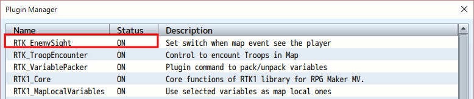
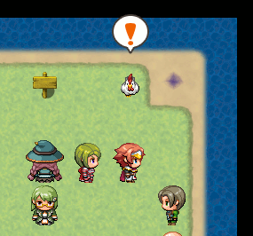
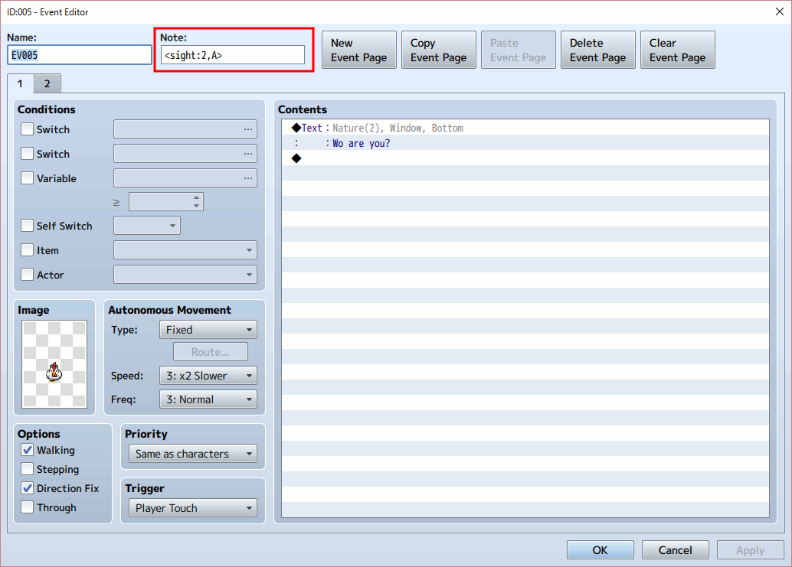
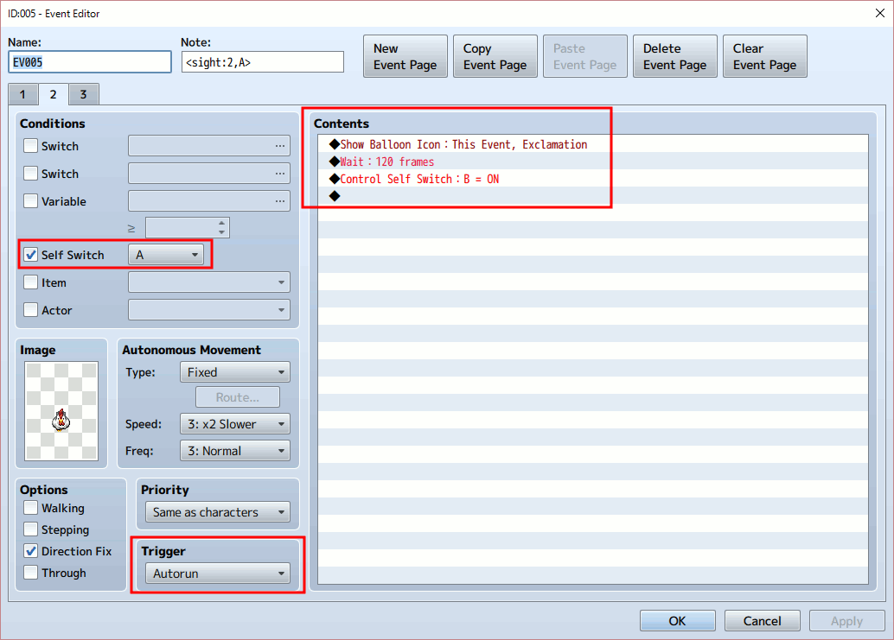
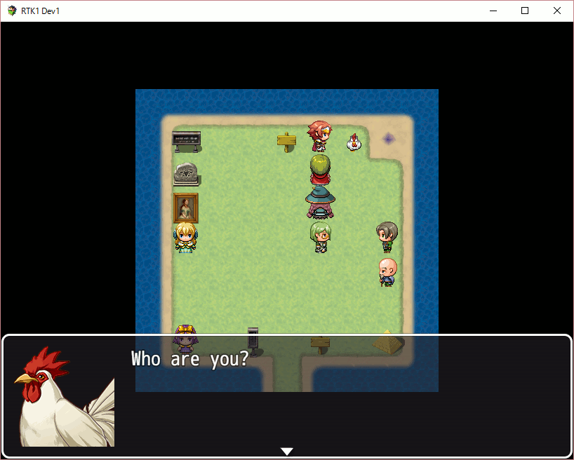
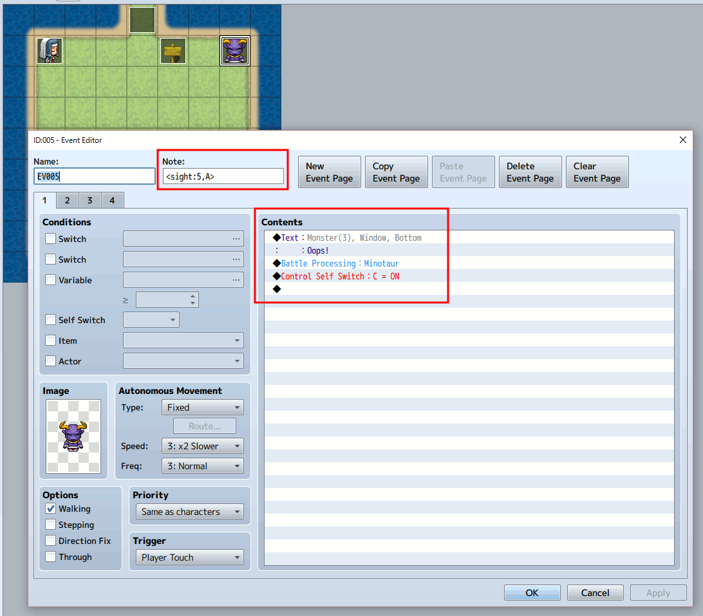
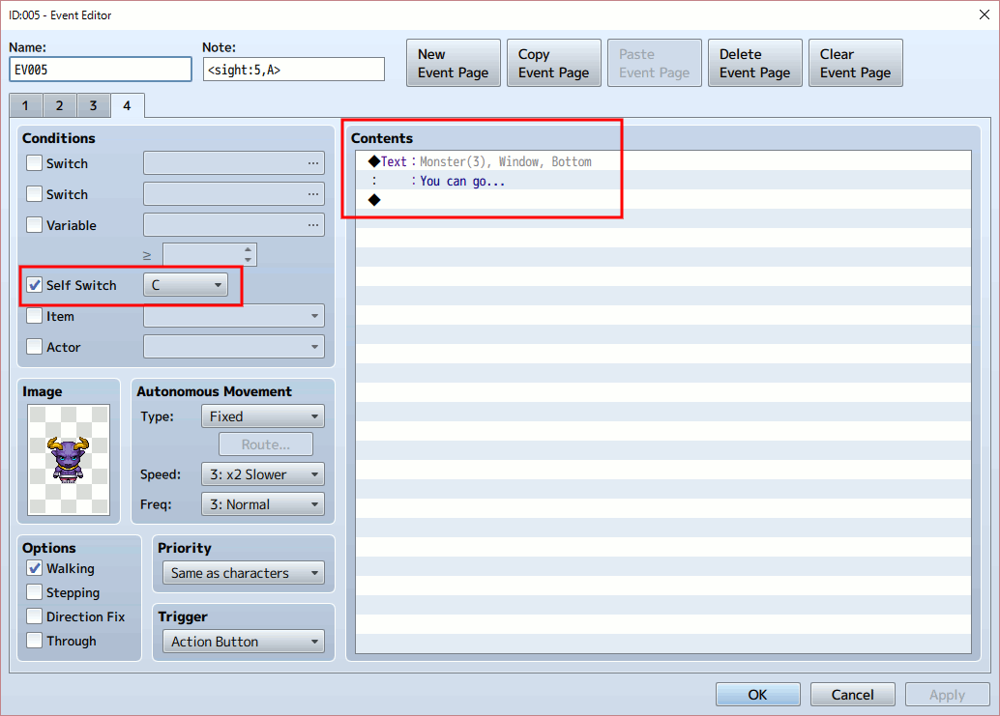
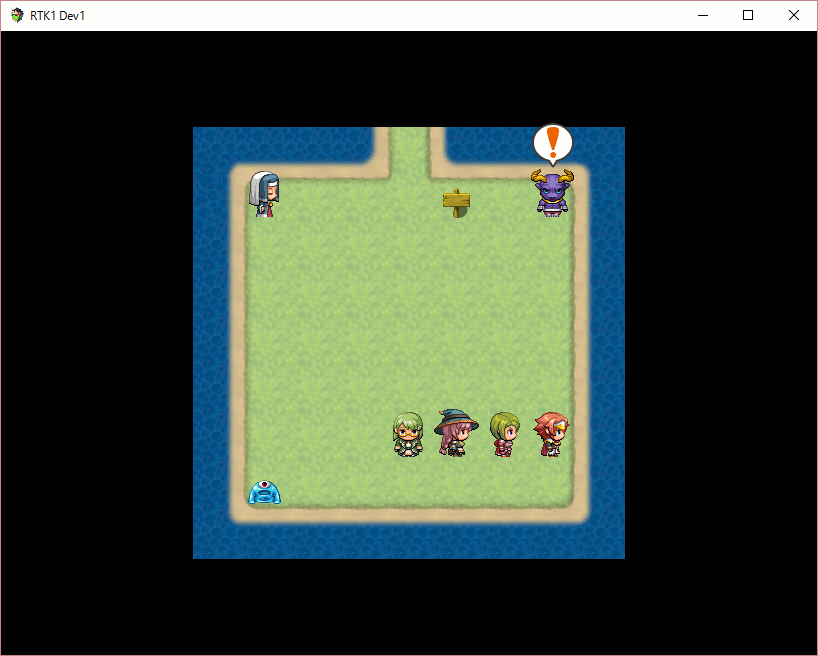
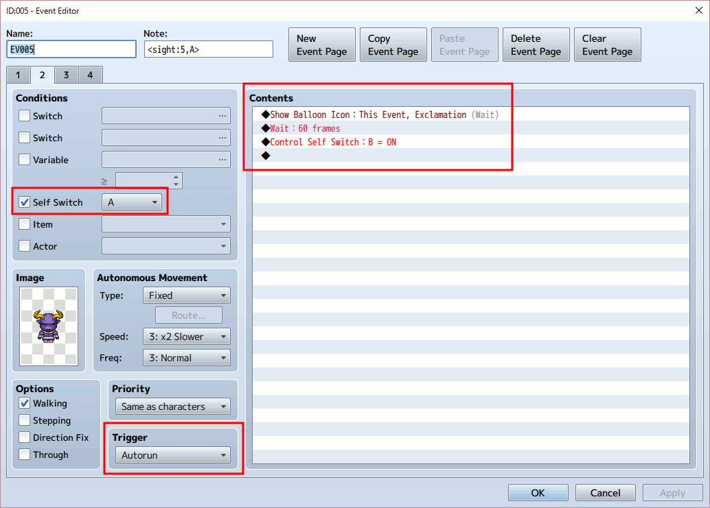
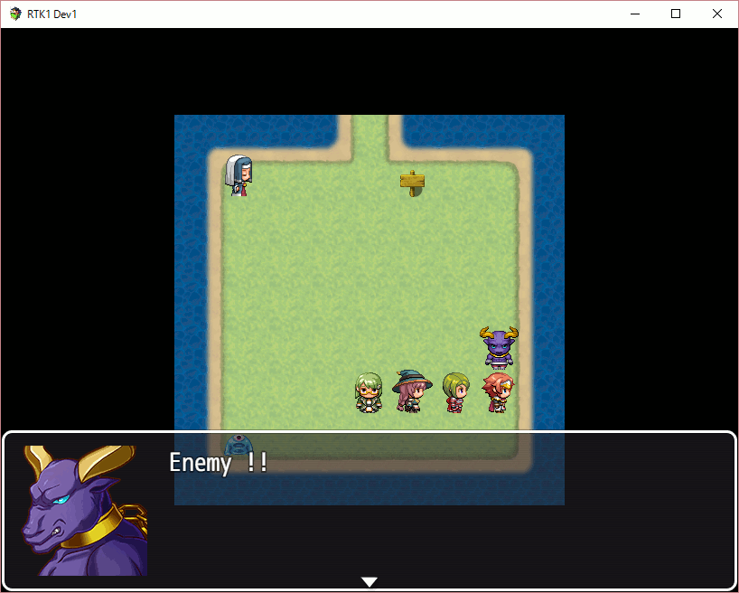

[トップページに戻る](README.ja.md)

# [RTK_EnemySight](RTK_EnemySight.js) プラグイン

RPGツクール MV 用に作成した、敵との遭遇(エンカウント)をコントロールするためのするための単独のプラグインです。

ダウンロード: [RTK_EnemySight.js](https://raw.githubusercontent.com/yamachan/jgss-hack/master/RTK_EnemySight.js)

## インストール

上記の js ファイルを RPGツクールMV　プロジェクトフォルダにある js/plugins フォルダに保存し、プラグインマネージャーで ON にしてください。

特に前提としている他のプラグインはありません。 基本的に置き換えている関数はありませんので、可能であればなるべく下のほうに配置してください。

## 基本的な使い方

まずは簡単な例として 「びっくりして消えるニワトリ」 を定義してみましょう。

このニワトリのイベント設定をみてみましょう。 赤枠のメモ欄に &lt;sight:2,A&gt; と入力してあるのがポイントです。

この  &lt;sight:2,A&gt; が本プラグイン用の指定で、'2' は視界の距離を示します。 つまりニワトリは、自分の目の前2マスだけが見えています。

次に指定されている 'A' はこのイベントのセルフスイッチを指定しています。 このニワトリが目の前にプレイヤーを見つけると、このセルフスイッチA が ON になります。

そしてセルフスイッチA が ON になったことにより、イベントの2ページ目に遷移します。

2ページ目のイベントのコンテンツには、プレイヤーを発見したときのニワトリの動作を指定します。 起動を自動実行(Autorun)にしておくのがポイントです。

イベント2ページ目の内容ですが、今回はビックリ(！)マークのバルーンを表示した後、120フレーム待ち、そしてセルフスイッチBをONにして空のページ3を有効にします。 つまりニワトリはプレイヤーを見てビックリ！し、ちょっとの間動きが止まった後、画面から消えます。

なおニワトリの視界ですが、まっすぐ前しか見えません。 なのでニワトリの前を横切らず、横からニワトリに触れると、このイベントの1ページに設定したメッセージが表示されます。

ニワトリを怖がらせないで、うまく話しかければ情報が得られる、って感じのイベントですね。

## 使い方の例

ポケモンのように 「目の前を通りがかると近寄ってきて、戦いを挑む」 敵キャラを設定してみます。

イベントの1ページ目は、さきほどのニワトリとほぼ同じです。 &lt;sight:5,A&gt; なので、視界が 5 と長めになっていますね。

プレイヤーから話しかけることも想定して、この1ページ目にも敵キャラの対応を設定します。 話しかけられたので 「Oops!」 と驚いてから、戦闘が始まることにしましょう。 戦闘が終了したらスイッチCをONにして、戦闘後の状態にします。

セルフスイッチCがONで表示される、4ページ目を先に見てみましょう。 戦闘が終わったので 「You can go...」 と弱々しく話すだけにします。

さて、敵の目の前をプレイヤーが通ったときの処理です。 本プラグインによってセルフスイッチA がONになって、イベントの2ページ目に遷移します。

さてこの2ページ目が、ポケモンっぽい対応をする部分の前編です。 まずは自動実行(Autorun)でイベントが開始し、ビックリ！マークのバルーンを表示して、セルフスイッチBをONにして3ページ目に遷移します。

3ページ目はポケモンっぽい対応をする部分の後編、です。 このイベントがプレイヤーめがけて移動してきます。

この3ページ目では、移動の設定がポイントです。 プレイヤーを追いかける設定で、かつ移動の頻度を上げることでプレイヤーにぐんぐん迫ってくる感が出ます。

そしてプレイヤーに追いつくとイベント内容が開始され 「Enemy !!」 と叫んで戦闘になり… って、実はこの部分、1ページ目のプレイヤーから話しかけた場合とセリフが違うだけなんです。

なので戦闘後はページ4に遷移し、話しかけると会話するだけのキャラになります。

以上、ポケモンっぽい敵キャラを定義してみました。

## 利用のアイデア

さきほどの 「ポケモンっぽい敵」 は、セルフスイッチを利用していて、プレイヤーに気がついた敵キャラだけが迫ってくる仕組みでした。

では先ほどと同様のイベントを5つほど画面に配置して、メモ欄のタグを &lt;sight:5,15&gt; のように、セルフスイッチではなく、通常のスイッチを ON にするよう変更したらどうなるでしょうか？ そして敵キャラはそのスイッチで追跡モードのページに遷移するとしたら？

そう、どれか1体の敵キャラの視界に入ってしまうと、5体全部がプレイヤーに襲い掛かってくる！ということになります。

貴重な宝箱の周りに、強そうなキャラが警備しており、もし見つかったら一斉に襲ってくる！敵キャラの視界を避けつつ、こっそり宝箱に近づく… という、ステルスゲームのような、もしくはパズルゲームのようなマップを作ってみたら、ちょっと楽しそうです。

## 更新履歴

| バージョン | 公開日 | 必須ライブラリ | 更新内容 |
| --- | --- | --- | --- |
| ver1.01 | 2016/07/16 | なし | ロジック修正 |
| [ver1.00](RTK_EnemySight_v1.00.js) | 2016/07/02 | なし | 公開 |

## ライセンス

[The MIT License (MIT)](https://opensource.org/licenses/mit-license.php) です。

提供されるjsファイルからコメント等を削除しないのであれば、著作権表示は不要です。 むろん表示いただくのは歓迎します！

[トップページに戻る](README.ja.md)
