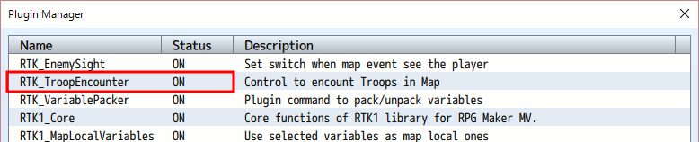
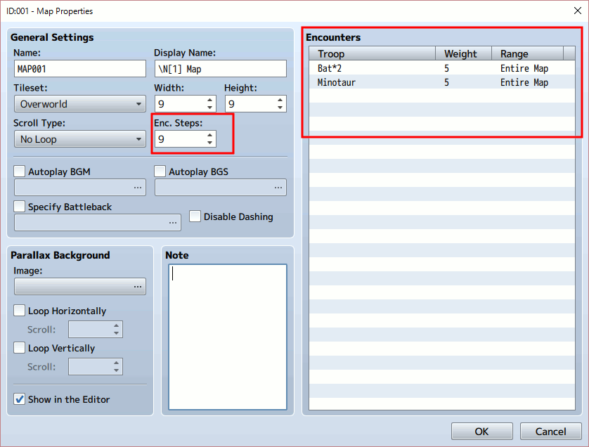
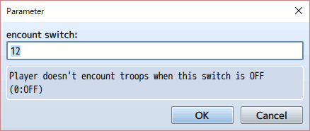
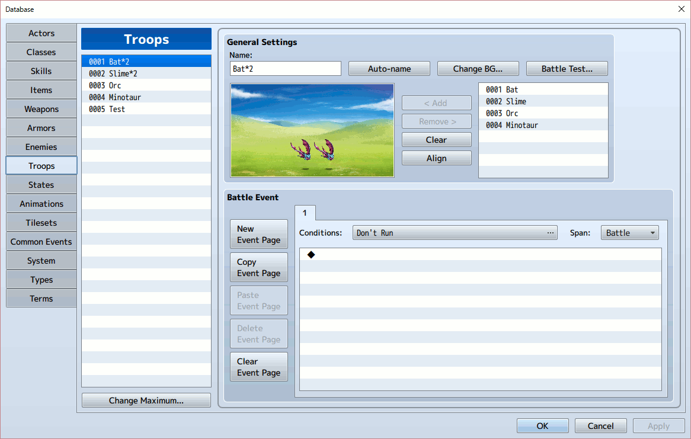
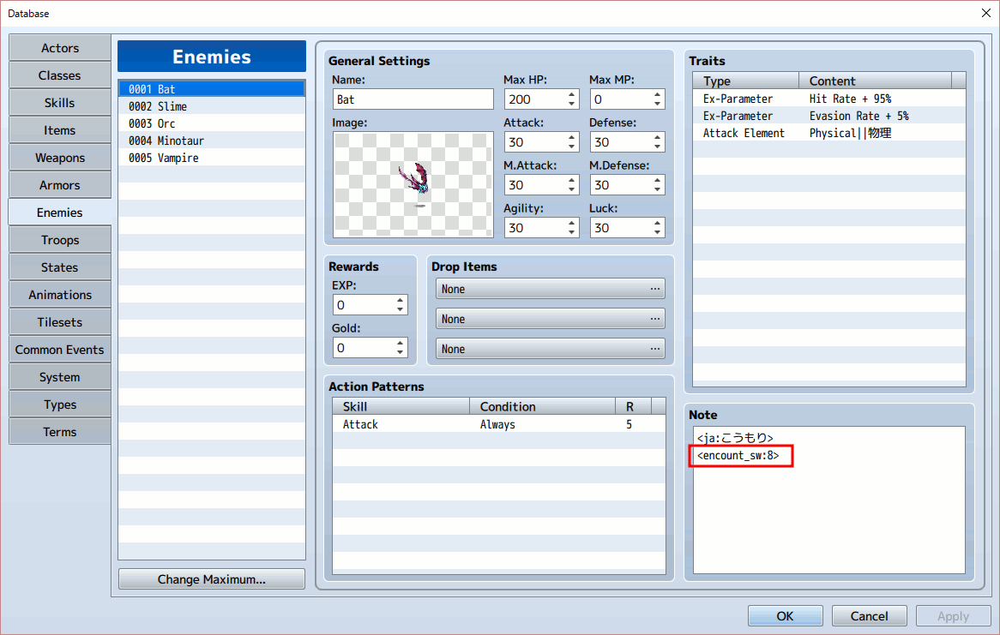
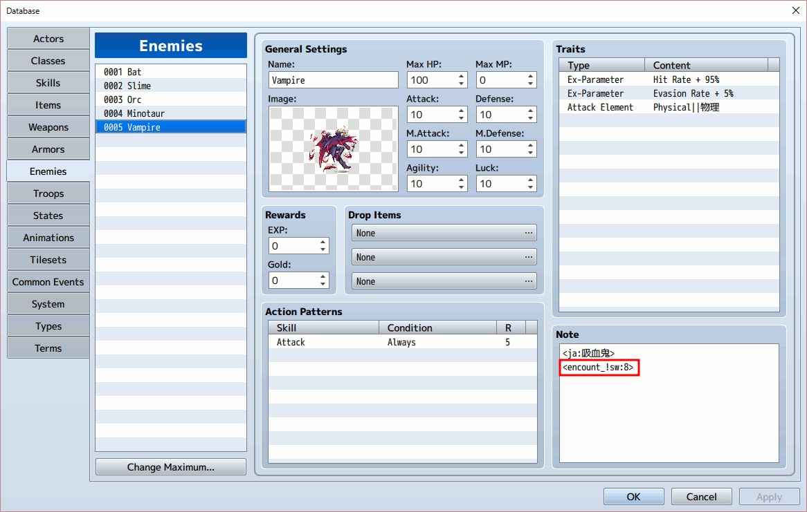
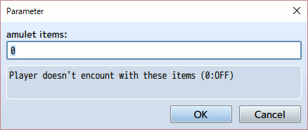
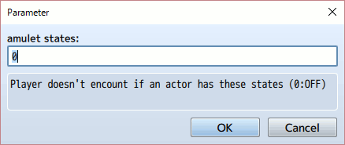

[トップページに戻る](README.ja.md)

# [RTK_TroopEncounter](RTK_TroopEncounter.js) プラグイン

RPGツクール MV 用に作成した、敵との遭遇(エンカウント)をコントロールするためのするための単独のプラグインです。

ダウンロード: [RTK_TroopEncounter.js](https://raw.githubusercontent.com/yamachan/jgss-hack/master/RTK_TroopEncounter.js)

## インストール

上記の js ファイルを RPGツクールMV　プロジェクトフォルダにある js/plugins フォルダに保存し、プラグインマネージャーで ON にしてください。



特に前提としている他のプラグインはありません。 基本的に置き換えている関数はありませんので、可能であればなるべく下のほうに配置してください。

## 概要

RPGツクールMV では、敵との遭遇をマップ画面で設定することができます。



このマップ画面では遭遇する敵グループの定義や、遭遇する場所、確率など詳細な設定をすることができます。 ただ欠点として、これらは全て静的な設定で、ゲーム中に柔軟に変更することが難しいです。

例えば私の制作しているゲームには昼と夜の概念があり、昼と夜では遭遇する敵の種類が異なります。 これを標準機能で実現するのはわりと難しいです。

本プラグインはスイッチなどと連動して、遭遇する敵の種類を切り替えることができます。

## 基本的なエンカウント制御

本プラグインには "encount switch" というプラグインパラメータがあり、初期値として 0 が指定されています。 ここでスイッチの番号を指定すれば、そのスイッチで敵との遭遇をコントロールすることができるようになります。



上記の設定では、スイッチ12 が敵との遭遇用のスイッチとなります。 このスイッチが ON の間は、これまで通りマップ上で敵グループとエンカウントします。 しかしこのスイッチが OFF の間は、マップ上を歩いても敵にはエンカウントしません。

例えばある平和な村があり、そのマップでは敵にエンカウントしないとします。しかしある出来事があり、村は荒れ果てしまい、その後は敵にエンカウントするようになってしまいました… といったシナリオを、この機能で実現することができます。

## 敵ごとのエンカウント制御

RPGツクールMVには敵グループ(Troop)という概念があり、データベースで定義することができます。



本当はこのレベルでエンカウントを制御したいのですが、残念ながら敵グループ設定にはメモ欄(Note)がありません。 そこで本プラグインでは、敵の設定画面にあるメモ欄を使用します。

敵のメモ欄に &lt;encount_sw:8&gt; と記載すると、この敵を含んだ敵グループはこのスイッチがONの時にしかエンカウントしなくなります。



この敵を含んだ敵グループをマップで指定した場合、「敵グループにエンカウントするが、この敵は含まれない」 のではなく 「この敵を含んだ敵グループとはエンカウントしない」 という仕様になっています。 間違いやすい部分なので注意してください。

さて、今回の例ではスイッチ8を指定しました。 この制作中のゲームには昼と夜の概念があり、スイッチ8 が ON の時は昼です。 夜にエンカウントする敵も設定してみましょう。



敵のメモ欄に &lt;encount_!sw:8&gt; と記載すると、この敵を含んだ敵グループはこのスイッチがOFFの時にしかエンカウントしなくなります。 さきほどとは逆ですね。

さてゲーム上では、こうもり(Bat)と吸血鬼(Vampire)を含んだ敵グループとの遭遇をマップに定義しておきましょう。 すると昼(スイッチ8がON)にはわりと安全でこうもりとエンカウントするマップが、夜(スイッチ8がOFF)には危険な吸血鬼とエンカウントするマップになります。夜は危険なので出歩くな、ってわけですね。

## アイテム所持によるエンカウント制御

本プラグインには "amulet items" というプラグインパラメータがあり、初期値として 0 が指定されています。



"amulet items" は 「魔除けのアイテム」 という意味で、ここで指定されたアイテムを所持している間、マップ上を歩いても敵とエンカウントしません。 指定する値はアイテムの ID で、カンマ(,)で区切って複数のアイテムを指定することができます。

またゲーム中に以下のプラグインコマンドを使用して、魔除けのアイテムの設定を変更することができます。 変更した値はセーブファイルに保存されますので、ゲームをセーブして中断しても維持されます。

```
RTK_TroopEncounter items #IDs
```

以下のプラグインコマンドは、上記のコマンドによる設定をクリアして、初期状態に戻します。

```
RTK_TroopEncounter items reset
```

## ステートによるエンカウント制御

本プラグインには "amulet states" というプラグインパラメータがあり、初期値として 0 が指定されています。



これは 「魔除けのアイテム」 のステート(状態)版で、パーティの中で誰かが指定したステートになっていれば、マップ上を歩いても敵とエンカウントしません。 指定する値はアイテムの ID で、カンマ(,)で区切って複数のアイテムを指定することができます。

例えば 「透明」 というステートを作成し、「透明スプレー」というアイテムを使うとパーティがこのステートになるとします。 この 「透明」 ステートの ID を上記のプラグインパラメーターに指定してあれば、透明である間はずっと敵とエンカウントしなくなります。

ステートは歩数で外れるように設定できますので、この機能と併用すると、ドラクエの聖水やトヘロスの呪文に近い機能が実現できそうです。

amulet states も amulet items と同様に、プラグインコマンドで対象を変更することが可能です。

```
RTK_TroopEncounter states #IDs
RTK_TroopEncounter states reset
```

## 更新履歴

| バージョン | 公開日 | 必須ライブラリ | 更新内容 |
| --- | --- | --- | --- |
| ver1.02 | 2016/07/18 | なし | amulet item 機能の追加<br>amulet states 機能の追加 |
| [ver1.01](RTK_TroopEncounter_v1.01.js) | 2016/07/16 | なし | encount switch パラメータ追加<br>!sw モードの追加 |
| [ver1.00](RTK_TroopEncounter_v1.00.js) | 2016/06/26 | なし | 公開 |

## ライセンス

[The MIT License (MIT)](https://opensource.org/licenses/mit-license.php) です。

提供されるjsファイルからコメント等を削除しないのであれば、著作権表示は不要です。 むろん表示いただくのは歓迎します！

[トップページに戻る](README.ja.md)
