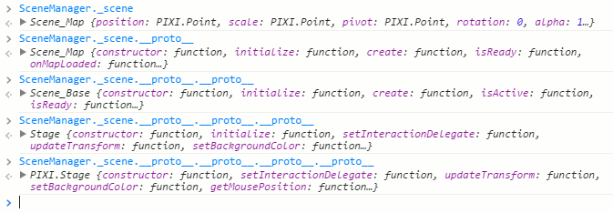
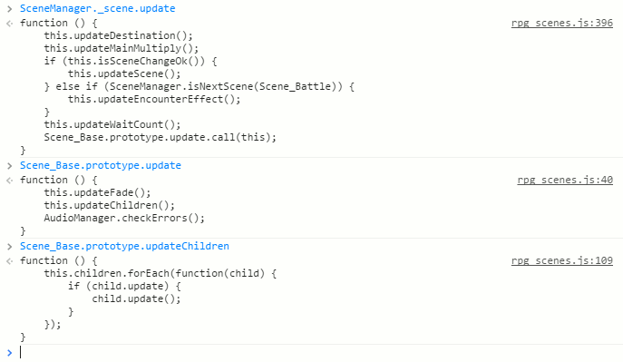
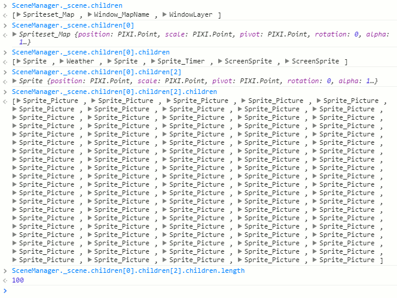
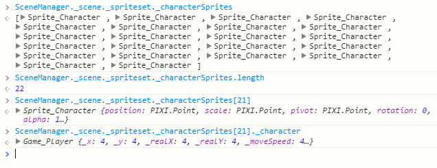
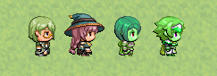

[トップページに戻る](../README.ja.md) | [前回の入門](plugin-dev-04.ja.md)

# RPGツクールMV プラグイン作成入門 (5)

RPGツクールMV で利用する JavaScript ベースの Game Scripting System (JGSS) で記述したプラグイン作成のための入門資料っぽい何か、です。 JS(JavaScript)の基本知識がある方が対象です。

## これまでの入門

[作成入門 (1)](plugin-dev-01.ja.md) と [作成入門 (2)](plugin-dev-02.ja.md) では、アクターやエネミーの名前の後にIDを追加表示する、シンプルなプラグインを完成しました。  [RTK_ShowID.js](RTK_ShowID.js) で完成したソースコードを参照できます。

[作成入門 (3)](plugin-dev-03.ja.md) ではグローバル変数の定義を説明し、前提となるプラグインをチェックする関数を定義してみて、また制御文字を使えるようにする拡張について説明しました。

[作成入門 (4)](plugin-dev-03.ja.md) ではプラグイン開発の環境に特有な、JavaScript言語の拡張のうち便利そうなものを幾つか紹介しました。

今回はRPGツクールMVの仕組みのなかでも特徴的な、画面表示に関して説明していきましょう。 ついでに簡単なプラグインも作成してみます。

## 画面表示について

[作成入門 (1)](plugin-dev-01.ja.md) で MVC(Model-View-Control)モデルの話をしましたが、View 説明は省いてしまっていました。 今回は View 部分について簡単に説明します。

* Model : ゲームの基本データ
  * RPGツクールMVにより自動生成されたデータファイルに格納されている
  * ゲーム開始時に読み込まれ $data変数に格納される
  * 単純なデータオブジェクト
  * 静的なデータでゲーム中では変更されない
* Control :
  * ゲームの状態をあらわす動的データ
  * セーブファイルで保持され、$game変数に格納される
  * Game系のクラスで実装されている
* View :
  * ゲーム要素を実際に画面に表示する役割
  * Sprite系のクラスで実装されている
  * Scene をベースにchildrenに子要素をリストした木構造で管理されている
  * Pixi.js の表示用の基本クラスをRPGツクールMV用にカスタマイズしたもの

実際のゲーム構築は三層構造になっています。

まず最下位に Model 層があり、Model 要素は Model 要素しか知りません。

その上に Control 層があり、Contorl 要素は必要な Model 要素を参照しつつ、他の Control 層の要素と連携してゲームを進行させます。 基本的に Contorl 層は上位のView層を知りません。

最上位に View層があり、Contorl 層の情報を参照しながら、それを画面上に表現していきます。

## 画像における三層構造

僕がプラグインを作成し始めたとき、最初に困惑したのが画面への表示部分です。 「基本的に Contorl 層は上位のView層を知りません」 ということに気がつくまで、かなりシステムのコードを読み込まないと駄目でした。

例えば、画像の表示のコードですが、プラグインからは以下の関数で簡単に画像表示が可能です。

```js
Game_Screen.prototype.showPicture = function(pictureId, name, origin, x, y, scaleX, scaleY, opacity, blendMode) {
    var realPictureId = this.realPictureId(pictureId);
    var picture = new Game_Picture();
    picture.show(name, origin, x, y, scaleX, scaleY, opacity, blendMode);
    this._pictures[realPictureId] = picture;
};
```
でもこれは Game_Picture クラスのインスタンスを生成しているだけで、実際の画像ファイルを読み込んだり、画面に表示したりする処理は含まれていません。 なので Game_Picture クラスのほうをみてみます。

```js
Game_Picture.prototype.initialize = function() {
    this.initBasic();
    this.initTarget();
    this.initTone();
    this.initRotation();
};

Game_Picture.prototype.show = function(name, origin, x, y, scaleX, scaleY, opacity, blendMode) {
    this._name = name;
    this._origin = origin;
    this._x = x;
    this._y = y;
    this._scaleX = scaleX;
    this._scaleY = scaleY;
    this._opacity = opacity;
    this._blendMode = blendMode;
    this.initTarget();
    this.initTone();
    this.initRotation();
};
```

驚くことに、画像ファイルの読み込みも、表示も、コードが見当たらないのです。 最初に調べた時は、ここで八方塞がりになり、途方に暮れました…

## View 層の発見

いったんは画像表示を理解することを諦めた僕ですが、突破口は意外なところにありました。 Scene の親クラスに Pixi.Stage があることに気がついたのです。



Pixi.Stage は Pixi.js の表示のベースとなるクラスですから、そこから children を辿って Pixi 側の構成が確認できます。 そしてこれが、前回見失った表示部分、View 層の発見でもありました。

以下は当時の探求の様子を、最初の部分だけ再現したものです。 children に格納された子要素の update が順に呼ばれていくのがわかります。



同様に children の階層を確認したときの再現です。 以下が目的のスプライトたち…



そう、これが画像表示用にあらかじめ用意されていた Sprite_Picture オブジェクトの配列です。 100個あります。 イベントコマンドの管理番号が1～100に制限されている理由が理解できた瞬間でした。

なおこの配列ですが、 SceneManager.\_scene.\_spriteset.\_pictureContainer.children で得られるものと同じようにみえます。 またこれら配列では各オブジェクトの \_pictureId 値と配列中のインデックスにズレがあるので注意が必要です。 配列の最初のオブジェクトの \_pictureId が 1 になっています。

## View 層の更新

さて、これら100個用意された Sprite_Picture オブジェクトですが、画面更新のたびに update() されています。 コードをみてみましょう。

```js
Sprite_Picture.prototype.update = function() {
    Sprite.prototype.update.call(this);
    this.updateBitmap();
    if (this.visible) {
        this.updateOrigin();
        this.updatePosition();
        this.updateScale();
        this.updateTone();
        this.updateOther();
    }
};

Sprite_Picture.prototype.updateBitmap = function() {
    var picture = this.picture();
    if (picture) {
        var pictureName = picture.name();
        if (this._pictureName !== pictureName) {
            this._pictureName = pictureName;
            this.loadBitmap();
        }
        this.visible = true;
    } else {
        this._pictureName = '';
        this.bitmap = null;
        this.visible = false;
    }
};

Sprite_Picture.prototype.picture = function() {
    return $gameScreen.picture(this._pictureId);
};
Sprite_Picture.prototype.loadBitmap = function() {
    this.bitmap = ImageManager.loadPicture(this._pictureName);
};
ImageManager.loadPicture = function(filename, hue) {
    return this.loadBitmap('img/pictures/', filename, hue, true);
};
```

ここで $gameScreen がでてきて、やっと関連性が把握できました！

Control 層である $gameScreen.picture()、つまり Game_Picture クラスからコードを追うのは無理だったのです。 何故なら View 層の Sprite_Picture のことなんて知らないから。

View 層の Sprite_Picture のほうが一方的に、Control 層の Game_Picture を知っていて参照していたのです。 その際に picture の name に応じた bitmap のロードまで面倒をみてくれていました。

例えば利用側が画像を表示しようと $gameScreen.showPicture() を実行すると、Control 側の Game_Picture 情報は確かに更新されますが、この段階ではまだ画面に影響はありません。 その後で別途、画面更新のタイミングで Sprite_Picture の更新が呼ばれ、その中で bitmap の読みこみや画面表示など、実際の描画処理に関わるコードが全て実行されます。

Game_Picture の情報更新と、Sprite_Picture の画面反映は別の処理で、非同期で実施されている、が正しい理解のようです。

## 簡単なプラグイン

おおまかな仕組みが理解できたところで、簡単なプラグインを作成してみましょう。 [作成入門 (3)](plugin-dev-03.ja.md) で作りかけのサンプルプラグインにコードを追加していきます。

スクリプトから画像を表示したい場合、以下の関数を利用すれば簡単です。

```js
$gameScreen.showPicture(pictureId, name, origin, x, y, scaleX, scaleY, opacity, blendMode);
```

前から少し不満だったのは、pictureId の管理です。 空いている番号を探すのがけっこう面倒ではありませんか？ そこでプラグインの RTK_Sample グローバル変数に以下の便利関数を定義してみましょう。

```js
RTK_Sample.nextPictureId = function(){
  for (var l=1; l<=100; l++) {
    if (!$gameScreen._pictures[l]) {
      return l;
    }
  }
  return 0;
};
```

RTK_Sample.nextPictureId() 関数は $gameScreen.\_pictures 配列をチェックし、未使用の pictureId を探してくれる関数です。 空きがない場合には 0 を返します。

これで問題なさそうですが、実はバトルテストの際に問題が発生します。 IDには以下のようなルールがあるからです。

```js
Game_Screen.prototype.realPictureId = function(pictureId) {
    if ($gameParty.inBattle()) {
        return pictureId + this.maxPictures();
    } else {
        return pictureId;
    }
};
Game_Screen.prototype.maxPictures = function() {
    return 100;
};
```

この関数で得た知識を、さきほどの便利関数に反映してみましょう。 最大数も変化することも考慮して、例えば以下はどうでしょうか。

```js
RTK_Sample.nextPictureId = function(){
  var start = $gameScreen.realPictureId(1);
  var end = $gameScreen.realPictureId($gameScreen.maxPictures());
  for (var l=start; l<=end; l++) {
    if (!$gameScreen._pictures[l]) {
      return l - start + 1;
    }
  }
  return 0;
};
```

うん、なかなか便利な関数になりましたね。 もし良かったら使ってみてください。

## アクターを探せ！

今度はマップ画面のアクターの画像を少し弄ってみたいですね。 どこにあるのでしょう？

Scene_Map の初期化部分を探してみると…　うん、ここでしょうね。

```js
Scene_Map.prototype.createSpriteset = function() {
    this._spriteset = new Spriteset_Map();
    this.addChild(this._spriteset);
};

Spriteset_Map.prototype.createCharacters = function() {
    this._characterSprites = [];
    $gameMap.events().forEach(function(event) {
        this._characterSprites.push(new Sprite_Character(event));
    }, this);
    $gameMap.vehicles().forEach(function(vehicle) {
        this._characterSprites.push(new Sprite_Character(vehicle));
    }, this);
    $gamePlayer.followers().reverseEach(function(follower) {
        this._characterSprites.push(new Sprite_Character(follower));
    }, this);
    this._characterSprites.push(new Sprite_Character($gamePlayer));
    for (var i = 0; i < this._characterSprites.length; i++) {
        this._tilemap.addChild(this._characterSprites[i]);
    }
};
```

コンソールで確認しましたが、やはり \_characterSprites の最後がプレイヤーのようですね。



よーし、これを使って悪戯してみましょう。

```js
var _Scene_Map_updateMain = Scene_Map.prototype.updateMain;
Scene_Map.prototype.updateMain = function() {
  _Scene_Map_updateMain.call(this);
  var splist = SceneManager._scene._spriteset._characterSprites;
  var sp = splist[splist.length - 1];
  if (Graphics.frameCount % 100 == 0 && sp._bitmap) {
    sp._bitmap.rotateHue(45);
  }
};
```

どこでも良いのですが、マップ画面で定期的に呼び出される関数を拡張し、プレイヤーの使用画像を探して、rotateHue で色調を変化させます。 今回は100フレームごとにHueを45度回転させているので、800フレームごとに元の色に戻るはず。

さて実行してみましょう。



うん、うまく色調は変化していますが、二人目のキャラクターも同時に色調が変化しています…

実はこれらの2つのキャラクター、定義されているpng画像が同じなんです。 なので内部で使用している bitmap も同じ。 よって色調の変化が両方にあらわれてしまいます。 タイル形式の画像、つまり1つの大きな画像に複数の小さな画像をまとめたものは、bitmap の扱いに注意する必要がありそうですね。

まあ、悪戯ですし、今回はこれで良しとします。

## 今回のコード

今回、ご紹介したプラグインのコードをあわせると、以下のようになります。

```js
//=============================================================================
// RTK_Test.js	2016/08/02
// The MIT License (MIT)
//=============================================================================

/*:
 * @plugindesc テスト用プラグイン
 * @author Toshio Yamashita (yamachan)
 *
 * @help このプラグインにはプラグインコマンドはありません。
 * テスト用に作成したものなので、実際に利用する場合には適当にリネームしてください
 */

(function(_global) {
	// ここにプラグイン処理を記載
	var N = 'RTK_Test';
	var param = PluginManager.parameters(N);

	_global["RTK_Sample"] = _global["RTK_Sample"] || {};
	RTK_Sample.hasPlugin = function(_name){
		return !!PluginManager._parameters[_name.toLowerCase()];      
	}

	var _Scene_Map_createMapNameWindow = Scene_Map.prototype.createMapNameWindow;
	Scene_Map.prototype.createMapNameWindow = function() {
		var ret = _Scene_Map_createMapNameWindow.call(this);
		this._mapNameWindow.drawText = function(text, x, y, maxWidth, align) {
			text = this.convertEscapeCharacters(text);
			return Window_MapName.prototype.drawText.call(this, text, x, y, maxWidth, align);
		}
		return ret;
	};

	// ここから第5回のサンプル

	RTK_Sample.nextPictureId = function(){
		var start = $gameScreen.realPictureId(1);
		var end = $gameScreen.realPictureId($gameScreen.maxPictures());
		for (var l=start; l<=end; l++) {
			if (!$gameScreen._pictures[l]) {
				return l - start + 1;
			}
		}
		return 0;
	};

	var _Scene_Map_updateMain = Scene_Map.prototype.updateMain;
	Scene_Map.prototype.updateMain = function() {
		_Scene_Map_updateMain.call(this);
		var splist = SceneManager._scene._spriteset._characterSprites;
		var sp = splist[splist.length - 1];
		if (Graphics.frameCount % 100 == 0 && sp._bitmap) {
			sp._bitmap.rotateHue(45);
		}
	};
})(this);
```

ではまた！

[トップページに戻る](../README.ja.md) | [前回の入門](plugin-dev-04.ja.md)
