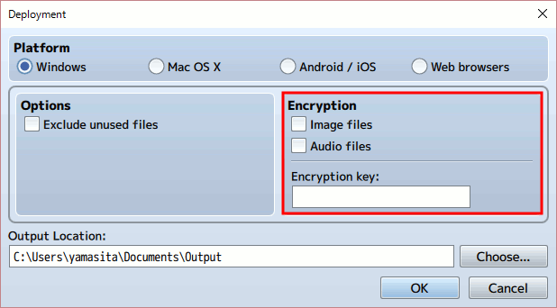

[トップページに戻る](../README.ja.md)

# RPGツクールMV ver1.3.1 メモ (1)

RPGツクールMVも ver1.3.1 になり、pixi.js が ver4.0.0 ベースになるなど、大きな変更があったようです。
プラグイン開発に影響が出ないか、従来のプラグインの動作に問題が出ないか、少し気になりますね。
コードをざっとみて、修正点を確認してみたいとおもいます。

## plugins.js

プロジェクトを新規作成すると、スプラッシュ画面を表示するプラグインが自動で設定されるようになったようです。

```js
var $plugins = [
  {
    "name":"MadeWithMv",
    "status":true,
    "description":"Show a Splash Screen \"Made with MV\" and/or a Custom Splash Screen before going to main screen.",
    "parameters":{
      "Show Made With MV":"true",
      "Made with MV Image":"MadeWithMv",
      "Show Custom Splash":"false",
      "Custom Image":"",
      "Fade Out Time":"120",
      "Fade In Time":"120",
      "Wait Time":"160"
    }
  }
];
```

## rpg_managers.js

まずは \*Manager が定義されている rpg_managers.js ファイルを見てみます。
画像と音楽の暗号化に対応した以外は大きな変化は無さそうです。

### DataManager

onLoad 処理が拡張されていますが、名称からして暗号化されたコンテンツに対応したようです。
Decrypter クラスは rpg_core.js で定義されています。

```js
DataManager.onLoad = function(object) {
    // 既存コード
    if (object === $dataSystem) {
        Decrypter.hasEncryptedImages = !!object.hasEncryptedImages;
        Decrypter.hasEncryptedAudio = !!object.hasEncryptedAudio;
        Scene_Boot.loadSystemImages();
    }
};
```

プロジェクトをデプロイする時に、画像と音楽を暗号化するオプションが追加されているので、これでしょうね。



### ImageManager

```js
ImageManager._cache = {}; // before
```

内部キャッシュが以下のように配列からクラスに変更されています。

```js
ImageManager.cache = new CacheMap(ImageManager); // after
```

CacheMap クラスは rpg_core.js で定義されています。
キャッシュ対象の寿命(Time to live)管理がされるようになりました。
ゲーム開始時に利用イメージを一括してロードするような、キャッシュを利用したデータの先読みに影響が出るかもしれません。
要チェック項目ですね。

```js
ImageManager.loadNormalBitmap = function(path, hue) { // before
    var key = path + ':' + hue;
    if (!this._cache[key]) {
        var bitmap = Bitmap.load(path);
        bitmap.addLoadListener(function() {
            bitmap.rotateHue(hue);
        });
        this._cache[key] = bitmap;
    }
    return this._cache[key];
};
```

キャッシュ機構の変更に伴い、画像などの読み込み部分も更新されています。
が、このあたりは本質的な変更ではなさそうです。

```js
ImageManager.loadNormalBitmap = function(path, hue) { // after
    var key = path + ':' + hue;
    var bitmap = this.cache.getItem(key);
    if (!bitmap) {
        bitmap = Bitmap.load(path);
        bitmap.addLoadListener(function() {
            bitmap.rotateHue(hue);
        });
        this.cache.setItem(key, bitmap);
    }
    return bitmap;
};
```

### AudioManager

静的変数がひとつ追加されているようです。 BLOB は Binary Large OBject の略でしょうか。

```js
AudioManager._blobUrl        = null;
```

```js
AudioManager.playBgm = function(bgm, pos) {
    // 既存のコード
        if (bgm.name) {
            if(Decrypter.hasEncryptedAudio && this.shouldUseHtml5Audio()){
                this.playEncryptedBgm(bgm, pos);
            }
            else {
                // 既存のコード
            }
        }
        // 既存のコード
};
```

使用している関数も上記に続いて定義されています。
\_blobUrl は暗号化されたファイルのURLで、値が定義されていれば優先的に利用されるようです。

```js
AudioManager.playEncryptedBgm = function(bgm, pos) {
    var ext = this.audioFileExt();
    var url = this._path + 'bgm/' + encodeURIComponent(bgm.name) + ext;
    url = Decrypter.extToEncryptExt(url);
    Decrypter.decryptHTML5Audio(url, bgm, pos);
};

AudioManager.createDecryptBuffer = function(url, bgm, pos){
    this._blobUrl = url;
    this._bgmBuffer = this.createBuffer('bgm', bgm.name);
    this.updateBgmParameters(bgm);
    if (!this._meBuffer) {
        this._bgmBuffer.play(true, pos || 0);
    }
    this.updateCurrentBgm(bgm, pos);
};
```

rpg_core.js で定義されている Decrypter クラスの該当部分を少し見てみましょう。
暗号化されている音楽は、拡張子が変更されていることがわかります。

```js
Decrypter.extToEncryptExt = function(url) {
    var ext = url.split('.').pop();
    var encryptedExt = ext;

    if(ext === "ogg") encryptedExt = ".rpgmvo";
    else if(ext === "m4a") encryptedExt = ".rpgmvm";
    else if(ext === "png") encryptedExt = ".rpgmvp";
    else encryptedExt = ext;

    return url.slice(0, url.lastIndexOf(ext) - 1) + encryptedExt;
};
```

### SceneManager

あまり変更点は無いですね。
Utils.isMobileSafari() で入力処理を場合分けしていますが、何かトラブル対応でしょうかね？

ImageManager のキャッシュを更新する処理が追加されています。
ここを無効化すれば、旧バージョンと同様にキャッシュの寿命を永遠にできそうな気がしますね。

```js
SceneManager.updateManagers = function(ticks, delta) {
    ImageManager.cache.update(ticks, delta);
};
```

ただ、この関数、どこから呼ばれているのでしょうか… 呼ばれていない気が…


## その他、小さな変更メモ

* SceneManager.onSceneStart 実行時にタイトル画面などでは $gameMap が null な場合がありチェックが必要


[トップページに戻る](../README.ja.md)
