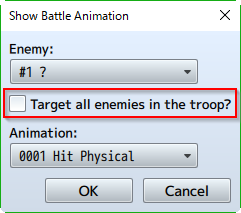

[トップページに戻る](../README.ja.md) | [JGSS 技術メモ](index.md)

# JGSS ver1.2.0 から ver1.3.4 への変化 (後編)

ちょっと離れている間に、JGSS が ver1.3.4 まで進化していました。コードの主要部分を眺めて、違いをざっと把握してみましょう。

[前編](201401-jgss134.md) は plugins.js と rpg_core.js が対象でしたが、今回は以下が対象の後編です。

 * [rpg_sprites.js](#rpg_spritesjs)
 * [rpg_objects.js](#rpg_objectsjs)
 * [rpg_scenes.js](#rpg_scenesjs)
 * [rpg_managers.js](#rpg_managersjs)

## rpg_sprites.js

pixi.js の Sprite を拡張する表示用のクラスですね。中間層なので変化は少なそうです。

### 主な修正点

Sprite では false だった \_isPicture ですが、それを継承した Sprite_Picture では true に変更(上書き)されています。

```js
Sprite_Picture.prototype.initialize = function(pictureId) {
    Sprite.prototype.initialize.call(this);
    this._pictureId = pictureId;
    this._pictureName = '';
    this._isPicture = true; // 追加された処理
    this.update();
};
```

[前編 ブレンド処理の高速化](201401-jgss134.md#dirty-の独自実装とブレンド処理の高速化) とあわせて理解できます。WebGL で描画されるとき、Sprite と Sprite_Picture は異なったレンダリングされ、それを分けるために \_isPicture を加えたよ、と。Picture 用の Sprite はちょっと重めでもきちんとブレンドされる描画モードを使いましょう、ということでしょうかね。

また Spriteset_Map の createTilemap メソッドで、描画モードによって Tilemap のクラスを分けるようになりました。今回 rpg_core.js で新しく追加された [前編 ShaderTilemap クラス](201401-jgss134.md#shadertilemap-クラス) が WebGL 用ですね。

```js
Spriteset_Map.prototype.createTilemap = function() {
    if (Graphics.isWebGL()) {
        this._tilemap = new ShaderTilemap();  // 追加された処理
    } else {
        this._tilemap = new Tilemap();
    }
    // 以下略
};
```

同じく Spriteset_Map クラスの loadTileset メソッドで、以前は毎回実施していた \_tilemap.refresh() を、条件をみて実施するようになりました。無駄な処理を省く工夫だとおもわれます。

```js
Spriteset_Map.prototype.loadTileset = function() {
    this._tileset = $gameMap.tileset();
    if (this._tileset) {
        var tilesetNames = this._tileset.tilesetNames;
        for (var i = 0; i < tilesetNames.length; i++) {
            this._tilemap.bitmaps[i] = ImageManager.loadTileset(tilesetNames[i]);
        }
        var newTilesetFlags = $gameMap.tilesetFlags();
        this._tilemap.refreshTileset();
        if (!this._tilemap.flags.equals(newTilesetFlags)) {  // この条件判断が追加
            this._tilemap.refresh();
        }
        this._tilemap.flags = newTilesetFlags;
    }
};
```

それぞれ地味な改善にみえますが、こういった部分を場合分け、最適化することで全体のパフォーマンスって変わってくるんですよね。頑張っていただきたいです。

### その他

Sprite_Animation クラスに \_reduceArtifacts 属性が追加されています。が、例によって他でこれを利用しているコードが見つかりません… 謎ですね。

```js
Sprite_Animation.prototype.initialize = function() {
    Sprite.prototype.initialize.call(this);
    this._reduceArtifacts = true;  // 追加された属性
    this.initMembers();
};
```
## rpg_objects.js

ゲーム内の情報を表現するデータオブジェクトですね。サイズは大きいですが、これも中間層なので変化は少なそうです。

### バグ修正

以下は ver1.3.2の「吸収スキルを反射した際、効果・対象が正しく反転されない問題を修正」関連のようですね。

```js
Game_Action.prototype.gainDrainedHp = function(value) {
    if (this.isDrain()) {
       var gainTarget = this.subject();
       if (this._reflectionTarget !== undefined) {
            gainTarget = this._reflectionTarget;  // 追加された処理
        }
       gainTarget.gainHp(value);
    }
};

Game_Action.prototype.gainDrainedMp = function(value) {
    if (this.isDrain()) {
       var gainTarget = this.subject();
       if (this._reflectionTarget !== undefined) {
           gainTarget = this._reflectionTarget;  // 追加された処理
       }
       gainTarget.gainMp(value);
    }
};

BattleManager.invokeMagicReflection = function(subject, target) {
    this._action._reflectionTarget = target;  // 追加された処理
    this._logWindow.displayReflection(target);
    this._action.apply(subject);
    this._logWindow.displayActionResults(target, subject);  // 第一引数を変更
};

```

以下は ver1.3.4の「特殊効果「逃げる」を設定した「スキル」及び「アイテム」を使用してバトル中に逃走を試みた際、進行不能となる不具合を修正」関連でしょうかね。

```js
Game_Actor.prototype.testEscape = function(item) {
    return item.effects.some(function(effect, index, ar) {
        return effect && effect.code === Game_Action.EFFECT_SPECIAL;
    });
};

Game_Actor.prototype.meetsUsableItemConditions = function(item) {
    if($gameParty.inBattle() && !BattleManager.canEscape() && this.testEscape(item)){
        return false;
    }
    return this.canMove() && this.isOccasionOk(item);
};
```

また TP のレート計算の分母が 100 に固定されていたのも修正されたようです。

```js
Game_BattlerBase.prototype.tpRate = function() {
    return this.tp / this.maxTp();  // 以前は100で割っていた
};
```

### 便利機能

また以下は今までありそうで無かったメソッドの実装です。Weapon などと違いIdを指定するので注意。

```js
Game_Actor.prototype.hasSkill = function(skillId) {
    return this.skills().contains($dataSkills[skillId]);
};
```

### Show Battle Animation コマンドの拡張

以下の赤枠の指定が追加されたので、それに対応するコードが追加されたようです。



```js
// Show Battle Animation
Game_Interpreter.prototype.command337 = function() {
    if (this._params[2] == true) {
        this.iterateEnemyIndex(-1,function(enemy) {  // 追加された処理
            if (enemy.isAlive()) {
                enemy.startAnimation(this._params[1],false,0);
            }
        }.bind(this));
    } else {
        this.iterateEnemyIndex(this._params[0], function (enemy) {
            if (enemy.isAlive()) {
                enemy.startAnimation(this._params[1], false, 0);
            }
        }.bind(this));
    }
    return true;
};

Game_Interpreter.prototype.iterateEnemyIndex = function(param, callback) {
    if (param < 0) {
        $gameTroop.members().forEach(callback);
    } else {
        var enemy = $gameTroop.members()[param];
        if (enemy) {
            callback(enemy);
        }
    }
};
```


## rpg_scenes.js

ゲームのシナリオを実行する主要部分ですね。これも中間層なので変化は少なそうです。

### 開始時のリソース読み込み遅延

Scene_Boot クラスの loadSystemImages から一部の処理が分離して、以下の新メソッドになりました。

```js
Scene_Boot.prototype.loadSystemWindowImage = function() {
    ImageManager.loadSystem('Window');
};
```

また create メソッドで呼び出されるのもこの新メソッドになりました。


```js
Scene_Boot.prototype.create = function() {
    Scene_Base.prototype.create.call(this);
    DataManager.loadDatabase();
    ConfigManager.load();
    this.loadSystemWindowImage();  // 前はloadSystemImagesだった
};
```

理由は rpg_managers.js を参照するとわかりますが、リソースの暗号化だとおもわれます。

'Window' は例外リストにあるので暗号化されませんが、それ以外のリソースは暗号化されている可能性があります。そして暗号化されているかどうかは $dataSystem の hasEncrypted* 属性で判断するので、$dataSystem の読み込みが完了後でないとわかりません。よって loadSystemImages の呼び出しがここ($dataSystemの読み込み完了)まで待たされているわけです。

```js
DataManager.onLoad = function(object) {
    var array;
    if (object === $dataMap) {
        this.extractMetadata(object);
        array = object.events;
    } else {
        array = object;
    }
    if (Array.isArray(array)) {
        for (var i = 0; i < array.length; i++) {
            var data = array[i];
            if (data && data.note !== undefined) {
                this.extractMetadata(data);
            }
        }
    }
    if (object === $dataSystem) {  // 追加された処理
        Decrypter.hasEncryptedImages = !!object.hasEncryptedImages;
        Decrypter.hasEncryptedAudio = !!object.hasEncryptedAudio;
        Scene_Boot.loadSystemImages();  // このタイミングで残りリソースを読み込む
    }
};
```

### バグ修正

メモリ解放のために以下の TODO 以降が追加されたようですが、なぜ動作しているのか開発側でも不明なようですw

```js
Scene_Map.prototype.terminate = function() {
    Scene_Base.prototype.terminate.call(this);
    if (!SceneManager.isNextScene(Scene_Battle)) {
        this._spriteset.update();
        this._mapNameWindow.hide();
        SceneManager.snapForBackground();
    }
    $gameScreen.clearZoom();
    //TODO: Ivan: investigate why is it working, what keeps Scene_Map from freeing stuff
    this.removeChild(this._fadeSprite);
    this.removeChild(this._mapNameWindow);
    this.removeChild(this._windowLayer);
    this.removeChild(this._spriteset);
};
```

## rpg_managers.js

このファイルに関しては、このページでも既に2ケ所ほど違いを述べてしまいましたが、それ以外をまとめます。

### ImageManager 関連

[前編 メモリ効率の改善](201401-jgss134.md#cacheentry-と-cachemap-によるメモリ効率の改善) で出てきた CacheMap を利用して画像の管理をするようになっています。空の Birmap にちゃんと 'empty' というキーワードが与えられたのは良いですね。

```js
ImageManager.cache = new CacheMap(ImageManager);

ImageManager.loadEmptyBitmap = function() {
    var empty = this.cache.getItem('empty');
    if (!empty) {
        empty = new Bitmap();
        this.cache.setItem('empty', empty);
    }
    return empty;
};

ImageManager.loadNormalBitmap = function(path, hue) {
    var key = path + ':' + hue;
    var bitmap = this.cache.getItem(key);
    if (!bitmap) {
        bitmap = Bitmap.load(path);
        bitmap.addLoadListener(function() {
            bitmap.rotateHue(hue);
        });
        this.cache.setItem(key, bitmap);
    }
    return bitmap;
};

ImageManager.clear = function() {
    this.cache.clear();
};

ImageManager.isReady = function() {
    for (var key in this.cache._inner) {
        var bitmap = this.cache._inner[key].item;
        if (bitmap.isError()) {
            throw new Error('Failed to load: ' + bitmap.url);
        }
        if (!bitmap.isReady()) {
            return false;
        }
    }
    return true;
};
```

AudioManager 周りは暗号化の拡張が主で、基本は画像を同じなので割愛しますね。

### SceneManager 関連

メインロジックのあたりで iOS 用のロジックが場合分けされています。フレーム表示が間に合わない時に描画をスキップするあたりの部分、iOSだと何か問題が発生したのかもしれませんね。

```js
SceneManager.update = function() {
    try {
        this.tickStart();
        if (Utils.isMobileSafari()) {
            this.updateInputData();  // 追加された処理
        }
        this.updateMain();
        this.tickEnd();
    } catch (e) {
        this.catchException(e);
    }
};

SceneManager.updateMain = function() {
    if (Utils.isMobileSafari()) {// 追加された処理
        this.changeScene();
        this.updateScene();
    } else {
        var newTime = this._getTimeInMs();
        var fTime = (newTime - this._currentTime) / 1000;
        if (fTime > 0.25) fTime = 0.25;
        this._currentTime = newTime;
        this._accumulator += fTime;
        while (this._accumulator >= this._deltaTime) {
            this.updateInputData();
            this.changeScene();
            this.updateScene();
            this._accumulator -= this._deltaTime;
        }
    }
    this.renderScene();
    this.requestUpdate();
};
```

### BattleManager 関連

ver1.3.4の「特殊効果「逃げる」を設定した「スキル」及び「アイテム」を使用してバトル中に逃走を試みた際、進行不能となる不具合を修正」の関係か、Escape 関連の修正がありました。

checkAbort と似た checkAbort2 メソッドを追加し、使い分けています。

```js
BattleManager.checkAbort2 = function() {
    if ($gameParty.isEmpty() || this.isAborting()) {
        SoundManager.playEscape();
        this._escaped = true;
        this.processAbort();
    }
    return false;
};

BattleManager.updateEvent = function() {
    switch (this._phase) {
        case 'start':
        case 'turn':
        case 'turnEnd':
            if (this.isActionForced()) {
                this.processForcedAction();
                return true;
            } else {
                return this.updateEventMain();
            }
    }
    return this.checkAbort2();  // 新しいほうに置き換え
};
```

また戦闘の終了後に「逃げた」かどうか確認するようになりました。

```js
BattleManager.updateBattleEnd = function() {
    if (this.isBattleTest()) {
        AudioManager.stopBgm();
        SceneManager.exit();
    } else if (!this._escaped && $gameParty.isAllDead()) {  // 条件の追加
        if (this._canLose) {
            $gameParty.reviveBattleMembers();
            SceneManager.pop();
        } else {
            SceneManager.goto(Scene_Gameover);
        }
    } else {
        SceneManager.pop();
    }
    this._phase = null;
};
```

以上、JGSS ver1.2.0 から ver1.3.4 への変化をざっとまとめてみました。 [前編](201401-jgss134.md) とあわせ、何か参考になれば幸いです。

[トップページに戻る](../README.ja.md) | [JGSS 技術メモ](index.md)
