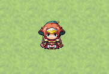
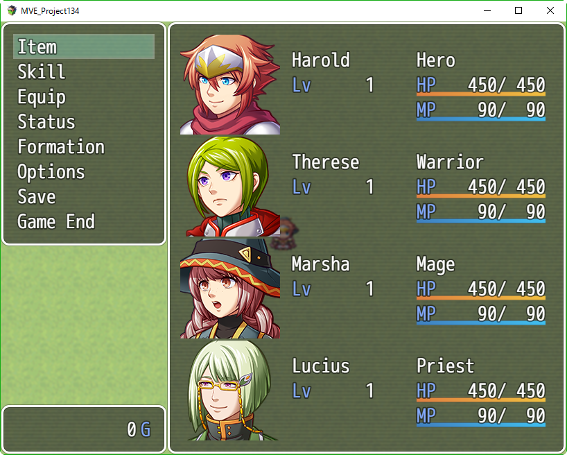

[トップページに戻る](../README.ja.md) | [JGSS 技術メモ](index.md)

# マップ移動中のコードの流れ

RPGのプレイ時間の大半は、マップ上の時間(Scene)か、戦闘(Battle)だと思います。その間、JGSSの内部ではどのようなロジックが動いているのでしょうか？今回はマップ上でキャラが動いている時のコードを追ってみます。

今回対象としているのは ver1.3.4 です。

ただし読みやすさを重視し、iOS専用の場合分けなど、今回の主目的には関係しないロジックは省略しています。また1～2行の短い関数は呼び出さずにその場に展開している場合もあります。エラー処理や例外処理を省いている場合もあります。

## ゲーム開始

新規にプロジェクトを作成し、いきなりテストプレイしてみましょう。タイトル画面で New Game を選択すると、マップ画面となり、何もない草原にハロルド君のパーティが立っていますね。



タイトル画面は Scene_Title で実行されるのですが、表示されたコマンド選択から New Game を選択すると、以下のコードが実行されます。

```js
Scene_Title.prototype.commandNewGame = function() {
    DataManager.setupNewGame();   // ゲームの準備
    this._commandWindow.close();  // コマンド選択を閉じる
    this.fadeOutAll();            // 画面を消す
    SceneManager.goto(Scene_Map); // マップシーンに遷移する
};
```

RPGツクールMVにおいてゲームとは、シーン(Scene)の集まりなのです。RPGツクールMVでゲームを作っている際、作成するマップのそれぞれが場面です。

最初に表示されるタイトル画面(Scene_Title)も、その後で表示されるマップ画面(Scene_Map)も、どちらも内部ではシーンとして扱われます。戦闘画面(Scene_Battle)も同じです。シーンは Scene_Base クラスのを親にもつオブジェクト(インスタンス)で、SceneManager.goto() でシーンが切り替わります。

さて、SceneManager.goto() でマップ画面(Scene_Map)に切り替わるコードを見てみます。

```js
SceneManager.goto = function(sceneClass) {
    if (sceneClass) {
        this._nextScene = new sceneClass();  // 次のシーンを用意する
    }
    if (this._scene) {
        this._scene.stop();                  // 現在のシーンを停止
    }
};
```

シーンが停止すると、 \_nextScene に設定された次のシーンが自動的にスタートします。そのあたりの仕組みを次に見ていきましょう。

## ゲームのメインループ

ゲームはシーンの集まり、なのでゲーム実行の中心は SceneManager です。そしてその requestUpdate() メソッドが全ての開始地点です。

```js
SceneManager.requestUpdate = function() {
    if (!this._stopped) {
        requestAnimationFrame(this.update.bind(this));
    }
};
```

[requestAnimationFrame](https://developer.mozilla.org/ja/docs/Web/API/Window/requestAnimationFrame) はブラウザの基本機能で、登録された update() メソッドがゲーム実行のメインループになります。

```js
SceneManager.update = function() {
    Graphics.tickStart();
    this.updateMain();
    Graphics.tickEnd();
};
```

そして主要な処理は updateMain() メソッドに任されています。

```js
SceneManager.updateMain = function() {
    var newTime = this._getTimeInMs();
    var fTime = (newTime - this._currentTime) / 1000;
    if (fTime > 0.25) fTime = 0.25;
    this._currentTime = newTime;
    this._accumulator += fTime;
    while (this._accumulator >= this._deltaTime) {
        this.updateInputData();　// 入力処理
        this.changeScene();　　　// シーンを遷移する
        this.updateScene();　　　// シーンを更新する
        this._accumulator -= this._deltaTime;
    }
    this.renderScene();          // シーンを表示する
    this.requestUpdate();        // 処理の最初に戻る
};
```

最後に開始地点の requestUpdate() が記述されていることで、処理が最初に戻ります。つまりループしています。

このメインループの処理を整理すると、以下の4つのメソッドが順に繰り返されているのがわかります。
* [updateInputData 入力処理](#updateinputdata-入力処理)
* [changeScene シーンを遷移する](#changescene-シーンを遷移する)
* [updateScene シーンを更新する](#updatescene-シーンを更新する)
* [renderScene シーンを表示する](#renderscene-シーンを表示する)

## updateInputData 入力処理

入力処理 updateInputData() メソッドはプレイヤーの入力、キーボードやパッド操作、画面へのタッチなどを処理する働きをします。

```js
SceneManager.updateInputData = function() {
    Input.update();
    TouchInput.update();
};
```

Input, TouchInput 共に rpg_core.js で定義されていて、とても興味深いのですが、今回はスキップすることにします。別の機会にしっかり見てみましょう。

## changeScene シーンを遷移する

シーンを遷移する changeScene() メソッドはシーンが stop() したことを察知して、次のシーンに切り替える働きをします。[ゲーム開始](#ゲーム開始) のところで「次のシーンが自動的にスタートします」と書いていますが、それを実現しているのがこのメソッドです。

```js
SceneManager.changeScene = function() {
    if (this.isSceneChanging() && !this.isCurrentSceneBusy()) {
        if (this._scene) {
            this._scene.terminate();    // 前のシーンを終了させる
            this._previousClass = this._scene.constructor;
        }
        this._scene = this._nextScene;  // 次のシーンに遷移する
        this._scene.create();           // 次のシーンを生成する
        this._nextScene = null;         
        this._sceneStarted = false;
        Graphics.startLoading();
        if (this._exiting) {
            this.terminate();
        }
    }
};
```

そんなに複雑なことをしていないので、ざっと見て理解できるとおもいます。

## updateScene シーンを更新する

シーンを更新する updateScene() メソッドは、シーン開始時を除けば単に this.\_scene.update() とシーンごとの update() 関数を呼んでいるだけですね。

```js
SceneManager.updateScene = function() {
    if (this._scene) {
        if (!this._sceneStarted && this._scene.isReady()) {
            this._scene.start();
            this._sceneStarted = true;
            Graphics.endLoading();
        }
        if (this.isCurrentSceneStarted()) {
            this._scene.update();
        }
    }
};
```

呼ばれるシーン側の update() ですが、親クラスでの定義は以下のようになっています。

```js
Scene_Base.prototype.update = function() {
    this.updateFade();            // フェードイン・アウトを更新する
    this.updateChildren();        // 子供の update() を呼ぶ
};

Scene_Base.prototype.updateChildren = function() {
    this.children.forEach(function(child) {
        if (child.update) {
            child.update();
        }
    });
};
```

Scene_Map の update に関しては、[もう少し後](#scene_map-の-update) で見てみましょう。

## renderScene シーンを表示する

シーンを表示する renderScene() メソッドは、Graphics を利用してシーンの状態を画面に反映させています。

```js
SceneManager.renderScene = function() {
    if (this.isCurrentSceneStarted()) {
        Graphics.render(this._scene);
    } else if (this._scene) {
        Graphics.updateLoading();
    }
};
```

## Scene_Map の update

さてやっと本題(?)です。具体的に、マップ画面のメイン処理を見ていきましょう。

```js
Scene_Map.prototype.update = function() {
    this.updateDestination();                // 画面タッチで移動する
    this.updateMain();
    if (this.isFastForward()) {              // 高速モードならば
        this.updateMain();                   // 内部でメイン処理をもう一度実行
    }
    if (this.isActive() && !$gameMessage.isBusy()) {
        this.updateScene();                  // シーンを更新
    } else if (SceneManager.isNextScene(Scene_Battle)) {
        this.updateEncounterEffect();        // 次のシーンが戦闘なら遭遇エフェクト
    }
    this.updateWaitCount();
    Scene_Base.prototype.update.call(this);  // 親クラスの update を呼ぶ
};

Scene_Map.prototype.updateMain = function() {
    var active = this.isActive();
    $gameMap.update(active);                 // マップを更新
    $gamePlayer.update(active);              // プレイヤーを更新
    $gameTimer.update(active);               // タイマーを更新
    $gameScreen.update();                    // ゲーム画面の更新
};

Scene_Map.prototype.updateScene = function() {
    this.checkGameover();                    // ゲームオーバー条件の確認
    if (!SceneManager.isSceneChanging()) {
        this.updateTransferPlayer();         // TBD
    }
    if (!SceneManager.isSceneChanging()) {
        this.updateEncounter();              // TBD
    }
    if (!SceneManager.isSceneChanging()) {
        this.updateCallMenu();               // メニュー利用
    }
};
```

## updateTransferPlayer

## updateEncounter

## マップ画面でのメニュー利用

メニューは以下の画面です。



マップ画面でのメニュー利用に関しては Scene_Map クラスの updateCallMenu() メソッドが担当しています。

```js
Scene_Map.prototype.updateCallMenu = function() {
    if (this.isMenuEnabled()) {              // メニューが利用可能な状態で
        if (this.isMenuCalled()) {           // メニューボタンが押されたら
            this.menuCalling = true;
        }
        if (this.menuCalling && !$gamePlayer.isMoving()) {
            this.callMenu();                 // メニューを開く
        }
    } else {
        this.menuCalling = false;
    }
};
Scene_Map.prototype.isMenuEnabled = function() {
    return $gameSystem.isMenuEnabled() && !$gameMap.isEventRunning();
};
Game_System.prototype.isMenuEnabled = function() {
    return this._menuEnabled;
};
Scene_Map.prototype.isMenuCalled = function() {
    return Input.isTriggered('menu') || TouchInput.isCancelled();
};
```
メニュー利用中は menuCalling というフラグが ON になっているのがわかりますね。

またメニューはプレイヤーが行動できる状態で、更にマップイベントが実行中でない時にだけ利用できることがわかります。更に $gameSystem.\_menuEnabled というフラグも参照されていることがわかります。

なおメニュー画面も、やはりシーン(Scene_Menu)として実装されています。こちらのシーンも面白いのですが、Window部品など様々な要素を含むため、また別の機会に見ることにしましょう。

```js
Scene_Map.prototype.callMenu = function() {
    SoundManager.playOk();
    SceneManager.push(Scene_Menu);
    Window_MenuCommand.initCommandPosition();
    $gameTemp.clearDestination();
    this._mapNameWindow.hide();
    this._waitCount = 2;
};
```

[トップページに戻る](../README.ja.md) | [JGSS 技術メモ](index.md)
