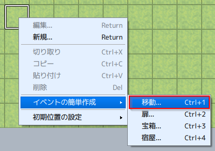
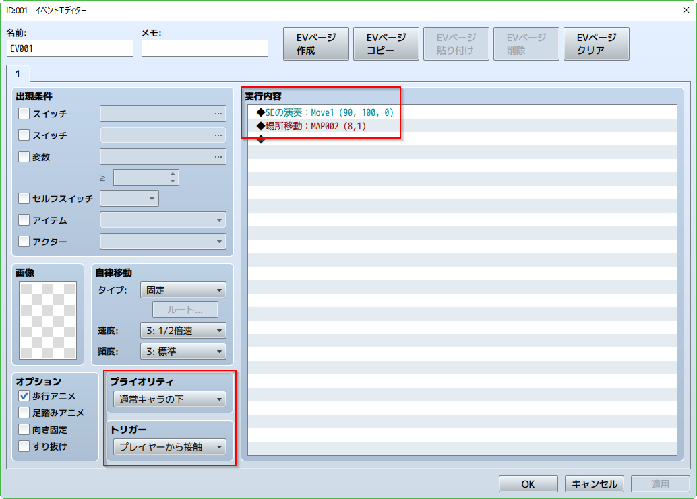
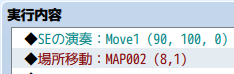
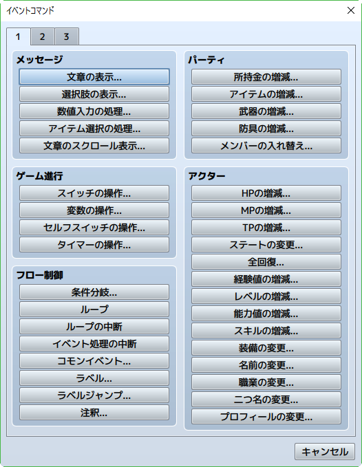
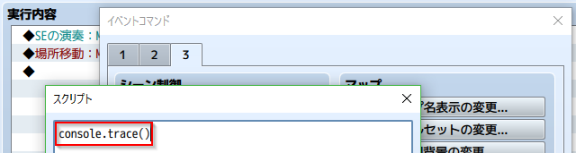
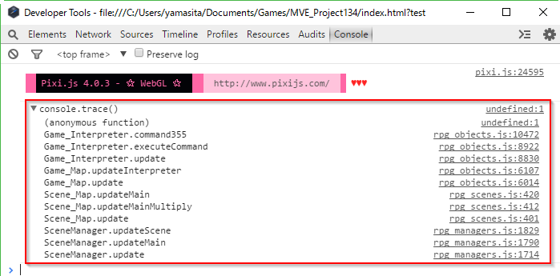

[トップページに戻る](../README.ja.md) | [JGSS 技術メモ](index.md)

# マップ移動中のコードの流れ その2

[前回](201701-scenes.md) に引き続き、今回もマップ上でキャラが動いている時のコードを追ってみます。対象は ver1.3.4 です。

前回はおおまかな流れを見ていったので、今回はその補足というか、気になったところを適当に眺めてみる予定です。ぶらぶら散歩、的なw

## 移動イベントの簡単作成

RPGツクールMVのマップ画面で右クリックすると「イベントの簡易作成」メニューがあって便利ですよね。そのなかでも「移動」はマップ移動によく使います。何気なく使っていますが、どういった仕組みなのでしょうか？



実際に作成された移動イベントが以下になります。赤枠の部分がポイントでしょうかね。



ここでまず、右側の「実行内容」に注目してみます。



プラグインとか作成していると、開発言語ですか？ RPGツクールVX Ace は Ruby で、MV は JavaScript になりましたね。とか思いますが…

たぶん違いますよね？ゲーム開発者にとって、RPGツクールでの開発言語といえば、上記の「実行内容」であり、以下のイベントコマンドのリストだとオモイマス。



僕はこれがけっこう好きで、よくできた言語環境だとおもいます。なので、今回の「実行内容」が内部的にはどうなっているか、ちょっと追ってみましょう！

### イベントコマンドの格納方法

まず作成されたマップですが、data フォルダのなかに Map001.json として保存されています。json 形式ですから、JavaScript ベースのデータファイルってことですね。そのファイルを見て… も長いですから、上記の「実行内容」の部分を抜き出してみます。コメント付きで。

```js
"list":[
  // SEの演奏 : Move1 (90, 100, 0)
  {"code":250,"indent":0,"parameters":[{"name":"Move1","pan":0,"pitch":100,"volume":90}]},
  // 場所移動 : NAP002 (8,1)
  {"code":201,"indent":0,"parameters":[0,2,8,1,0,0]},
  // 何もしない (イベントの終了)
  {"code":0,"indent":0,"parameters":[]}
]
```

さあ、この「実行内容」は内部的にどう処理されているのでしょうか？コードのどこを見ればわかるのでしょうか？

ここで皆さんに、コード内を散歩する際の強い味方をご紹介しましょう。実行内容の最後に「スクリプト」として console.trace() を追加してください。



さきほどの Map001.json には以下の行が挿入されたはず。code 355 が「スクリプト」コマンドなんですね。

```js
{"code":355,"indent":0,"parameters":["console.trace()"]},
```

そしてゲームをテストプレイし、移動イベントのあるところまで移動してから F8 で開発者コンソールを開いてみてください。以下のように関数の呼び出し状況が表示されているはずです。



この呼び出しは下から上に向かって呼び出されています。 Comannd355 というのは「スクリプト」処理用でしょうから、その上にある Game_Interpreter クラスの executeCommand とか update が怪しいですね。あ、Game_Interpreter の update って、[前回出てきた](201701-scenes.md#マップを更新) 気もしますね。

### イベントコマンドの実行方法

さて、見つかった関数のなかで、直接の呼び出し元の executeCommand がこちら。

```js
Game_Interpreter.prototype.executeCommand = function() {
    var command = this.currentCommand();              // 現在の実行行を入手
    if (command) {
        this._params = command.parameters;
        this._indent = command.indent;
        var methodName = 'command' + command.code;    // code から処理関数を入手
        if (typeof this[methodName] === 'function') { // 処理関数が存在するならば
            if (!this[methodName]()) {                // 処理関数を実行
                return false;
            }
        }
        this._index++;
    } else {
        this.terminate();                             // イベント処理終了
    }
    return true;
};
Game_Interpreter.prototype.currentCommand = function() {
    return this._list[this._index];
};
```

どうやら commandXXX という、code から探せる関数があって、それが各イベントコマンドの実態のようです。 というわけでまず、code 250 であるSEの演奏は…

```js
// Play SE
Game_Interpreter.prototype.command250 = function() {
    AudioManager.playSe(this._params[0]);
    return true;
};
```

そして code 201 である場所移動は…

```js
// Transfer Player
Game_Interpreter.prototype.command201 = function() {
    if (!$gameParty.inBattle() && !$gameMessage.isBusy()) {
        var mapId, x, y;
        if (this._params[0] === 0) {  // Direct designation
            mapId = this._params[1];
            x = this._params[2];
            y = this._params[3];
        } else {  // Designation with variables
            mapId = $gameVariables.value(this._params[1]);
            x = $gameVariables.value(this._params[2]);
            y = $gameVariables.value(this._params[3]);
        }
        $gamePlayer.reserveTransfer(mapId, x, y, this._params[4], this._params[5]);
        this.setWaitMode('transfer');
        this._index++;
    }
    return false;
};
```

コードを見ると、json にあったパラメータ [0,2,8,1,0,0] の意味がわかりますね。

0. 直接指定なら0、それ以外は変数で指定
1. 直接指定ならマップ番号、変数で指定ならマップ番号の指定された変数
2. 直接指定ならx座標、変数で指定ならx座標の指定された変数
3. 直接指定ならy座標、変数で指定ならy座標の指定された変数
4. 向きの指定
5. フェードの指定

またマップ移動の場合には $gamePlayer.reserveTransfer で移動の準備をしておき、this.setWaitMode で 'transfer' という待ちモードに設定していることがわかりますね。このあたりを次で見てみましょう。

### さらに余談ですが

さて、開発言語好きの方なら、Game_Interpreter の「インタープリター」という言葉に反応するかもしれませんね。この方式は順番に命令を解釈していくので柔軟性があり、デバッグも容易なのですが、実行速度に劣る面があります。それに対して事前に一括で解釈してしまう「コンパイル」という方式があり、こちらは処理速度が速いです。

RPGツクールMVで作成されたゲームですが、今回の場所移動のように定型化されたもので、かつ頻繁に呼び出される処理が幾つかあるとおもいます。それらだけでも事前にコンパイルしておく、つまり事前に作成した JavaScript の関数 (できれば asm.js も使って？) の呼び出しに置き換えてあげるだけで、そこそこの手間で有効な、ゲームの高速化ができそうな気がします。誰か実装してみませんか？ (他力本願すぎる…)


[トップページに戻る](../README.ja.md) | [JGSS 技術メモ](index.md)
