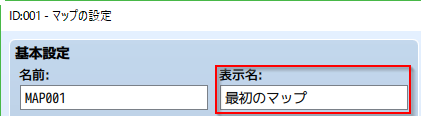
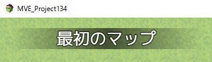
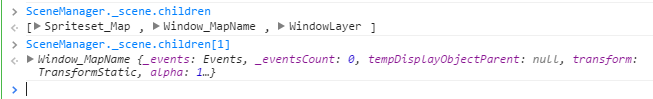
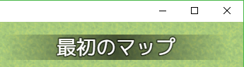
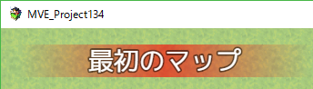
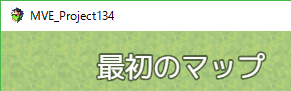
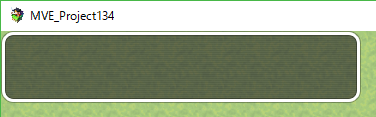
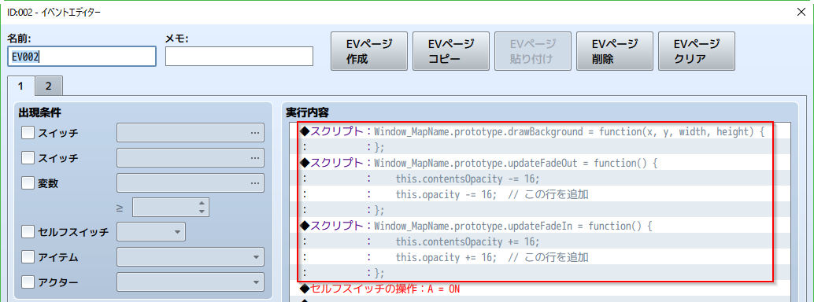

[トップページに戻る](../README.ja.md) | [JGSS 技術メモ](index.md)

# ウィンドウ表示のコードの流れ

RPGツクールMVのウィンドウ機能関連は面白いと思いますので、簡単にコードを追ってみましょう。

## マップ名の表示

マップの編集画面で「表示名」があって



プレイ中に新しいマップに入ると、画面の左上に少しの間、マップの表示名が表示されます。



さて MapName あたりのキーワードで rpg_windows.js を探してみると、マップ名用の定義がすぐに見つかります。

```js
// Window_MapName
//
// The window for displaying the map name on the map screen.

function Window_MapName() {
    this.initialize.apply(this, arguments);
}
Window_MapName.prototype = Object.create(Window_Base.prototype);
Window_MapName.prototype.constructor = Window_MapName;
```

Window_Base はすべてのウィンドウの親になっているスーパークラスです。Window_MapName はその直接の子供なので、とても基本的なクラスであることが期待できそうです。

## マップ名が作成される様子

実際のマップを表示するシーン(rpg_scenes.js)のほうで、Window_MapName クラスを探してみます。と、そのものズバリな関数が見つかります。

```js
Scene_Map.prototype.createMapNameWindow = function() {
    this._mapNameWindow = new Window_MapName();
    this.addChild(this._mapNameWindow);
};
```

お、シーンの子供として追加されていますね。実際に開発コンソールで見ると、マップ名はシーン直下に配置されていることがわかります。このへんの階層を探す詳細はガイドの [view-層の発見](../guide/plugin-dev-05.ja.md#view-層の発見) あたりを参照してください。



さて、この createMapNameWindow が呼ばれるタイミングは…

```js
Scene_Map.prototype.isReady = function() {
    if (!this._mapLoaded && DataManager.isMapLoaded()) {
        this.onMapLoaded();
        this._mapLoaded = true;
    }
    return this._mapLoaded && Scene_Base.prototype.isReady.call(this);
};

Scene_Map.prototype.onMapLoaded = function() {
    if (this._transfer) {
        $gamePlayer.performTransfer();
    }
    this.createDisplayObjects();
};

Scene_Map.prototype.createDisplayObjects = function() {
    this.createSpriteset();
    this.createMapNameWindow();
    this.createWindowLayer();
    this.createAllWindows();
};
```

という流れて呼ばれていますね。これらの起点となっている isReady はシーンの切り替えをおこなう SceneManager が呼んでくれます。

```js
SceneManager.updateScene = function() {
    if (this._scene) {
        if (!this._sceneStarted && this._scene.isReady()) {
            this._scene.start();
            this._sceneStarted = true;
            this.onSceneStart();
        }
        if (this.isCurrentSceneStarted()) {
            this._scene.update();
        }
    }
};
```

## 実際の初期化処理

Scene_Map の createMapNameWindow で new される Window_MapName ですが、その初期化処理を見ておきましょう。

```js
Window_Base.prototype.initialize = function(x, y, width, height) {
    Window.prototype.initialize.call(this);
    this.loadWindowskin();
    this.move(x, y, width, height);
    this.updatePadding();
    this.updateBackOpacity();
    this.updateTone();
    this.createContents();
    this._opening = false;
    this._closing = false;
    this._dimmerSprite = null;
};

Window_MapName.prototype.initialize = function() {
    var wight = this.windowWidth();
    var height = this.windowHeight();
    Window_Base.prototype.initialize.call(this, 0, 0, wight, height);
    this.opacity = 0;
    this.contentsOpacity = 0;
    this._showCount = 0;
    this.refresh();
};

Window_MapName.prototype.windowWidth = function() {
    return 360;
};
Window_MapName.prototype.windowHeight = function() {
    return this.fittingHeight(1);
};
```

最初から表示位置が (0,0) に設定されており、横幅が 360 ピクセルに固定されていることがわかります。縦の長さはどうでしょうか？

```js
Window_Base.prototype.fittingHeight = function(numLines) {
    return numLines * this.lineHeight() + this.standardPadding() * 2;
};
Window_Base.prototype.lineHeight = function() {
    return 36;
};
Window_Base.prototype.standardPadding = function() {
    return 18;
};
```

ということで、縦の長さは行数と上下のパディング(隙間)から計算され、72 ピクセルになることがわかります。

## マップ名の表示位置を変えてみる

ここまでわかったところで、少し遊んでみます。以前の [プラグインを用いないで、システムを好き勝手いじくろう！](201701-scenes2.md#更に移動イベント) の技を使って、自動実行イベントで以下のスクリプトを実行します。

```js
var _Window_MapName_initialize = Window_MapName.prototype.initialize;
Window_MapName.prototype.initialize = function() {
    var func = _Window_MapName_initialize;
    var ret = func.call(this);
    this.move(Graphics.width - this.windowWidth(), 0, this.windowWidth(), this.windowHeight());
    return ret;
};
```

置き換えた関数のなかで func という変数をわざわざ定義しているのに少し違和感があるでしょう。これは自動実行イベントでクラス定義を書き換えるとき、元の関数を呼ぶための更なる裏技だったりします。

【マニアックな解説】スクリプト実行時に var で定義した \_Window_MapName_initialize 変数はglobal領域に定義されるわけではないようで、後で関数の実行時にはエラーになります。関数内でいったんfunc変数に代入しておくと、funcは変数のスコープ内で保持されます。これで実行時のエラーが回避できます。

さて、裏技では表示位置を move() で変更しています。もとは 0 だった x座標を、画面の大きさから表示幅をひいたもの、に変更している、つまりは右上に移動しているのです。

さて実行してみましょう。最初に表示されるマップ名は、左上のままのはずです。これは今回の裏技が自動実行イベントのため、最初のマップのマップ名表示に間に合わないから、なんですね。次のマップに移動したり、戻ってきたりすれば右上にマップ名が表示されます。



## マップ名の背景表示を変えてみる

更に裏技で遊んでみましょう。

マップ名表示する Window_MapName クラスには refresh 関数が定義されており、表示の初期化をおこなっています。

```js
Window_MapName.prototype.refresh = function() {
    this.contents.clear();
    if ($gameMap.displayName()) {
        var width = this.contentsWidth();
        this.drawBackground(0, 0, width, this.lineHeight());
        this.drawText($gameMap.displayName(), 0, 0, width, 'center');
    }
};
```

このうち drawBackground が背景の描画をしているようです。

```js
Window_MapName.prototype.drawBackground = function(x, y, width, height) {
    var color1 = this.dimColor1();
    var color2 = this.dimColor2();
    this.contents.gradientFillRect(x, y, width / 2, height, color2, color1);
    this.contents.gradientFillRect(x + width / 2, y, width / 2, height, color1, color2);
};
Window_Base.prototype.dimColor1 = function() {
    return 'rgba(0, 0, 0, 0.6)';
};
Window_Base.prototype.dimColor2 = function() {
    return 'rgba(0, 0, 0, 0)';
};
```

背景の表示色は Window_MapName では特に定義しておらず、Window_Base のものを引きついでいるようです。Window_MapName で上書きしてあげれば、好きな背景色にできそうですね。

では例の自動実行のスクリプトに今度は以下を記載します。

```js
Window_MapName.prototype.dimColor1 = function() {
  return 'rgba(255, 0, 0, 0.6)';
};
Window_MapName.prototype.dimColor2 = function() {
    return 'rgba(255, 0, 0, 0)';
};
```

実行すると、やはり二度目の表示からマップ名の背景が赤にかわるのが確認できます。



## マップ名に枠を付けてみる

マップ名の表示もウィンドウなのですが、他のと見た目が違いますよね。他と同じにしてみましょうか。

まずは例の裏技で、背景を描いている drawBackground 関数を無効化(空の関数で置き換え)してしまいます。すると背景が消え、とてもシンプルな表示になりましたね。

```js
Window_MapName.prototype.drawBackground = function(x, y, width, height) {
};
```


そして今度はウィンドウの枠を表示させましょう。そもそも他のウィンドウにはある枠が、なぜマップ名表示には無いのでしょう。

親クラスである Window_Base を眺めてみると、opacity というウィンドウ自体の透明度を指定する値があることに気がつきます。では、最初のほうの位置を変更する裏技を応用して、この値を変更してみましょう。

```js
Window_MapName.prototype.drawBackground = function(x, y, width, height) {
    this.opacity = 255;
};
```


あれま簡単だった！と喜んだ数秒後、そこにはフェードアウトから取り残された枠だけが…



さきほどの裏技、さすがに手抜き過ぎましたかね。では真面目に、フェードアウト関連の関数を置き換えてみましょう。

```js
Window_MapName.prototype.updateFadeIn = function() {
    this.contentsOpacity += 16;
    this.opacity += 16;  // この行を追加
};
Window_MapName.prototype.updateFadeOut = function() {
    this.contentsOpacity -= 16;
    this.opacity -= 16;  // この行を追加
};
```

うん、これで枠もちゃんと消えるようになりました。最終的に、裏技の1回だけ実行される自動実行スクリプトは以下のような感じです。




[トップページに戻る](../README.ja.md) | [JGSS 技術メモ](index.md)
