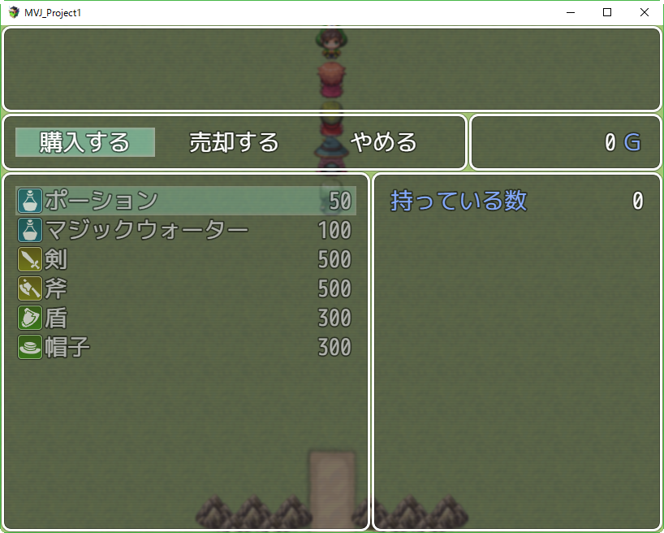
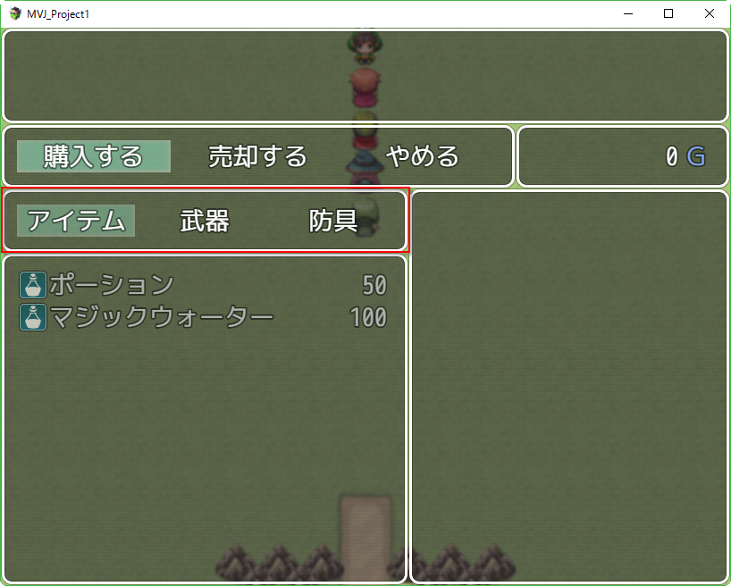
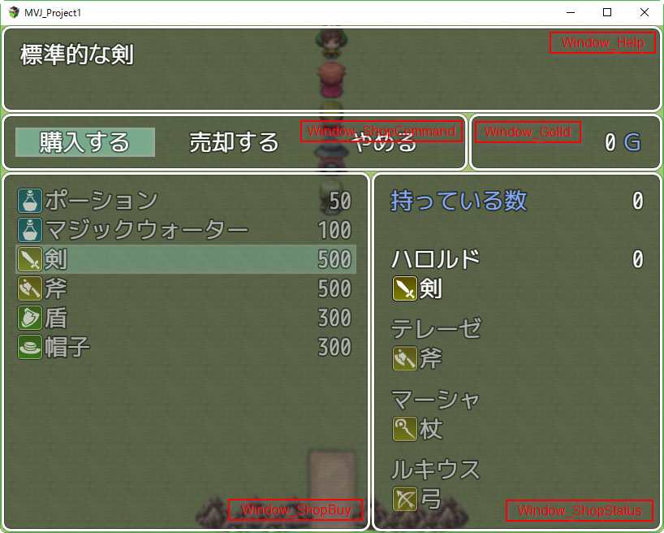
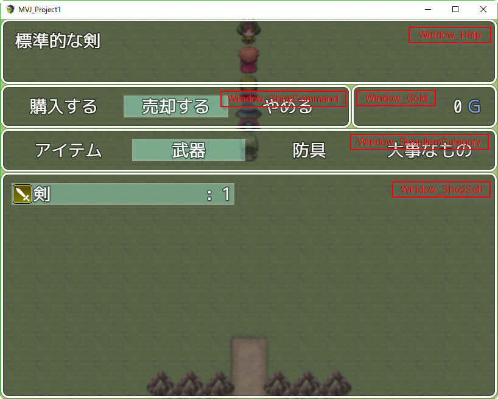
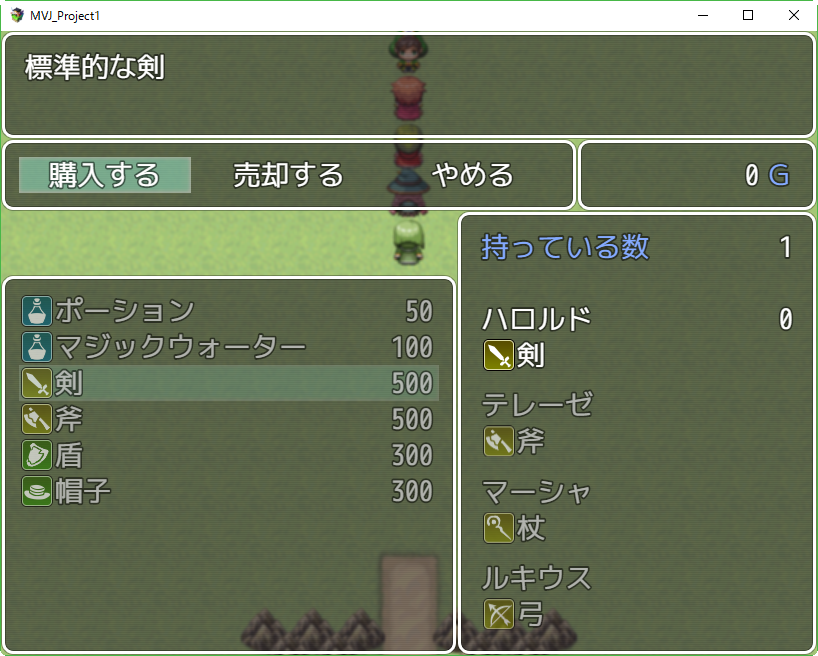
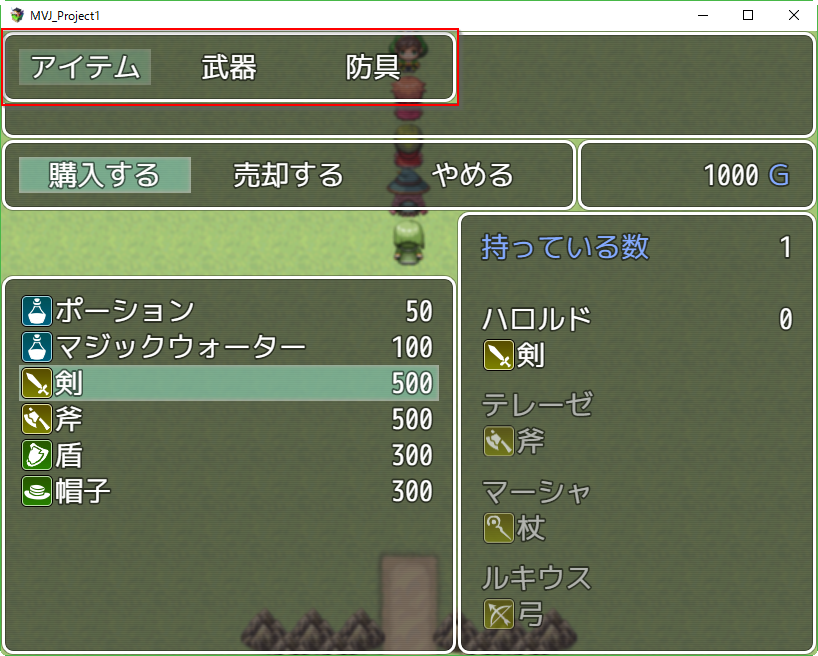
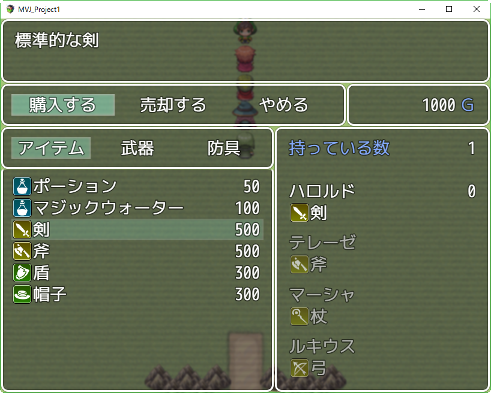
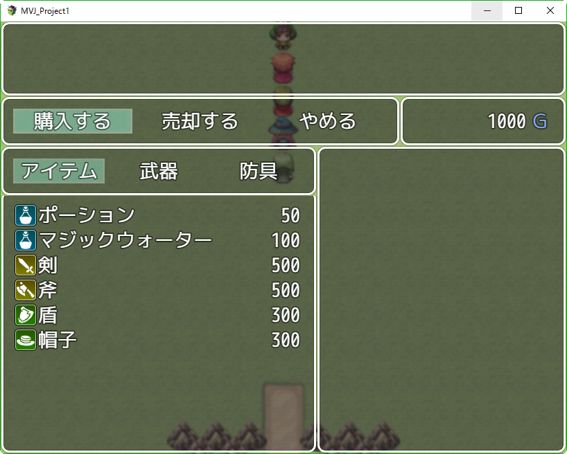
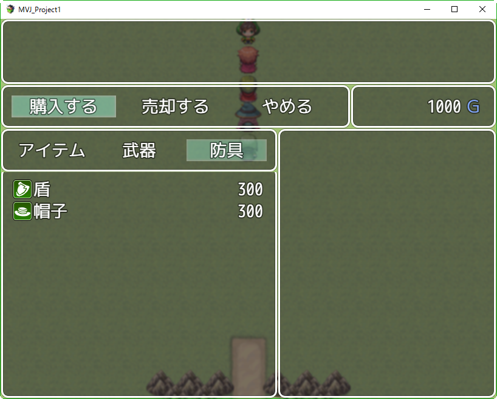
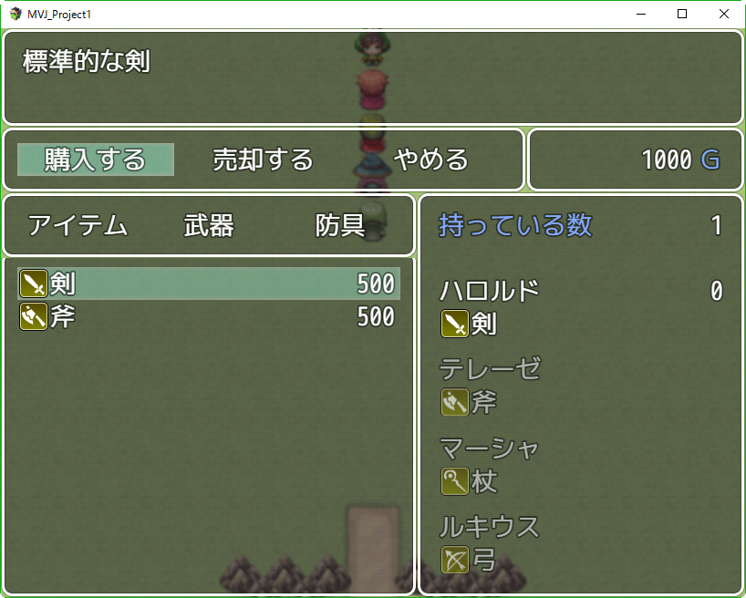

[トップページに戻る](../README.ja.md) | [JGSS 技術メモ](index.md)

# ショップ販売のカテゴリ化プラグインを作成してみる

[前回](201702-window.md) はマップ名表示機能のコードを見て、ウィンドウ関連の基礎部分をなんとなーく感じとってみました。今回はそれをベースに、少し実用的なことをやってみましょう。

## 今回のテーマ

僕が以前に作成したプラグインに [標準のショップ機能を拡張する RTK1_Shop](../RTK1_Shop.ja.md) があります。これに「購入時のカテゴリ表示」というオプション機能があります。



という通常のショップ画面に、以下の赤枠の「カテゴリ選択」を追加する、というもの。



まあ地味な機能なのですが… 意外と便利ですし、前回ちょっと基礎を学んだウィンドウ関連の扱いを学ぶにはちょうど良い素材なのかな、と。これを単機能のプラグインにしてみましょう。元のプラグインに対し以下の差があることを想定しています。

* ショップにカテゴリ選択を追加するだけのシンプルなプラグイン
* 前提となるライブラリなどなく使いやすい
* オプションはなく、不要ならば外すだけ
* ただし他プラグインとの競合は今回はあまり考慮しない (説明が長くなるので)

## まずは空のプラグインを準備

[RTK_Test.js](../guide/RTK_Test.js) をRPGツクールMV プロジェクトの js/plugins フォルダに RTK_ShopCategory.js というファイル名で保存してください。コメント部分を適当に書き換えます。

```js
//=============================================================================
// RTK_ShopCategory.js	2017/02/19
// The MIT License (MIT)
//=============================================================================

/*:
 * @plugindesc ショップにカテゴリ選択を追加する
 * @author Toshio Yamashita (yamachan)
 *
 * @help このプラグインにはプラグインコマンドはありません。
 */

(function(_global) {
	// ここにプラグイン処理を記載
})(this);
```

そしてRPGツクールMVでこのプラグインを設定します。これは空のプラグインなので、設定してもゲームの動作は変わりません。


以後のコードは、この RTK_ShopCategory.js ファイルの「ここにプラグイン処理を記載」のコメントにある部分に記載していきます。

## 現在のウィンドウ配置

カテゴリ選択の機能を実装するには、カテゴリを表示する表示エリア(ウィンドウ)を追加する必要があります。まずはそのための場所をあけてみましょう。

ショップ画面は rpg_scenes.js で定義されている Scene_Shop シーンで表示されます。その初期化部分をみると

```js
Scene_Shop.prototype.create = function() {
    Scene_MenuBase.prototype.create.call(this);
    this.createHelpWindow();    // 上のヘルプ表示
    this.createGoldWindow();    // 中央右の所持金表示
    this.createCommandWindow(); // 中央左のコマンド選択
    this.createDummyWindow();
    this.createNumberWindow();
    this.createStatusWindow();  // 右下の商品詳細
    this.createBuyWindow();     // 左下の商品リスト
    this.createCategoryWindow();
    this.createSellWindow();
};
```

それぞれのウィンドウですが、購入画面の以下に対応しています。



今回は関係ありませんが、売却画面のほうは以下のような構成です。



## まずはウィンドウの配置を変えてみる

カテゴリ選択の場所を確保するため、商品リストの高さを減らしてみましょう。商品リストのウィンドウを作成している関数がこちら。

```js
Scene_Shop.prototype.createBuyWindow = function() {
    var wy = this._dummyWindow.y;
    var wh = this._dummyWindow.height;
    this._buyWindow = new Window_ShopBuy(0, wy, wh, this._goods);
    this._buyWindow.setHelpWindow(this._helpWindow);
    this._buyWindow.setStatusWindow(this._statusWindow);
    this._buyWindow.hide();
    this._buyWindow.setHandler('ok',     this.onBuyOk.bind(this));
    this._buyWindow.setHandler('cancel', this.onBuyCancel.bind(this));
    this.addWindow(this._buyWindow);
};
```
そして rpg_windows.js にあるウィンドウの定義部分がこちら。横幅は固定なので作成時には渡さない、というのがちょっと面白いです。

```js
Window_ShopBuy.prototype = Object.create(Window_Selectable.prototype);
Window_ShopBuy.prototype.constructor = Window_ShopBuy;

Window_ShopBuy.prototype.initialize = function(x, y, height, shopGoods) {
    var width = this.windowWidth();
    Window_Selectable.prototype.initialize.call(this, x, y, width, height);
    this._shopGoods = shopGoods;
    this._money = 0;
    this.refresh();
    this.select(0);
};
Window_ShopBuy.prototype.windowWidth = function() {
    return 456;
};
```

横幅は固定でしたが、作成するときに表示位置を指定する、というのはわかりやすいですね。ではプラグインの本体で Window_ShopBuy の初期化部分を以下のように書き換えてみます。

```js
(function(_global) {
	// ここにプラグイン処理を記載
  var cat_h = 64;

  Window_ShopBuy.prototype.initialize = function(x, y, height, shopGoods) {
    var width = this.windowWidth();
    y += cat_h;       // 表示位置を下げる
    height -= cat_h;  // 縦幅を短くする
    Window_Selectable.prototype.initialize.call(this, x, y, width, height);
    this._shopGoods = shopGoods;
    this._money = 0;
    this.refresh();
    this.select(0);
  };
})(this);
```

実行してみると、商品リストの上に 64 ドットの空白が！



## カテゴリ選択ウィンドウを定義しよう

次はカテゴリ選択ウィンドウを自分で作成してみましょう。既存の Window_ShopCommand クラスの定義をコピーして、Window_ShopCommand を全部 MyWindow に変更します。

```js
function MyWindow() {
    this.initialize.apply(this, arguments);
}

MyWindow.prototype = Object.create(Window_HorzCommand.prototype);
MyWindow.prototype.constructor = MyWindow;
```

初期化部分ですが、Window_ShopCommand は以下のようになっていますので、

```js
Window_ShopCommand.prototype.initialize = function(width, purchaseOnly) {
    this._windowWidth = width;
    this._purchaseOnly = purchaseOnly;
    Window_HorzCommand.prototype.initialize.call(this, 0, 0);
};
Window_ShopCommand.prototype.windowWidth = function() {
    return this._windowWidth;
};
Window_ShopCommand.prototype.maxCols = function() {
    return 3;
};
Window_ShopCommand.prototype.makeCommandList = function() {
    this.addCommand(TextManager.buy,    'buy');
    this.addCommand(TextManager.sell,   'sell',   !this._purchaseOnly);
    this.addCommand(TextManager.cancel, 'cancel');
};
```

purchaseOnly を外し、makeCommandList の選択肢を変更して以下のようにしてみます。

```js
MyWindow.prototype.initialize = function(width) {   // 引数を減らした
    this._windowWidth = width;
    Window_HorzCommand.prototype.initialize.call(this, 0, 0);
};
MyWindow.prototype.windowWidth = function() {
    return this._windowWidth;
};
MyWindow.prototype.maxCols = function() {
    return 3;
};
MyWindow.prototype.makeCommandList = function() {
    this.addCommand(TextManager.item,    'item');   // 表示項目を変えた
    this.addCommand(TextManager.weapon,  'weapon'); // 表示項目を変えた
    this.addCommand(TextManager.armor,   'armor');  // 表示項目を変えた
};
```

さて、この MyWindow を作成して画面に追加しなければいけません。他を参照して、最低限を記述してみましょう。ついでに、いろいろ便利なので my_scene に親であるシーンを保持しておきます。

```js
var my_scene;
Scene_Shop.prototype.createMyWindow = function() {
  my_scene = this;                     // いろいろ便利なためキャッシュしておく
  this._myWindow = new MyWindow(456);  // 幅は商品リストとあわせウィンドウを作成
  this.addWindow(this._myWindow);      // 作成したウィンドウを登録
}

var _Scene_Shop_create = Scene_Shop.prototype.create;
Scene_Shop.prototype.create = function() {
  var ret = _Scene_Shop_create.call(this);
  this.createMyWindow();  // もともとの処理にこの行を追加する
  return ret;
};
```

さて、この状態で実行してみると！



とりあえず左上に追加した選択リストが表示されているのがわかります。赤枠の部分。現時点では何の意味もないというか、場所が悪くて邪魔な表示ですねw

## カテゴリ選択ウィンドウの位置合わせ

まずは位置を直さないと駄目です。先ほど定義した initialize の y 位置を修正しましょう。引数で y を指定できるように改良し…

```js
MyWindow.prototype.initialize = function(width, y) {  // 引数 y を追加しています
    this._windowWidth = width;
    Window_HorzCommand.prototype.initialize.call(this, 0, y);  // ココ！
};
```

右にある \_statusWindow と同じ y 位置を渡してあげましょう。

```js
Scene_Shop.prototype.createMyWindow = function() {
  my_scene = this;
  this._myWindow = new MyWindow(456, this._statusWindow.y);  // ココ！
  this.addWindow(this._myWindow);
}
```

これで正しい位置に表示されるようになりました。



さいしょからずっと表示されているのは変ですので、作成直後は hide() で隠しておきましょう。

```js
Scene_Shop.prototype.createMyWindow = function() {
  my_scene = this;
  this._myWindow = new MyWindow(456, this._statusWindow.y);
  this._myWindow.hide();  // ココ！
  this.addWindow(this._myWindow);
}
```

## カテゴリ選択ウィンドウを実装していこう

さて見た目はOKな感じなので、次は動きを制御していきましょう。まずは上にある CommandWindow の生成部分を見てみます。

```js
Scene_Shop.prototype.createCommandWindow = function() {
    this._commandWindow = new Window_ShopCommand(this._goldWindow.x, this._purchaseOnly);
    this._commandWindow.y = this._helpWindow.height;
    this._commandWindow.setHandler('buy',    this.commandBuy.bind(this));  // 注目！！
    this._commandWindow.setHandler('sell',   this.commandSell.bind(this));
    this._commandWindow.setHandler('cancel', this.popScene.bind(this));
    this.addWindow(this._commandWindow);
};
```

ここで setHandler 関数に注目します。これには各メニューが選択されたとき、それに対応する処理を設定する役割があります。設定されている commandBuy 関数をみていきます。

```js
Scene_Shop.prototype.commandBuy = function() {
    this._dummyWindow.hide();
    this.activateBuyWindow();
};
Scene_Shop.prototype.activateBuyWindow = function() {
    this._buyWindow.setMoney(this.money());
    this._buyWindow.show();      // 注目！！
    this._buyWindow.activate();  // 注目！！
    this._statusWindow.show();
};
```

コマンドリストで 'buy' キーワードは「購入する」に対応します。つまり「購入する」を選択すると上記の処理が実行されるわけです。

そして activateBuyWindow 関数のなかで、商品リストを表示する \_buyWindow が表示(show)され活性化(activate)されているのがわかります。今回は間に MyWindow が入っているので、 \_myWindow も表示するようにプラグインで書き換えます。また商品リストの select(0) を deselect() に変更して選択を外しておきます。

```js
Scene_Shop.prototype.activateBuyWindow = function() {
  this._buyWindow.setMoney(this.money());
  this._buyWindow.show();
  this._buyWindow.deselect();  // 修正
  this._myWindow.show();       // 追加
  this._myWindow.activate();   // 追加
  this._statusWindow.show();
};
```

これでショップを開き、「購入する」を選択すれば、今回追加した MyWindow と選択されていない商品リストが表示されるようになります。



しかしまだ、商品リストには全商品が並んだままですし、またキャンセルボタンを押しても MyWindow から元のコマンドリストに戻れません。ゲームを強制終了するしかなくなります。

なので MyWindow のキャンセルアクションを追加します。onMyWindowCancel 関数は既存の onBuyCancel をコピーし、自分自身を hide() する処理を加えます。

```js
Scene_Shop.prototype.createMyWindow = function() {
  my_scene = this;
  this._myWindow = new MyWindow(456, this._statusWindow.y);
  this._myWindow.hide();
  this._myWindow.setHandler('cancel', this.onMyWindowCancel.bind(this));  // 追加
  this.addWindow(this._myWindow);
}

Scene_Shop.prototype.onMyWindowCancel = function() {  // onBuyCancel の真似
    this._commandWindow.activate();
    this._dummyWindow.show();
    this._buyWindow.hide();
    this._myWindow.hide();  // 追加
    this._statusWindow.hide();
    this._statusWindow.setItem(null);
    this._helpWindow.clear();
};
```

これで MyWindow からキャンセルボタンで元のコマンドリストに戻れるようになりました。ちょっと安心です。

## カテゴリ選択の結果を商品リストに反映させる

現時点では MyWindow で アイテム/武器/防具 の選択を変更しても、下の商品リストの表示がかわりません。反映するよう修正してみましょう。Window_Selectable.prototype.select という関数があり、選択するたびに呼ばれることを利用して、MyWindow クラスで上書きをします。

```js
var my_select = 0;
MyWindow.prototype.select = function(index) {
    var ret = Window_Selectable.prototype.select.call(this, index);
    my_select = index < 0 ? my_select : index;  // 現在の選択を記録しておく
    my_scene._buyWindow.refresh();              // 商品リストを更新
    return ret;
};
```

この段階で実行し、アイテム/武器/防具 の選択を変更してても変化はありません。商品リストのほうで my_select に対応させる必要がありますね。商品リストを準備しているのは以下の部分のようなので

```js
Window_ShopBuy.prototype.makeItemList = function() {
    this._data = [];
    this._price = [];
    this._shopGoods.forEach(function(goods) {
        var item = null;
        switch (goods[0]) {
        case 0:
            item = $dataItems[goods[1]];
            break;
        case 1:
            item = $dataWeapons[goods[1]];
            break;
        case 2:
            item = $dataArmors[goods[1]];
            break;
        }
        if (item) {
            this._data.push(item);
            this._price.push(goods[2] === 0 ? item.price : goods[3]);
        }
    }, this);
};
```

MyWindow で選択した my_select に合致するものだけをリストするように if 文を追加します。都合の良いことに goods[0]には商品の種類が入っているので、それが記録してあった選択と一致する場合だけ ItemList に追加する、という役割の if 文です。

```js
Window_ShopBuy.prototype.makeItemList = function() {
  this._data = [];
  this._price = [];
  this._shopGoods.forEach(function(goods) {
    var item = null;
    if (my_select == goods[0]) {    // 追加
      switch (goods[0]) {
        case 0:
          item = $dataItems[goods[1]];
	        break;
	      case 1:
	        item = $dataWeapons[goods[1]];
	        break;
	      case 2:
	        item = $dataArmors[goods[1]];
	        break;
	    }
	  }                             // 追加
    if (item) {
      this._data.push(item);
      this._price.push(goods[2] === 0 ? item.price : goods[3]);
    }
  }, this);
};
```

これで MyWindow の アイテム/武器/防具 選択に応じて、下の商品リストが切り替わるようになりました。かなり進んだ感じですね！



## カテゴリ選択ウィンドウに選択動作を実装

さきほどはキャンセル動作を定義しましたので、続いて選択動作も実装していきます。onMyWindowSelect もやはり、commandBuy をベースにちょっと書き換えます。これで選択ボタンで下の商品リストにカーソルが移動するようになります。

```js
Scene_Shop.prototype.createMyWindow = function() {
  my_scene = this;
  this._myWindow = new MyWindow(456, this._statusWindow.y);
  this._myWindow.hide();
  this._myWindow.setHandler('item', this.onMyWindowSellect.bind(this));    // 追加
  this._myWindow.setHandler('weapon', this.onMyWindowSellect.bind(this));  // 追加
  this._myWindow.setHandler('armor', this.onMyWindowSellect.bind(this));   // 追加
  this._myWindow.setHandler('cancel', this.onMyWindowCancel.bind(this));
  this.addWindow(this._myWindow);
}

Scene_Shop.prototype.onMyWindowSelect = function() {
  this._myWindow.deselect();
  this._buyWindow.select(0);
  this._buyWindow.activate();
};
```

アイテム・武器・防具のどれを選んでも同じ処理関数で、単に商品リストに移動するだけ、となっています。商品リストは選択を変えるたびに自動で更新されているため、単に移動だけで済み、ここでの処理は楽できています！

## 残りの動作を実装する

ここまでの実装で、購入時のカテゴリ選択はだいたい動くようになりました。しかしいろいろ動作を試してみると、以下の2点が不十分です。

* 購入時に商品リストでキャンセルボタンを押すと、カテゴリ選択ではなくコマンドリストまで戻ってしまう
* 購入直後にカテゴリ選択にフォーカスが戻らない

元々の購入処理は購入時のカテゴリ選択(MyWindow)を考慮していないため、うまくフォーカスの移動ができていないのですね。それぞれ順に対処していきましょう。

商品リストでのキャンセル処理は以下ですが

```js
Scene_Shop.prototype.onBuyCancel = function() {
    this._commandWindow.activate();
    this._dummyWindow.show();
    this._buyWindow.hide();
    this._statusWindow.hide();
    this._statusWindow.setItem(null);
    this._helpWindow.clear();
};
```

コマンドウィンドウまで戻らないで、カテゴリ選択(MyWindow)にフォーカスを戻すように以下のように書き換えます。

```js
Scene_Shop.prototype.onBuyCancel = function() {
    this._buyWindow.deselect();
    this._myWindow.select(my_select);
    this._myWindow.activate();
};
```

いろいろ処理が消えてるが大丈夫かって？はい、実はそれは onMyWindowCancel のほうに移動しているので問題ないです。ここではひとつ前のカテゴリ選択ウィンドウ(MyWindow)に処理を戻しているだけなので。

さて、もう一方の購入後の処理を見てみましょう。

```js
Scene_Shop.prototype.endNumberInput = function() {
    this._numberWindow.hide();
    switch (this._commandWindow.currentSymbol()) {
    case 'buy':
        this._myWindow.select(my_select);
        this.activateBuyWindow();
        break;
    case 'sell':
        this.activateSellWindow();
        break;
    }
};
```

これの buy の処理を変更し、単純に商品リストを再表示させ選択するだけにしました。activateBuyWindow() は便利なのですが、商品リストの選択までクリアしてしまうので、余計なお世話すぎ。その一部だけ実行している感じです。

```js
Scene_Shop.prototype.endNumberInput = function() {
    this._numberWindow.hide();
    switch (this._commandWindow.currentSymbol()) {
    case 'buy':
        this._buyWindow.show();      // 修正点
        this._buyWindow.activate();  // 修正点
        break;
    case 'sell':
        this.activateSellWindow();
        break;
    }
};
```

これでようやく、カテゴリ選択の機能が普通に使えるようになりました！

## おわりに

今回作成したプラグインで、標準のショップで購入する際に、アイテム・武器・防具のカテゴリ分けをすることができるようになりました。



なかなか便利なので、もしよろしければ使ってみてください。

今回の作成を通じて、RPGツクールMVのウィンドウ関連の表示のさせ方と、入力を処理する基本的なやり方が見えてきたのではないかとおもいます。配置を変更するなどして、独自の使い易い拡張にチャレンジするのも良いとおもいます。

最後に、今回作成した全てのソースを以下のファイルにまとめて置いておきます。もし良かったら、復習として軽く眺めてみてください。

* [RTK_ShopCategory.js](RTK_ShopCategory.js)

[トップページに戻る](../README.ja.md) | [JGSS 技術メモ](index.md)
