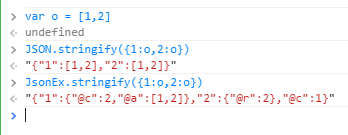

[トップページに戻る](../README.ja.md) | [JGSS 技術メモ](index.md)

# JGSS ver1.4.0 から ver1.5.0 への変化 (その2)

さて [前回](201707-jgss150.md) に引き続き、JGSS が ver1.5.0 に更新され、どう改善されたかざっと見ていきましょう。

# rpg_core.js の続き

[前回](201707-jgss150.md) に引き続き、rpg_core.js の中身をみていきます。

## Graphics クラスでのフォント読み込み

まずは静的な値(クラス変数)として以下が追加されているのがわかります。

```js
Graphics._cssFontLoading =  document.fonts && document.fonts.ready;
Graphics._fontLoaded = null;
Graphics._videoVolume = 1;
```

document.fonts.ready はわりと目新しくて、Chrome などで実装されているフォント読み込み完了を利用する機能ですね。以下のオブジェクト初期化の部分で利用されています。

```js
Graphics.initialize = function(width, height, type) {
  // 中略
  this._errorShowed = false;
  // 中略
  this._videoUnlocked = !Utils.isMobileDevice();
  this._videoLoading = false;  
  // 中略
  this._setupCssFontLoading();
};

Graphics._setupCssFontLoading = function(){
    if(Graphics._cssFontLoading){
        document.fonts.ready.then(function(fonts){
            Graphics._fontLoaded = fonts;
        }).catch(function(error){
            SceneManager.onError(error);
        });
    }
};
```

で、この Graphics.\_fontLoaded ですが、以下で参照されていました。 Graphics.\_cssFontLoading が使えないときの処理は、ほぼ以前と同様です。

```js
Graphics.isFontLoaded = function(name) {
    if (Graphics._cssFontLoading) {
        if(Graphics._fontLoaded){
            return Graphics._fontLoaded.check('10px "'+name+'"');
        }
        return false;
    } else {
        if (!this._hiddenCanvas) {
            this._hiddenCanvas = document.createElement('canvas');
        }
        // 省略 (以前の処理と同様)
    }
};
```

ちなみに上記で定義された Graphics.isFontLoaded ですが、rpg_managers.js の Scene_Boot で利用されていました。

```js
Scene_Boot.prototype.isReady = function() {
    if (Scene_Base.prototype.isReady.call(this)) {
        return DataManager.isDatabaseLoaded() && this.isGameFontLoaded();
    } else {
        return false;
    }
};

Scene_Boot.prototype.isGameFontLoaded = function() {
    if (Graphics.isFontLoaded('GameFont')) {
        return true;
    } else if (!Graphics.canUseCssFontLoading()){
        var elapsed = Date.now() - this._startDate;
        if (elapsed >= 60000) {
            throw new Error('Failed to load GameFont');
        }
    }
};
```

ゲーム用のフォント(GameFont)の読み込みは必須であること、そして60秒以内に読み込まれないとエラーになること、などがわかります。

ちなみに GameFont は fonts/gamefont.css で以下のように定義されています。

```css
@font-face {
    font-family: GameFont;
    src: url("mplus-1m-regular.ttf");
}
```

また読み込み時のエラー表示のため、Graphics.printLoadingError 関数と Graphics.eraseLoadingError 関数が定義されていますが、使用頻度が低そうなことと、一般的なコードなのでスルーします。

## ResourceHandler クラス

以前の Graphics.playVideo 関数は Graphics.\_playVideo にリネームされ、以下のように同名の新機関数が追加されています。

```js
Graphics.playVideo = function(src) {
    this._videoLoader = ResourceHandler.createLoader(null, this._playVideo.bind(this, src), this._onVideoError.bind(this));
    this._playVideo(src);
};
```

そして上記で定義された this.\_videoLoader は、実際にビデオを再生する際のエラーハンドラとして登録されています。

```js
Graphics._playVideo = function(src) {
  // 省略
  this._video.onerror = this._videoLoader;
  // 省略
};
```

そして利用されている ResourceHandler が ver1.5.0 から新規追加された3つ目のクラスではないかと思われます。 rpg_core.js ファイルの最後に定義がありました。

```js
function ResourceHandler() {
    throw new Error('This is a static class');
}
ResourceHandler._reloaders = [];
ResourceHandler._defaultRetryInterval = [500, 1000, 3000];

ResourceHandler.createLoader = function(url, retryMethod, resignMethod, retryInterval) {
    retryInterval = retryInterval || this._defaultRetryInterval;
    var reloaders = this._reloaders;
    var retryCount = 0;
    return function() {
        if (retryCount < retryInterval.length) {
            setTimeout(retryMethod, retryInterval[retryCount]);
            retryCount++;
        } else {
            if (resignMethod) {
                resignMethod();
            }
            if (url) {
                if (reloaders.length === 0) {
                    Graphics.printLoadingError(url);
                    SceneManager.stop();
                }
                reloaders.push(function() {
                    retryCount = 0;
                    retryMethod();
                });
            }
        }
    };
};

ResourceHandler.exists = function() {
    return this._reloaders.length > 0;
};

ResourceHandler.retry = function() {
    if (this._reloaders.length > 0) {
        Graphics.eraseLoadingError();
        SceneManager.resume();
        this._reloaders.forEach(function(reloader) {
            reloader();
        });
        this._reloaders.length = 0;
    }
};
```

また ResourceHandler の影響は意外なところにあって、以下のように ok 入力で retry がかかるように拡張されていますね。

```js
Input._onKeyDown = function(event) {
    if (this._shouldPreventDefault(event.keyCode)) {
        event.preventDefault();
    }
    if (event.keyCode === 144) {    // Numlock
        this.clear();
    }
    var buttonName = this.keyMapper[event.keyCode];
    if (ResourceHandler.exists() && buttonName === 'ok') { // ver1.5.0 で追加
        ResourceHandler.retry();                           // ver1.5.0 で追加
    } else if (buttonName) {
        this._currentState[buttonName] = true;
    }
};
```

たぶんこれまで、ビデオ再生で問題が発生していたとおもわれます。例えば読み込み時間がかかりすぎて、開始に間に合わずエラーになるとか。

そこで ver1.5.0 から新規追加された ResourceHandler クラスは読み込みを何度かリトライする仕組みを提供しています。これによりロードに時間がかかる長めのビデオでも、読み込みエラーが発生しても何度か既定の回数だけリトライし、問題なく再生を開始できるようなったと思われます。

余談ですがビデオの音量をセットするための関数も新規追加されていますね。

```js
Graphics.setVideoVolume = function(value) {
    this._videoVolume = value;
    if (this._video) {
        this._video.volume = this._videoVolume;
    }
};
```

またタッチ操作で停止していたビデオの再開ができるようになったようです。

```js
Graphics._setupEventHandlers = function() {
  window.addEventListener('resize', this._onWindowResize.bind(this));
  document.addEventListener('keydown', this._onKeyDown.bind(this));
  document.addEventListener('touchend', this._onTouchEnd.bind(this)); // ver1.5.0 で追加
};

Graphics._onTouchEnd = function(event) {
    if (!this._videoUnlocked) {
        this._video.play();
        this._videoUnlocked = true;
    }
    if (this._isVideoVisible() && this._video.paused) {
        this._video.play();
    }
};
```

## JsonEx の拡張について

JsonEx 関連が拡張されていて、セーブデータの圧縮など可能になっていますね。以下の実行結果がわかり易いとおもいます。



まあこの例ではサイズが増大していますが… 同じオブジェクトへの参照がある場合に、通常の JSON.stringify では単にそれを展開していますが、JsonEx ではちゃんと参照になっているのがわかります。

セーブデータの圧縮、ではなく、正確に言えば「相互参照するデータを保存する際に、自前ロジックで処理しなくても重複でセーブデータが増大しなくなった」が正解でしょうか。変にコピーができて、全体の整合性が失われることもなくなって、良い改良だとおもいます。

## その他 rpg_core.js での変更

[前回](201707-jgss150.md#rpg_corejs) に出てきた isSupportPassiveEvent が実際に使われていました。

```js
TouchInput._setupEventHandlers = function() {
  var isSupportPassive = Utils.isSupportPassiveEvent();
  // 中略
  document.addEventListener('touchstart', this._onTouchStart.bind(this), isSupportPassive ? {passive: false} : false);
  document.addEventListener('touchmove', this._onTouchMove.bind(this), isSupportPassive ? {passive: false} : false);
  // 省略
};
```

また Sprite で image を処理する際に、\_refreshFrame というフラグを利用するようになりました。これは画像読み込みを何度もリトライするようになったため、実際の更新処理を遅延させ、更に処理が重複しないように修正したと思われます。

```js
Object.defineProperty(Sprite.prototype, 'bitmap', {
    get: function() {
        return this._bitmap;
    },
    set: function(value) {
        if (this._bitmap !== value) {
            this._bitmap = value;

            if(value){
              // this.setFrame(0, 0, 0, 0); // 以前の処理
              this._refreshFrame = true;    // ver1.5.0 で追加
              value.addLoadListener(this._onBitmapLoad.bind(this));
            }else{
              this._refreshFrame = false;   // ver1.5.0 で追加
              this.texture.frame = Rectangle.emptyRectangle;
            }
        }
    },
    configurable: true
});

Sprite.prototype.setFrame = function(x, y, width, height) {
    this._refreshFrame = false;             // ver1.5.0 で追加
    var frame = this._frame;
    if (x !== frame.x || y !== frame.y ||
            width !== frame.width || height !== frame.height) {
        frame.x = x;
        frame.y = y;
        frame.width = width;
        frame.height = height;
        this._refresh();
    }
};

Sprite.prototype._onBitmapLoad = function(bitmapLoaded) {
    if(bitmapLoaded === this._bitmap){
        if (this._refreshFrame && this._bitmap) {
            this._refreshFrame = false;
            this._frame.width = this._bitmap.width;
            this._frame.height = this._bitmap.height;
        }
    }
    this._refresh();
};
```

Bitmap 読み込み部分の修正にあわせ、表示部分でも isReasy() をチェックするようになったり、細かく対応しています。

```js
Sprite.prototype._renderCanvas = function(renderer) {
    if (this.bitmap) {
        this.bitmap.touch();
    }
    if(this.bitmap && !this.bitmap.isReady()){ // ver1.5.0 で追加
        return;                                // ver1.5.0 で追加
    }                                          // ver1.5.0 で追加
    if (this.texture.frame.width > 0 && this.texture.frame.height > 0) {
        this._renderCanvas_PIXI(renderer);
    }
};
```

以上、rpg_core.js の修正点だけでも、けっこう多くありました。

特に Image キャッシュがちゃんと処理されるおかげで、大規模なゲームや、シーンごとにタイルセットなどを変更しているゲームでは、メモリ管理効率が非常に良くなったのでは？とおもいます。

次回は rpg_objects.js あたりを見ていきましょうか。

[トップページに戻る](../README.ja.md) | [JGSS 技術メモ](index.md)
