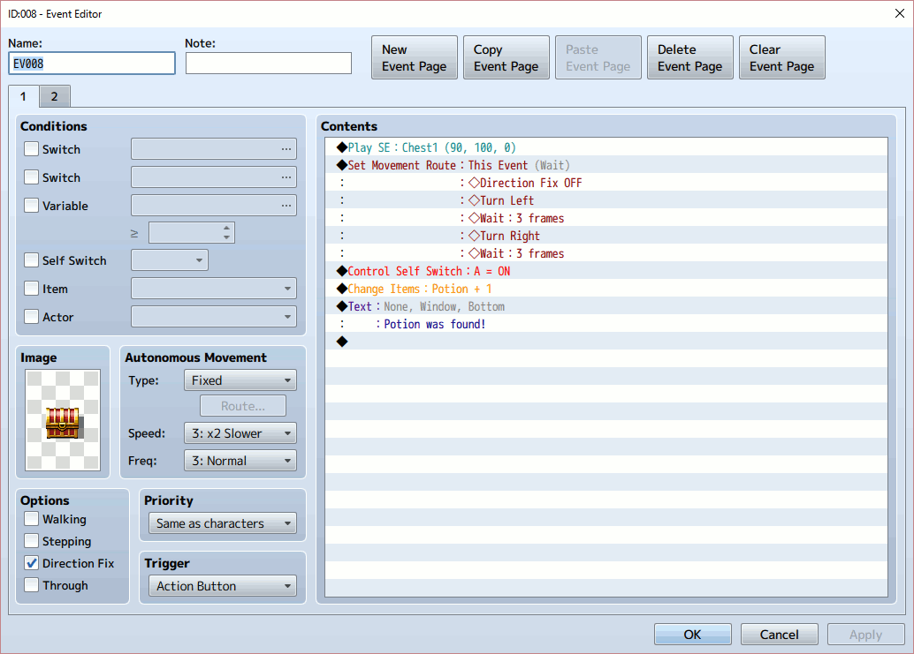
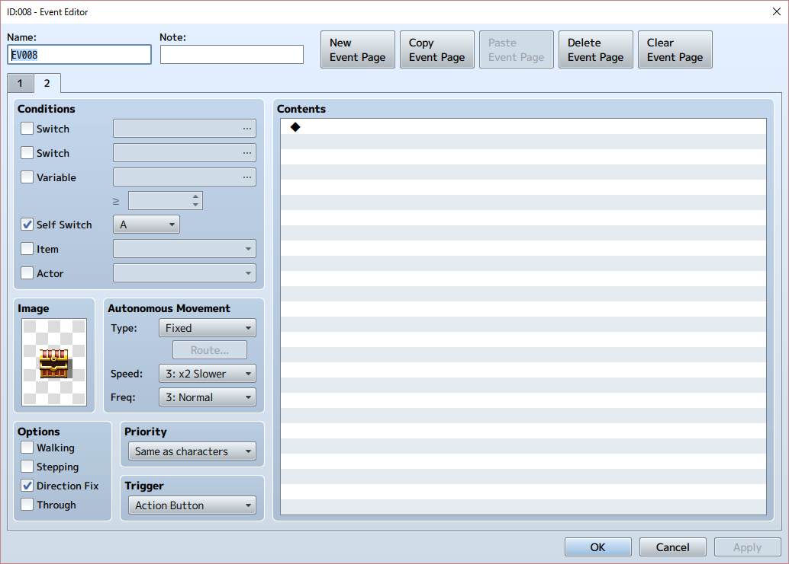
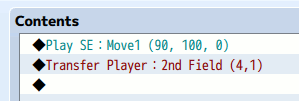
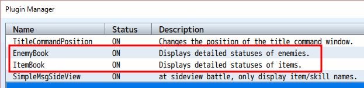
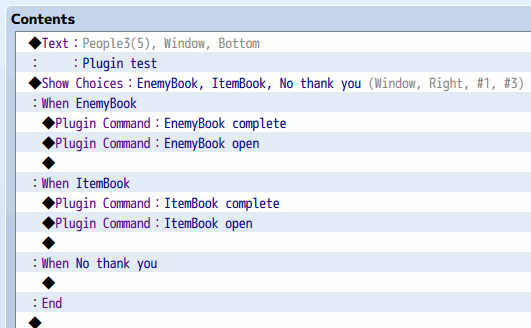
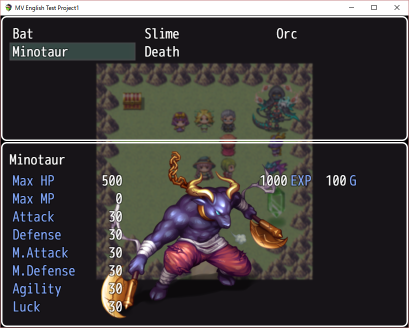
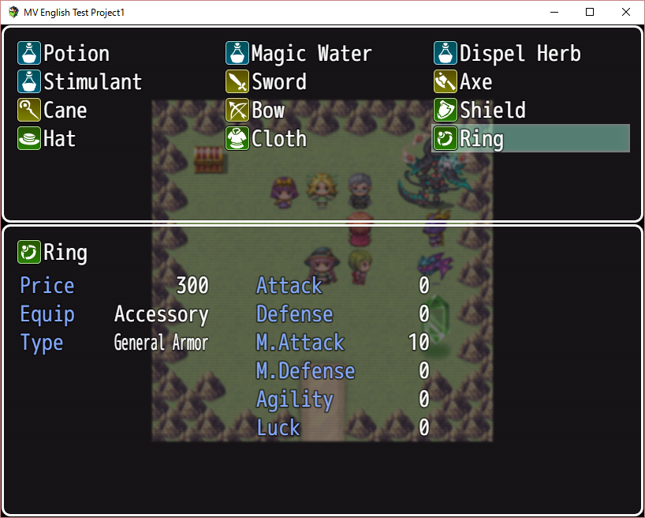
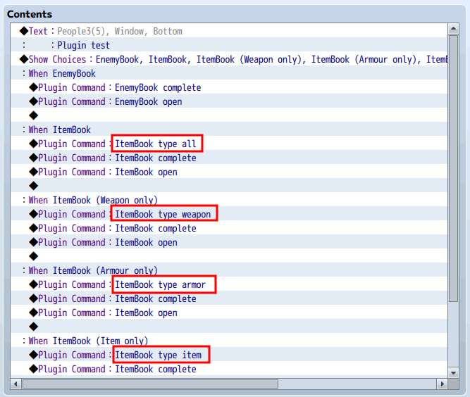
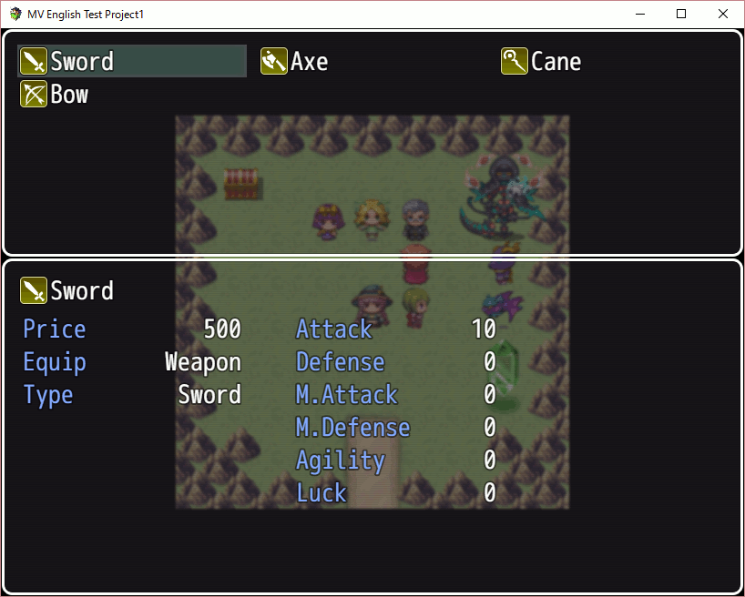

# 201605-2nd-Try

## Global game objects in game

At first, see data objects in the game.

```js
DataManager.setupNewGame = function() {
    this.createGameObjects();
    this.selectSavefileForNewGame();
    $gameParty.setupStartingMembers();
    $gamePlayer.reserveTransfer($dataSystem.startMapId, $dataSystem.startX, $dataSystem.startY);
    Graphics.frameCount = 0;
};
```

```js
DataManager.createGameObjects = function() {
    $gameTemp          = new Game_Temp();
    $gameSystem        = new Game_System();
    $gameScreen        = new Game_Screen();
    $gameTimer         = new Game_Timer();
    $gameMessage       = new Game_Message();
    $gameSwitches      = new Game_Switches();
    $gameVariables     = new Game_Variables();
    $gameSelfSwitches  = new Game_SelfSwitches();
    $gameActors        = new Game_Actors();
    $gameParty         = new Game_Party();
    $gameTroop         = new Game_Troop();
    $gameMap           = new Game_Map();
    $gamePlayer        = new Game_Player();
};
```

In RPG Maker MV application, let's add a simple evevt object, like a signboard. You can set your custom JS code with using 'Advanced/Script...' content in it, as follows;

```js
console.dir({
  "$gameTemp":$gameTemp, "$gameSystem":$gameSystem,
  "$gameScreen":$gameScreen, "$gameTimer":$gameTimer,
  "$gameMessage":$gameMessage,
  "$gameSwitches":$gameSwitches,
  "$gameVariables":$gameVariables,
  "$gameSelfSwitches":$gameSelfSwitches,
  "$gameActors":$gameActors, "$gameParty":$gameParty,
  "$gameTroop":$gameTroop, "$gameMap":$gameMap,
  "$gamePlayer":$gamePlayer
});
```


During the test play on RPG Maker MV, you can use Development tool by 'F8' key. This tool is very familiar for us, Web developers.

When you use the signboard in test game, you can see all global objects defined in DataManager.createGameObjects funcrion in the tool's console. It's useful.


## Global data objects in game

In addition, let's add one more　a sign board for data objects in game;

```js
console.dir({
 "$dataActors":$dataActors,"$dataClasses":$dataClasses,
 "$dataSkills":$dataSkills,"$dataItems":$dataItems,
 "$dataWeapons":$dataWeapons,"$dataArmors":$dataArmors,
 "$dataEnemies":$dataEnemies,"$dataTroops":$dataTroops,
 "$dataStates":$dataStates,"$dataAnimations":$dataAnimations,
 "$dataTilesets":$dataTilesets,
 "$dataCommonEvents":$dataCommonEvents,
 "$dataSystem":$dataSystem,
 "$dataMapInfos":$dataMapInfos,"$dataMap":$dataMap
});
```

Most of $data* objects looks simple Array. We need to understand the relationship among $data* arrays and $game* objects in game logic.

## Quick Event Creation - Treasure box

RPG Maker MV has a good function to create typical events automatically. It's very useful! The following is one of them, a simple Treasure box event.



I think this is a good sample to understand an event which uses a self switch only - easy to copy and paste to anywhere. You can find the self switch A is working on the 2nd page;



## Quick Event Creation - Transfer

One more sample, the Transfer is too simple;



## Use plugin - EnemyBook and ItemBook

I like the official plugin, ItemBook and EnemyBook.



To test both books, I had added the following test event;



The following is a test play of EnemyBook. This is a simple test, so it shows all enemies of the game.



The following is a test play of ItemBook. This is a simple test, so it shows all items of the game. It includes weapons and armours.



## Update ItemBook plugin

I want to use WeaponBook and ArmorBook, like ItemBook. In addition, the ItemBook should not contain Weapon and Armor. I try to enhance "ItemBook" plugin a little for me.

At first, I added 'type' command into Game_Interpreter.prototype.pluginCommand function in ItemBook.js.

```js
    case 'type':
        $gameSystem._ItemBookType = $gameSystem.itemBookTypeToIndex(args[1]);
        break;
```


Then I updated Window_ItemBookIndex.prototype.refresh function as follows;

```js
Window_ItemBookIndex.prototype.refresh = function() {
    var i, item;
    this._list = [];
    for (i = 1; i < $dataItems.length; i++) {
        item = $dataItems[i];
        if (item.name && item.itypeId === 1 && item.meta.book !== 'no' && !($gameSystem._ItemBookType == 1 || $gameSystem._ItemBookType == 2)) {
            this._list.push(item);
        }
    }
    for (i = 1; i < $dataWeapons.length; i++) {
        item = $dataWeapons[i];
        if (item.name && item.meta.book !== 'no' && !($gameSystem._ItemBookType == 0 || $gameSystem._ItemBookType == 2)) {
            this._list.push(item);
        }
    }
    for (i = 1; i < $dataArmors.length; i++) {
        item = $dataArmors[i];
        if (item.name && item.meta.book !== 'no' && !($gameSystem._ItemBookType == 0 || $gameSystem._ItemBookType == 1)) {
            this._list.push(item);
        }
    }
    this.createContents();
    this.drawAllItems();
};
```

Now, I can use 'ItemBook type [all|weapon|armor|item]' plugin command as follows;



For example, the following is an ItemBook which contains only Weapons (ItemBook type weapon).


