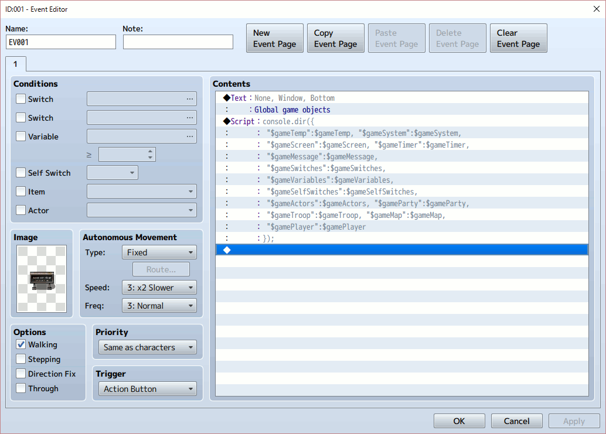

# 201605-2nd-Try

## Global game objects in game

At first, see data objects in the game.

    DataManager.setupNewGame = function() {
        this.createGameObjects();
        this.selectSavefileForNewGame();
        $gameParty.setupStartingMembers();
        $gamePlayer.reserveTransfer($dataSystem.startMapId, $dataSystem.startX, $dataSystem.startY);
        Graphics.frameCount = 0;
    };

    DataManager.createGameObjects = function() {
        $gameTemp          = new Game_Temp();
        $gameSystem        = new Game_System();
        $gameScreen        = new Game_Screen();
        $gameTimer         = new Game_Timer();
        $gameMessage       = new Game_Message();
        $gameSwitches      = new Game_Switches();
        $gameVariables     = new Game_Variables();
        $gameSelfSwitches  = new Game_SelfSwitches();
        $gameActors        = new Game_Actors();
        $gameParty         = new Game_Party();
        $gameTroop         = new Game_Troop();
        $gameMap           = new Game_Map();
        $gamePlayer        = new Game_Player();
    };

In RPG Maker MV application, let's add a simple evevt object, like a signboard. You can set your custom JS code with using 'Advanced/Script...' content in it, as follows;

    console.dir({
      "$gameTemp":$gameTemp, "$gameSystem":$gameSystem,
      "$gameScreen":$gameScreen, "$gameTimer":$gameTimer,
      "$gameMessage":$gameMessage,
      "$gameSwitches":$gameSwitches,
      "$gameVariables":$gameVariables,
      "$gameSelfSwitches":$gameSelfSwitches,
      "$gameActors":$gameActors, "$gameParty":$gameParty,
      "$gameTroop":$gameTroop, "$gameMap":$gameMap,
      "$gamePlayer":$gamePlayer
    });

During the test play on RPG Maker MV, you can use Development tool by 'F8' key. This tool is very familiar for us, Web developers.

When you use the signboard in test game, you can see all global objects defined in DataManager.createGameObjects funcrion in the tool's console. It's useful.

## Global data objects in game

In addition, let's add one more　a sign board for data objects in game;

    console.dir({
     "$dataActors":$dataActors,"$dataClasses":$dataClasses,
     "$dataSkills":$dataSkills,"$dataItems":$dataItems,
     "$dataWeapons":$dataWeapons,"$dataArmors":$dataArmors,
     "$dataEnemies":$dataEnemies,"$dataTroops":$dataTroops,
     "$dataStates":$dataStates,"$dataAnimations":$dataAnimations,
     "$dataTilesets":$dataTilesets,
     "$dataCommonEvents":$dataCommonEvents,
     "$dataSystem":$dataSystem,
     "$dataMapInfos":$dataMapInfos,"$dataMap":$dataMap
    });

Most of $data* objects looks simple Array. We need to understand the relationship among $data* arrays and $game* objects in game logic.
