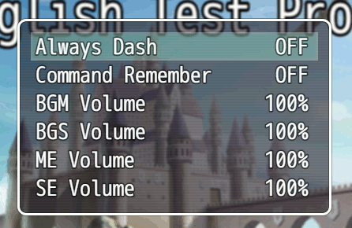
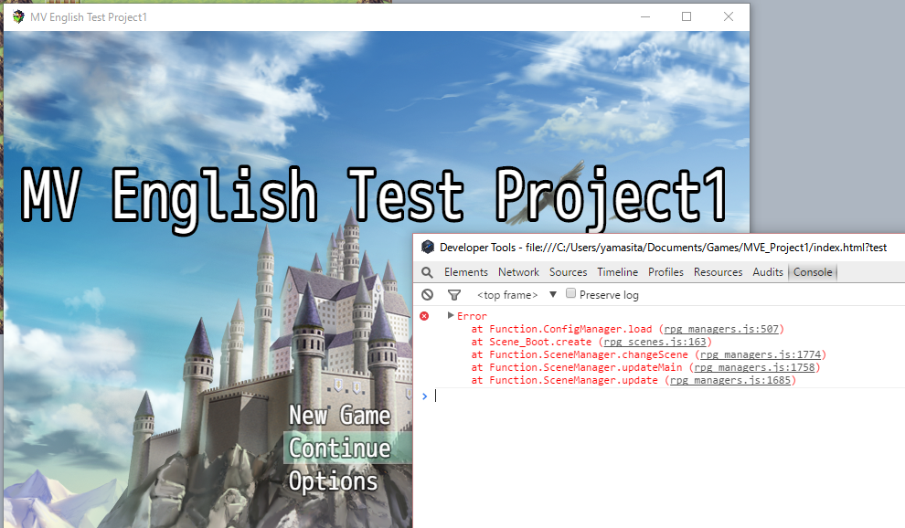
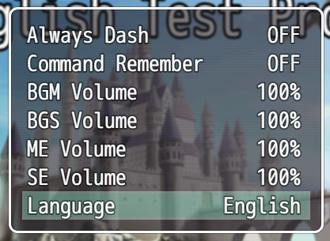

# 201606-enhance-options

## Call Options menu

In the title scene or game menu, we can use Option menu.



Let's check this menu from the Title scene (Scene_Title);

```js
Scene_Title.prototype.createCommandWindow = function() {
    this._commandWindow = new Window_TitleCommand();
    this._commandWindow.setHandler('newGame',  this.commandNewGame.bind(this));
    this._commandWindow.setHandler('continue', this.commandContinue.bind(this));
    this._commandWindow.setHandler('options',  this.commandOptions.bind(this));
    this.addWindow(this._commandWindow);
};
```

```js
Scene_Title.prototype.commandOptions = function() {
    this._commandWindow.close();
    SceneManager.push(Scene_Options);
};
```

It looks same in the Menu scene (Scene_Menu).

```js
Scene_Menu.prototype.createCommandWindow = function() {
    this._commandWindow = new Window_MenuCommand(0, 0);
    this._commandWindow.setHandler('item',      this.commandItem.bind(this));
    this._commandWindow.setHandler('skill',     this.commandPersonal.bind(this));
    this._commandWindow.setHandler('equip',     this.commandPersonal.bind(this));
    this._commandWindow.setHandler('status',    this.commandPersonal.bind(this));
    this._commandWindow.setHandler('formation', this.commandFormation.bind(this));
    this._commandWindow.setHandler('options',   this.commandOptions.bind(this));
    this._commandWindow.setHandler('save',      this.commandSave.bind(this));
    this._commandWindow.setHandler('gameEnd',   this.commandGameEnd.bind(this));
    this._commandWindow.setHandler('cancel',    this.popScene.bind(this));
    this.addWindow(this._commandWindow);
};
```

```js
Scene_Menu.prototype.commandOptions = function() {
    SceneManager.push(Scene_Options);
};
```

## Options scene

Next, let's check Options scene (Scene_Options). The code looks very simple;

```js
Scene_Options.prototype.create = function() {
    Scene_MenuBase.prototype.create.call(this);
    this.createOptionsWindow();
};
```

```js
Scene_Options.prototype.terminate = function() {
    Scene_MenuBase.prototype.terminate.call(this);
    ConfigManager.save();
};
```

```js
Scene_Options.prototype.createOptionsWindow = function() {
    this._optionsWindow = new Window_Options();
    this._optionsWindow.setHandler('cancel', this.popScene.bind(this));
    this.addWindow(this._optionsWindow);
};
```

The code to add menu items is in Window_Options and its base class, Window_Command.

```js
Window_Options.prototype.initialize = function() {
    Window_Command.prototype.initialize.call(this, 0, 0);
    this.updatePlacement();
};
```

```js
Window_Command.prototype.initialize = function(x, y) {
    this.clearCommandList();
    this.makeCommandList();
    var width = this.windowWidth();
    var height = this.windowHeight();
    Window_Selectable.prototype.initialize.call(this, x, y, width, height);
    this.refresh();
    this.select(0);
    this.activate();
};
```

OK, we can find the target code, makeCommandList function.

```js
Window_Options.prototype.makeCommandList = function() {
    this.addGeneralOptions();
    this.addVolumeOptions();
};
```

```js
Window_Options.prototype.addGeneralOptions = function() {
    this.addCommand(TextManager.alwaysDash, 'alwaysDash');
    this.addCommand(TextManager.commandRemember, 'commandRemember');
};
```

```js
Window_Options.prototype.addVolumeOptions = function() {
    this.addCommand(TextManager.bgmVolume, 'bgmVolume');
    this.addCommand(TextManager.bgsVolume, 'bgsVolume');
    this.addCommand(TextManager.meVolume, 'meVolume');
    this.addCommand(TextManager.seVolume, 'seVolume');
};
```

Now, we can add a new menu item into the Options menu anywhere.

## New menu item

The code of addCommand function is as follows;

```js
Window_Command.prototype.addCommand = function(name, symbol, enabled, ext) {
    if (enabled === undefined) {
        enabled = true;
    }
    if (ext === undefined) {
        ext = null;
    }
    this._list.push({ name: name, symbol: symbol, enabled: enabled, ext: ext});
};
```

The target values are defined in ConfigManager class.

```js
ConfigManager.alwaysDash        = false;
ConfigManager.commandRemember   = false;

Object.defineProperty(ConfigManager, 'bgmVolume', {
    get: function() {
        return AudioManager._bgmVolume;
    },
    set: function(value) {
        AudioManager.bgmVolume = value;
    },
    configurable: true
});
```

From the code of Window_Options class, we can find some rules (limitations).

* Only 2 types of data - ON/OFF or 0-100%
* If a symbol contains "Volume", the data type is 0-100%
* If a symbol doesn't contain "Volume", the data type is ON/OFF

If you want to add a option menu which are in these 2 data types, it looks easy. But you need to enhance the logics, if you want to use other types.

## Save function of Config Manager

Let's check about ConfigManager, to understand the save mechanism.

```js
ConfigManager.save = function() {
    StorageManager.save(-1, JSON.stringify(this.makeData()));
};
```

```js
ConfigManager.makeData = function() {
    var config = {};
    config.alwaysDash = this.alwaysDash;
    config.commandRemember = this.commandRemember;
    config.bgmVolume = this.bgmVolume;
    config.bgsVolume = this.bgsVolume;
    config.meVolume = this.meVolume;
    config.seVolume = this.seVolume;
    return config;
};
```

Follow the code of StorageManager class;

```js
StorageManager.save = function(savefileId, json) {
    if (this.isLocalMode()) {
        this.saveToLocalFile(savefileId, json);
    } else {
        this.saveToWebStorage(savefileId, json);
    }
};
```

```js
StorageManager.saveToLocalFile = function(savefileId, json) {
    var data = LZString.compressToBase64(json);
    var fs = require('fs');
    var dirPath = this.localFileDirectoryPath();
    var filePath = this.localFilePath(savefileId);
    if (!fs.existsSync(dirPath)) {
        fs.mkdirSync(dirPath);
    }
    fs.writeFileSync(filePath, data);
};
```

```js
StorageManager.localFilePath = function(savefileId) {
    var name;
    if (savefileId < 0) {
        name = 'config.rpgsave';
    } else if (savefileId === 0) {
        name = 'global.rpgsave';
    } else {
        name = 'file%1.rpgsave'.format(savefileId);
    }
    return this.localFileDirectoryPath() + name;
};
```

Now, we find the 'config.rpgsave' file contains Options setting.

The files are not easy to read, because of LZString.compressToBase64 process. So, for the future study, I try to add the following code into the last of StorageManager.saveToLocalFile function.

```js
  fs.writeFileSync(filePath + ".json", json);
```

For example, we can see the following json data in 'config.rpgsave.json' file.

```js
   {
      "alwaysDash":false,
      "commandRemember":false,
      "bgmVolume":100,
      "bgsVolume":100,
      "meVolume":100,
      "seVolume":100
    }
```

## Load function of Config Manager

The lode code of Options menu looks simple;

```js
ConfigManager.load = function() {
    var json;
    var config = {};
    json = StorageManager.load(-1);
    config = JSON.parse(json);
    this.applyData(config);
};
```

```js
ConfigManager.applyData = function(config) {
    this.alwaysDash = this.readFlag(config, 'alwaysDash');
    this.commandRemember = this.readFlag(config, 'commandRemember');
    this.bgmVolume = this.readVolume(config, 'bgmVolume');
    this.bgsVolume = this.readVolume(config, 'bgsVolume');
    this.meVolume = this.readVolume(config, 'meVolume');
    this.seVolume = this.readVolume(config, 'seVolume');
};
```

OK, let's find the call point of this. It must be found the start block of the game, to keep the game settings.

I want to suggest to use JavaScript's trace technique to save your time. Let's add 3 lines trace code into the target code, ConfigManager.load function.

```js
ConfigManager.load = function() {
    var o = {};
    Error.captureStackTrace(o);
    console.error(o.stack);

    var json;
    //...
}
```

So, you can see the stack trace in the dev console during the test play.



I'm happy to use JavaScript techniques not only on usual Web development work, but also game development on the RPG Maker MV. :-)

## Add Select type

For the test purpose, let't try to add a new type, select. It's a function to choose one String from String list. At first, add follwoing new functions.

```js
Window_Options.prototype.addSelectValues = function(symbol, values) {
    this._selctValueList = this._selctValueList || {};
    this._selctValueList[symbol] = values;
};
```

```js
Window_Options.prototype.isSelectSymbol = function(symbol) {
    return symbol.contains('Select') && this._selctValueList[symbol];
};
```

Then, add the following code into the middle of Window_Options.statusText function;

```js
    } else if (this.isSelectSymbol(symbol)) {
        return value || this._selctValueList[symbol][0];
```

Then, add 2 lines test code into Window_Options.makeCommandList function;

```js
Window_Options.prototype.makeCommandList = function() {
    this.addGeneralOptions();
    this.addVolumeOptions();
    this.addSelectValues("langSelect", ["English", "Japanese", "Chinese"]);
    this.addCommand("Language", "langSelect");
};
```

So, you can see the new option item in the test game;



But this is not enough. We need to add more codes to change value. Let's add the following code into both Window_Options.processOk and Window_Options.cursorRight functions;

```js
    } else if (this.isSelectSymbol(symbol)) {
        var values = this._selctValueList[symbol];
        var pos = values.indexOf(value);
        this.changeValue(symbol, values[(pos + 1) % values.length]);
```

One more, add the following code into Window_Options.cursorLeft function;

```js
    } else if (this.isSelectSymbol(symbol)) {
        var values = this._selctValueList[symbol];
        var pos = values.indexOf(value);
        this.changeValue(symbol, values[(pos + values.length - 1) % values.length]);
```

Now, we can change the value. The last action is for save/load functions.

To save the addtional data is easy, add one line into ConfigManager.makeData function;

```js
    config.langSelect = this.langSelect;
```

To load the addtional data is also easy, add one line into ConfigManager.applyData function;

```js
    this.langSelect = config["langSelect"];
```

That's all. Now, you can use select type option menu item like "Language" in your game.

Of course, if you will add "Language" item into your game option, you should add translated text values into your game. This is another try to enhance the game, so I will write another memo. soon.
