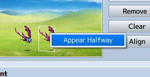
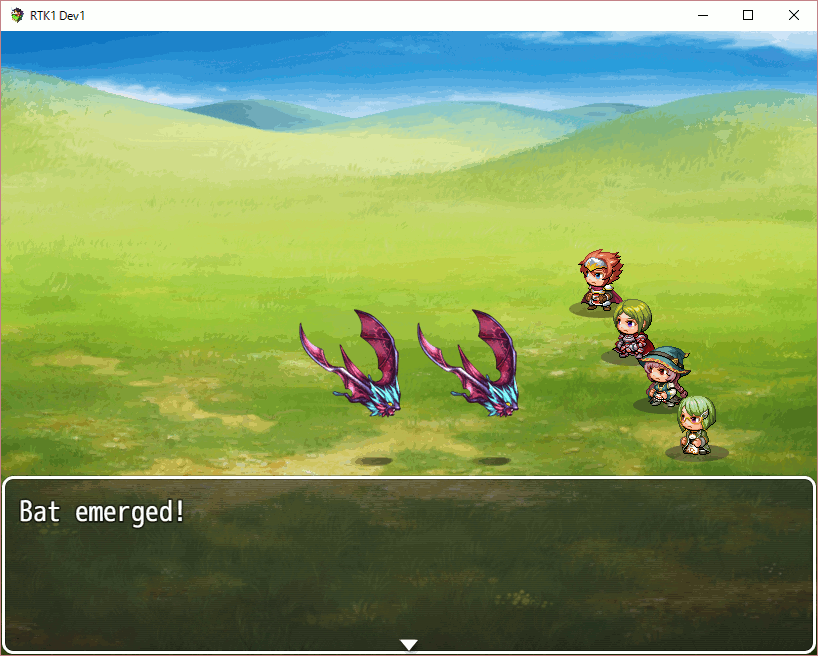
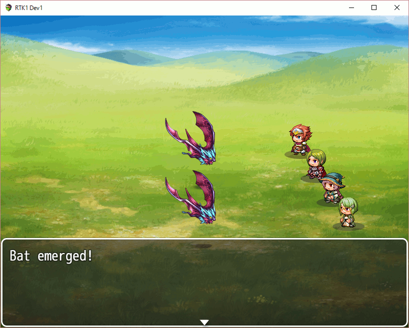

# 201607-battle

## BattleManager

To understand the battle of RPG Maker MV, let's check the BattleManager in 'rpg_managers.js' file.

```js
function BattleManager() {
    throw new Error('This is a static class');
}

BattleManager.setup = function(troopId, canEscape, canLose) {
    this.initMembers();
    this._canEscape = canEscape;
    this._canLose = canLose;
    $gameTroop.setup(troopId);
    $gameScreen.onBattleStart();
    this.makeEscapeRatio();
};

BattleManager.initMembers = function() {
    this._phase = 'init';
    this._canEscape = false;
    this._canLose = false;
    this._battleTest = false;
    this._eventCallback = null;
    this._preemptive = false;
    this._surprise = false;
    this._actorIndex = -1;
    this._actionForcedBattler = null;
    this._mapBgm = null;
    this._mapBgs = null;
    this._actionBattlers = [];
    this._subject = null;
    this._action = null;
    this._targets = [];
    this._logWindow = null;
    this._statusWindow = null;
    this._spriteset = null;
    this._escapeRatio = 0;
    this._escaped = false;
    this._rewards = {};
};
```

'$gameTroop' is a instance of 'Game_Troop' class. Let's follow this.

```
Game_Troop
  Game_Unit
    Object
```

## Setup of troops

Troop is set of enemies in this system.

```js
Game_Troop.prototype.troop = function() {
    return $dataTroops[this._troopId];
};

Game_Troop.prototype.setup = function(troopId) {
    this.clear();
    this._troopId = troopId;
    this._enemies = [];
    this.troop().members.forEach(function(member) {
        if ($dataEnemies[member.enemyId]) {
            var enemyId = member.enemyId;
            var x = member.x;
            var y = member.y;
            var enemy = new Game_Enemy(enemyId, x, y);
            if (member.hidden) {
                enemy.hide();
            }
            this._enemies.push(enemy);
        }
    }, this);
    this.makeUniqueNames();
};
```

It looks almost simple, but I wonder about 'hidden' value. Then, I found the hidden value is from;



The following is naming logic of enemies;

```js
Game_Troop.prototype.makeUniqueNames = function() {
    var table = this.letterTable();
    this.members().forEach(function(enemy) {
        if (enemy.isAlive() && enemy.isLetterEmpty()) {
            var name = enemy.originalName();
            var n = this._namesCount[name] || 0;
            enemy.setLetter(table[n % table.length]);
            this._namesCount[name] = n + 1;
        }
    }, this);
    this.members().forEach(function(enemy) {
        var name = enemy.originalName();
        if (this._namesCount[name] >= 2) {
            enemy.setPlural(true);
        }
    }, this);
};

Game_Enemy.prototype.setPlural = function(plural) {
    this._plural = plural;
};
Game_Enemy.prototype.name = function() {
    return this.originalName() + (this._plural ? this._letter : '');
};
```

## Idea: location of enemies

'Game_Troop.prototype.setup' function set the location of each enemy. So we can modift it to fit sideview battle mode.

I think the location of enemy should be rotated at 90-degree backspin for the sideview battle. The sample code is as follws;

```js
        //var x = member.x;
        var x = $dataSystem.optSideView ? Graphics.width - member.y : member.x;
        //var y = member.y;
        var y = $dataSystem.optSideView ? member.x : member.y;
```

OK, let's check. The following is the default logic;



And the following is the rotated one;



Of course, this is too simple to use. We need to add more code to use this in plugin file.

## Game_Enemy class

Next, let's check the instanciate of Game_Enemy.

```
Game_Enemy
  Game_Battler
    Game_BattlerBase
      Object
```

```js
function Game_Enemy() {
    this.initialize.apply(this, arguments);
}
Game_Enemy.prototype = Object.create(Game_Battler.prototype);
Game_Enemy.prototype.constructor = Game_Enemy;

Game_Enemy.prototype.initialize = function(enemyId, x, y) {
    Game_Battler.prototype.initialize.call(this);
    this.setup(enemyId, x, y);
};

Game_Enemy.prototype.setup = function(enemyId, x, y) {
    this._enemyId = enemyId;
    this._screenX = x;
    this._screenY = y;
    this.recoverAll();
};

```

There is no code to create PIXI.Sprite object... OK, let's back to the start point, 'BattleManager.setup'.

## Game_Screen class

```
Game_Screen
  Object
```

This class looks somple. Let's check the onBattleStart function which is called in 'BattleManager.setup'.

```js
Game_Screen.prototype.onBattleStart = function() {
    this.clearFade();
    this.clearFlash();
    this.clearShake();
    this.clearZoom();
    this.eraseBattlePictures();
};

Game_Screen.prototype.eraseBattlePictures = function() {
    this._pictures = this._pictures.slice(0, this.maxPictures() + 1);
};
```

It's wrong way... Back to BattleManager...

```js
SceneManager.push(Scene_Battle);
```

Oh, that's it. I forgot about 'Scene_Battle'...

## Scene_Battle

The battle starts in map with following code;

```js
Scene_Map.prototype.stop = function() {
    Scene_Base.prototype.stop.call(this);
    $gamePlayer.straighten();
    this._mapNameWindow.close();
    if (this.needsSlowFadeOut()) {
        this.startFadeOut(this.slowFadeSpeed(), false);
    } else if (SceneManager.isNextScene(Scene_Map)) {
        this.fadeOutForTransfer();
    } else if (SceneManager.isNextScene(Scene_Battle)) {
        this.launchBattle();
    }
};

Scene_Map.prototype.launchBattle = function() {
    BattleManager.saveBgmAndBgs();
    this.stopAudioOnBattleStart();
    SoundManager.playBattleStart();
    this.startEncounterEffect();
    this._mapNameWindow.hide();
};
```

Then, scene will start;

```js
function Scene_Battle() {
    this.initialize.apply(this, arguments);
}
Scene_Battle.prototype = Object.create(Scene_Base.prototype);
Scene_Battle.prototype.constructor = Scene_Battle;

Scene_Battle.prototype.initialize = function() {
    Scene_Base.prototype.initialize.call(this);
};
Scene_Base.prototype.initialize = function() {
    Stage.prototype.initialize.call(this);
    this._active = false;
    this._fadeSign = 0;
    this._fadeDuration = 0;
    this._fadeSprite = null;
};

Scene_Battle.prototype.create = function() {
    Scene_Base.prototype.create.call(this);
    this.createDisplayObjects();
};
```

```js
Scene_Battle.prototype.createDisplayObjects = function() {
    this.createSpriteset();
    this.createWindowLayer();
    this.createAllWindows();
    BattleManager.setLogWindow(this._logWindow);
    BattleManager.setStatusWindow(this._statusWindow);
    BattleManager.setSpriteset(this._spriteset);
    this._logWindow.setSpriteset(this._spriteset);
};

Scene_Battle.prototype.createSpriteset = function() {
    this._spriteset = new Spriteset_Battle();
    this.addChild(this._spriteset);
};
```

OK, 'Spriteset_Battle' looks important to show enemies.

```
Spriteset_Battle
  Spriteset_Base
    Sprite
      PIXI.Sprite
        PIXI.DisplayObjectContainer
          PIXI.DisplayObject
            Object
```

```js
function Spriteset_Battle() {
    this.initialize.apply(this, arguments);
}
Spriteset_Battle.prototype = Object.create(Spriteset_Base.prototype);
Spriteset_Battle.prototype.constructor = Spriteset_Battle;

Spriteset_Battle.prototype.initialize = function() {
    Spriteset_Base.prototype.initialize.call(this);
    this._battlebackLocated = false;
};
Spriteset_Base.prototype.initialize = function() {
    Sprite.prototype.initialize.call(this);
    this.setFrame(0, 0, Graphics.width, Graphics.height);
    this._tone = [0, 0, 0, 0];
    this.opaque = true;
    this.createLowerLayer();
    this.createToneChanger();
    this.createUpperLayer();
    this.update();
};

Spriteset_Battle.prototype.createLowerLayer = function() {
    Spriteset_Base.prototype.createLowerLayer.call(this);
    this.createBackground();
    this.createBattleField();
    this.createBattleback();
    this.createEnemies();
    this.createActors();
};
Spriteset_Base.prototype.createLowerLayer = function() {
    this.createBaseSprite();
};
Spriteset_Base.prototype.createBaseSprite = function() {
    this._baseSprite = new Sprite();
    this._baseSprite.setFrame(0, 0, this.width, this.height);
    this._blackScreen = new ScreenSprite();
    this._blackScreen.opacity = 255;
    this.addChild(this._baseSprite);
    this._baseSprite.addChild(this._blackScreen);
};

Spriteset_Base.prototype.createUpperLayer = function() {
    this.createPictures();
    this.createTimer();
    this.createScreenSprites();
};
```

OK, I met the enemies again!

```js
Spriteset_Battle.prototype.createEnemies = function() {
    var enemies = $gameTroop.members();
    var sprites = [];
    for (var i = 0; i < enemies.length; i++) {
        sprites[i] = new Sprite_Enemy(enemies[i]);
    }
    sprites.sort(this.compareEnemySprite.bind(this));
    for (var j = 0; j < sprites.length; j++) {
        this._battleField.addChild(sprites[j]);
    }
    this._enemySprites = sprites;
};

Spriteset_Battle.prototype.createActors = function() {
    this._actorSprites = [];
    for (var i = 0; i < $gameParty.maxBattleMembers(); i++) {
        this._actorSprites[i] = new Sprite_Actor();
        this._battleField.addChild(this._actorSprites[i]);
    }
};
```

So, let's check the 'Sprite_Enemy' class.

```
Sprite_Enemy
  Sprite_Battler
    Sprite_Base
      Sprite
        PIXI.Sprite...
```

```js
function Sprite_Enemy() {
    this.initialize.apply(this, arguments);
}

Sprite_Enemy.prototype = Object.create(Sprite_Battler.prototype);
Sprite_Enemy.prototype.constructor = Sprite_Enemy;

Sprite_Enemy.prototype.initialize = function(battler) {
    Sprite_Battler.prototype.initialize.call(this, battler);
};
Sprite_Battler.prototype.initialize = function(battler) {
    Sprite_Base.prototype.initialize.call(this);
    this.initMembers();
    this.setBattler(battler);
};
Sprite_Base.prototype.initialize = function() {
    Sprite.prototype.initialize.call(this);
    this._animationSprites = [];
    this._effectTarget = this;
    this._hiding = false;
};
Sprite.prototype.initialize = function(bitmap) {
    var texture = new PIXI.Texture(new PIXI.BaseTexture());

    PIXI.Sprite.call(this, texture);

    this._bitmap = null;
    this._frame = new Rectangle();
    this._realFrame = new Rectangle();
    this._offset = new Point();
    this._blendColor = [0, 0, 0, 0];
    this._colorTone = [0, 0, 0, 0];
    this._canvas = null;
    this._context = null;
    this._tintTexture = null;

    this.spriteId = Sprite._counter++;
    this.opaque = false;

    this.bitmap = bitmap;
};

Sprite_Battler.prototype.setBattler = function(battler) {
    this._battler = battler;
};

Sprite_Battler.prototype.initMembers = function() {
    this.anchor.x = 0.5;
    this.anchor.y = 1;
    this._battler = null;
    this._damages = [];
    this._homeX = 0;
    this._homeY = 0;
    this._offsetX = 0;
    this._offsetY = 0;
    this._targetOffsetX = NaN;
    this._targetOffsetY = NaN;
    this._movementDuration = 0;
    this._selectionEffectCount = 0;
};

Sprite_Enemy.prototype.initMembers = function() {
    Sprite_Battler.prototype.initMembers.call(this);
    this._enemy = null;
    this._appeared = false;
    this._battlerName = '';
    this._battlerHue = 0;
    this._effectType = null;
    this._effectDuration = 0;
    this._shake = 0;
    this.createStateIconSprite();
};

Sprite_Enemy.prototype.createStateIconSprite = function() {
    this._stateIconSprite = new Sprite_StateIcon();
    this.addChild(this._stateIconSprite);
};
```

Then, the battle starts;

```js
Scene_Battle.prototype.start = function() {
    Scene_Base.prototype.start.call(this);
    this.startFadeIn(this.fadeSpeed(), false);
    BattleManager.playBattleBgm();
    BattleManager.startBattle();
};

BattleManager.startBattle = function() {
    this._phase = 'start';
    $gameSystem.onBattleStart();
    $gameParty.onBattleStart();
    $gameTroop.onBattleStart();
    this.displayStartMessages();
};

Game_System.prototype.onBattleStart = function() {
    this._battleCount++;
};

Game_Unit.prototype.onBattleStart = function() {
    this.members().forEach(function(member) {
        member.onBattleStart();
    });
    this._inBattle = true;
};
Game_Battler.prototype.onBattleStart = function() {
    this.setActionState('undecided');
    this.clearMotion();
    if (!this.isPreserveTp()) {
        this.initTp();
    }
};
```

Who load the bitmap into Sprite_Enemy object?

```js
Sprite_Enemy.prototype.updateBitmap = function() {
    Sprite_Battler.prototype.updateBitmap.call(this);
    var name = this._enemy.battlerName();
    var hue = this._enemy.battlerHue();
    if (this._battlerName !== name || this._battlerHue !== hue) {
        this._battlerName = name;
        this._battlerHue = hue;
        this.loadBitmap(name, hue);
        this.initVisibility();
    }
};

Sprite_Battler.prototype.updateMain = function() {
    if (this._battler.isSpriteVisible()) {
        this.updateBitmap();
        this.updateFrame();
    }
    this.updateMove();
    this.updatePosition();
};

Sprite_Battler.prototype.update = function() {
    Sprite_Base.prototype.update.call(this);
    if (this._battler) {
        this.updateMain();
        this.updateAnimation();
        this.updateDamagePopup();
        this.updateSelectionEffect();
    } else {
        this.bitmap = null;
    }
};

```

Everytime a Sprite_Enemy update, if the bitmap name is different, the bitmap will be updated automatically. It means the init code nothing about bitmap, and the 1st update will cover it.

OK.

Now I undertstand a part of BattleManager, about enemy sprites. I will try to continue another time. :-P
