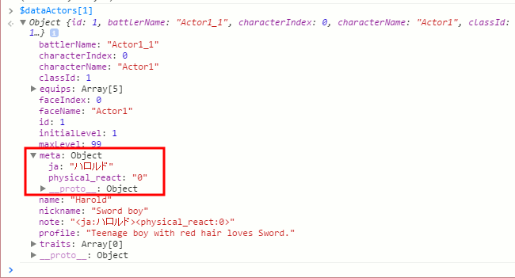
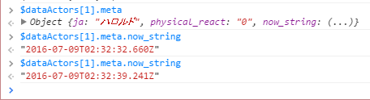

# 201607-meta

The logic and process timing of 'meta' attribute.



## Search the entry point

At first, I try to search meta keyword in 'rpg_managers.js' file;

```js
DataManager.onLoad = function(object) {
    var array;
    if (object === $dataMap) {
        this.extractMetadata(object);
        array = object.events;
    } else {
        array = object;
    }
    if (Array.isArray(array)) {
        for (var i = 0; i < array.length; i++) {
            var data = array[i];
            if (data && data.note !== undefined) {
                this.extractMetadata(data);
            }
        }
    }
};

DataManager.extractMetadata = function(data) {
    var re = /<([^<>:]+)(:?)([^>]*)>/g;
    data.meta = {};
    for (;;) {
        var match = re.exec(data.note);
        if (match) {
            if (match[2] === ':') {
                data.meta[match[1]] = match[3];
            } else {
                data.meta[match[1]] = true;
            }
        } else {
            break;
        }
    }
};
```

OK, it looks simple. Let's check 'extractMetadata' will be called later or not.

... search ... search ... Oh ...

I couldn't find the 'extractMetadata' in other place. I guess this 'extractMetadata' function is called one time in onLoad function, and 'meta' data will not be updated anymore...

## Idea: Add a dynamic value into meta

OK, 'meta' data is static. I can undesrstand, because $data* is static world in JGSS.

But let's try to add a dynamic value into 'meta' information, just for fun. The following is a simple plugin code to test a dynamic value.:-)

```js
(function(_global) {
	var _DataManager_extractMetadata = DataManager.extractMetadata;
	DataManager.extractMetadata = function(data) {
		_DataManager_extractMetadata.call(this, data);
		Object.defineProperty(data.meta, 'now_string', {
			get: function() {
				return (new Date()).toISOString();
			}
		});
	};
})(this);
```

The code can work;



Maybe, this code has big capacity - we can control other usful plugins which depends on static meta ionformation.

For example, we can replace a static meta attribute by the dynamic logic to refer the game switchs/variables, so user can change plugin's action with their event commands.

This can be a big power, so we need to use this code carefully.

## Caution

In the JGSS world, the 'meta' data has been static, so some plugins cache/copy necessary values in the init code of the plugin.

So we must check the target plugin can follow dynamic values in 'meta' object.

In the other hand, maybe, we should keep in mind about dynamic values in 'meta' object, and try to use the current values during we can do so.
